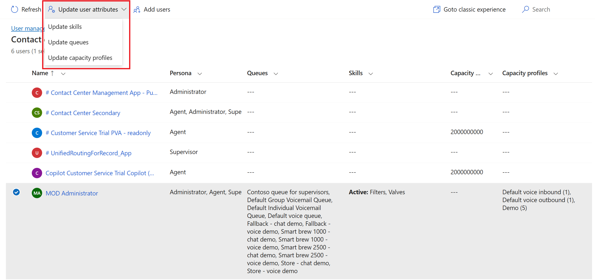

# Lab 1 - Set up your environment

### Introduction

This lab is designed to help you set up the foundational environment for
Dynamics 365 Customer Service. You will begin by enabling the Customer
Service trial license, configuring communication channels, and managing
Dynamics 365 Contact Center users. By completing these tasks, you will
establish the necessary environment and user configurations required to
effectively explore and work with Dynamics 365 Customer Service
features.

## Task 1 - Enabling Customer Service Trial License

1.  Open edge browser in VM and paste the link
    !!https://www.microsoft.com/en-in/dynamics-365/free-trial!! for
    enabling the **Dynamics 365 Customer Service Trial license**

2.  Scroll down and select **Dynamics 365 Customer Service**. Click on
    **Try for free**.

    

3.  Enter the Admin Tenant ID, select the agreement terms and then select
    **Start your free trial**.

    

4.  Select Country/Region - **United States** and enter your Phone
    number and **submit**.

    

5.  You will be navigated to **Customer Service workspace**.

    > **Note** - If you are prompted with a pop-up for using a microphone,
    click on **Allow while visiting the site**. If you are not prompted,
    you can proceed to the next step.

    

6.  Now you are on the **Customer Service Workspace** home page by
    default.

    

## Task 2 - Set up channels

1.  Click on the **App selector** from the top.

    

2.  Select **Copilot Service admin center** from the list of apps.

    

3.  Select **Channels** under **Customer Support** on the left
    navigation pane.

    

4.  Select **Manage** for **Manage channels**. The Manage channels page
    appears.

    

5.  You can view the channels that are enabled.

    

## Task 3 – Manage Dynamics 365 Contact Center Users

1.  Select **User management** under **Customer support** in the site
    map.

    

2.  On the page that appears, select **Manage** for **Enhanced user
    management**. The **Contact center users** view displays the users
    that have been configured in Power Platform admin center.

    

3.  Hover the pointer over the rows of your **MOD Administrator** users
    that you want to update and select the check boxes.

    

4.  To update user attributes, select **Update user attributes**, and
    you will see three options available. You can select one of the
    option based on your requirements.

    

5.  **Update skills**: On the dialog box that appears, review and note
    the options available:

    1.  **Add skills to users:** In the **Skills** box, select the
        skills that you want to add, select a proficiency, and then
        select **Add to all**. The selected skill and proficiency is
        added for the users in the list. To have a different proficiency
        for the skills, select one skill and proficiency at a time.

    2.  **Activate or deactivate**: Select a skill in
        the **Skills** box, and select the ellipses to select **Activate
        for all** or **Deactivate for all**. Users with a deactivated
        skill will not be considered during assignment if the skill
        requirement of a work item matches the deactivated skill.

    3.  **Remove skills**: To remove a skill from the list of users,
        select the skill in the **Skills** box, and select **Remove from
        all**. Save your changes. The selected skills are removed for
        the users.

        

6.  Click on **Close**.

7.  Now select your **Admin > Update user attributes > Update
    queues**.

8.  **Update queues**: On the dialog box that appears, in
    the **Queues** box, review and note the options available.

    

9.  Click on **Close**.

10. Now perform step 7 again and select **Update capacity profile**.

11. On this dialog box , in the **Capacity profiles** box, select the
    profiles, review and note the options available.

    

12. Click on **Close.**

### Conclusion

By the end of this lab, you successfully enabled the trial license, set up communication channels, and managed user attributes, queues, and capacity profiles. This ensures that your Dynamics 365 Customer Service environment is fully prepared for further configuration and hands-on exploration.
