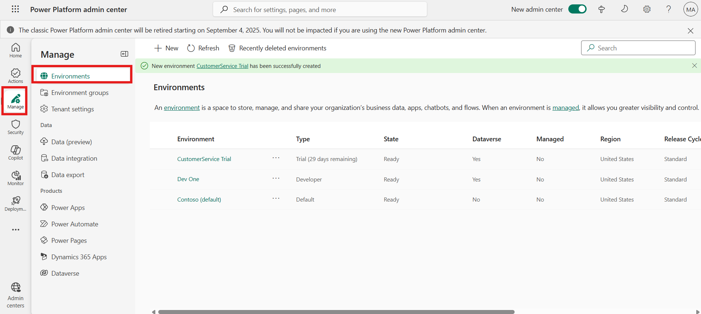
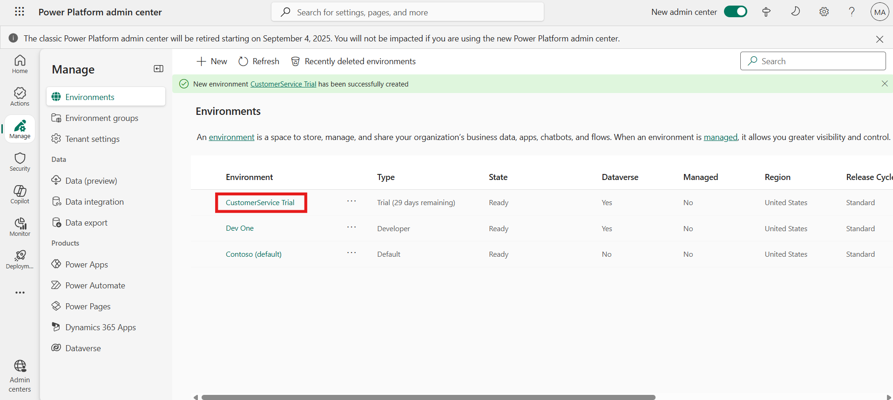
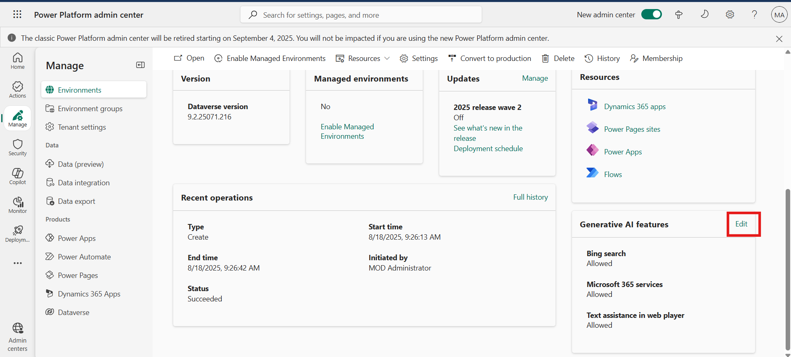
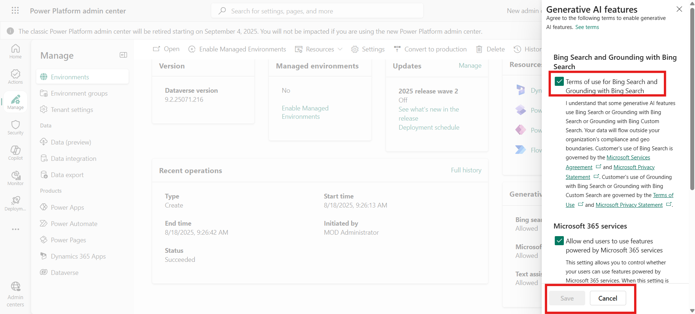
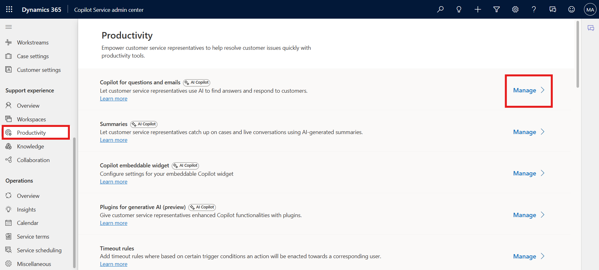
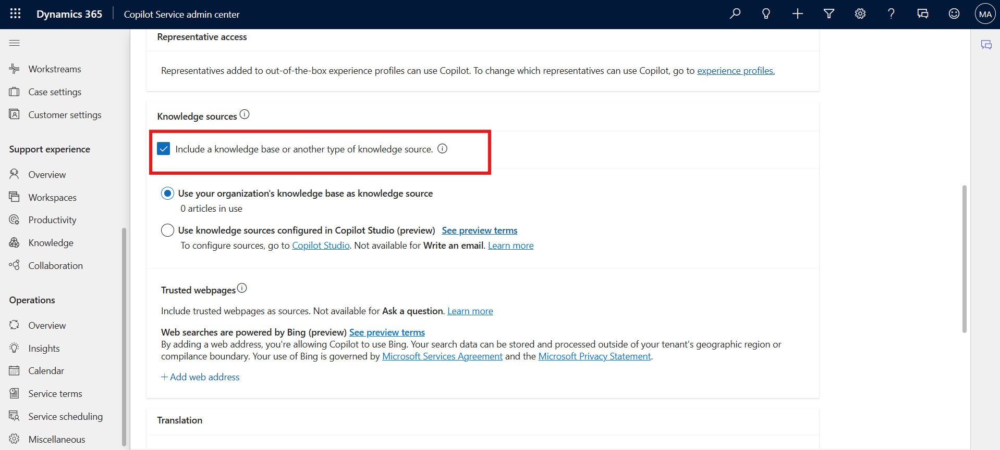
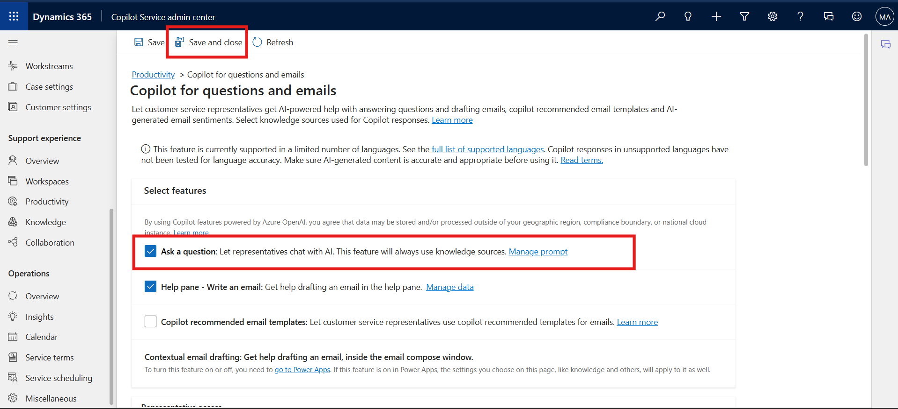
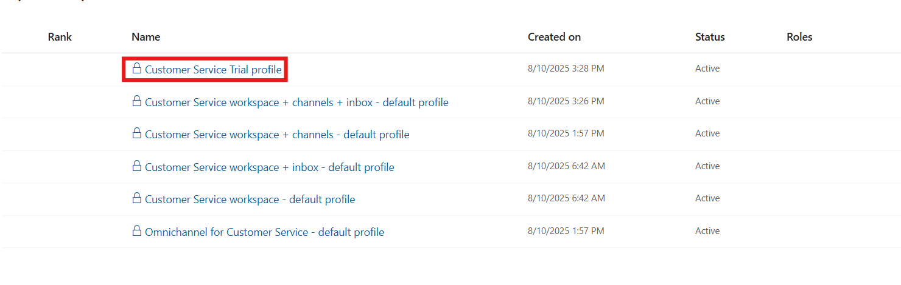

# Lab 2 - Manage Copilot features in Customer Service

### Introduction

In this lab, you will explore how to enable and manage Copilot features
within Dynamics 365 Customer Service. The lab focuses on turning on
copilots and generative AI features, setting up your Copilot with
knowledge sources, and making Copilot available to agents. These steps
help ensure that agents can leverage AI-powered assistance, such as
suggesting responses, drafting emails, and answering questions
efficiently within their workspace.

## Task 1 - Turn on copilots and generative AI features

To use copilots and generative AI features, you must consent to the
terms of use in the Power Platform admin center. To grant consent, you
must be a Power Platform administrator or Dynamics 365 administrator.

1.  Open a new tab in the browser. Sign in to the Power Platform admin
    center - !!https://admin.powerplatform.microsoft.com/!! with the
    credentials provided to execute the lab in the home tab.

2.  In the left side panel, select **Manage** option and then navigate
    to **Environments**.

    

3.  Select your **Customer Service Trial** environment.

    

4.  You will find the **Environment URL** under **Details**. This will
    take you to Customer Service page.

5.  On the Power Platform admin center page, scroll down until you see
    the **Generative AI features** card. Now, select **Edit**.

    

6.  Review the terms of use and select the **Bing Search** checkbox if
    it is not selected. When the **Bing Search** feature is turned on,
    your copilot in Microsoft Copilot Studio can use the data sources
    you provided, but it can use Bing’s APIs to index the results better
    and find the best answer from within your data sources.

7.  If any changes have been made, select **Save** to confirm them;
    otherwise, select **Cancel**.

    

## Task 2 - Set up your Copilot

1.  Switch back to **Copilot Service admin center** tab. Select **Productivity** under **Support experience** and then select **Manage** for **Copilot for questions and emails**.

    

2.  Scroll down and select **Include a knowledge source base** check
    box.

    

3.  Scroll up and then Select the checkbox for **Ask a question**.

4.  From the top command bar select **Save and close**.

    

## Task 3 - Make Copilot available to agents

1.  On the left navigation pane, Under **Support
    experience** select **Workspaces.**

2.  Select **Manage** under **Experience profiles.**

    

3.  Select the **Copilot Service Trial profile** agent experience
    profile from the list.

    

4.  On the **Productivity Pane**, make sure **Copilot help pane** toggle
    is **ON** so that agents can use the Copilot features such suggest a
    response, ask a question, and write an email on the productivity
    pane.

    

5.  Scroll down to **Copilot AI features** section. Make sure that all
    the Copilot AI features are enables.

    

### Conclusion

By completing this lab, you successfully enabled generative AI features,
configured Copilot with knowledge sources, and made it available for
agents. This setup enhances agent productivity by equipping them with
intelligent tools that streamline customer interactions and improve
service quality.

