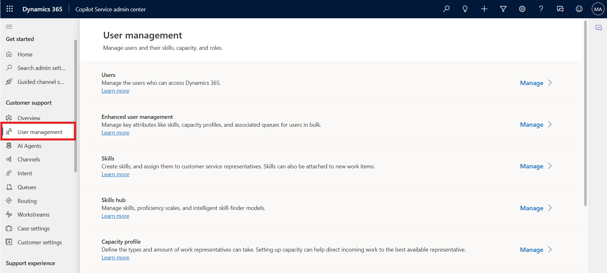
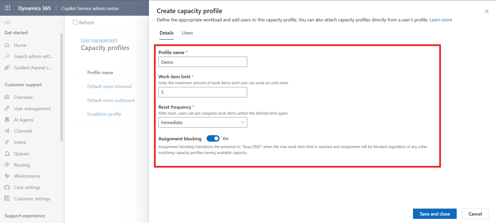
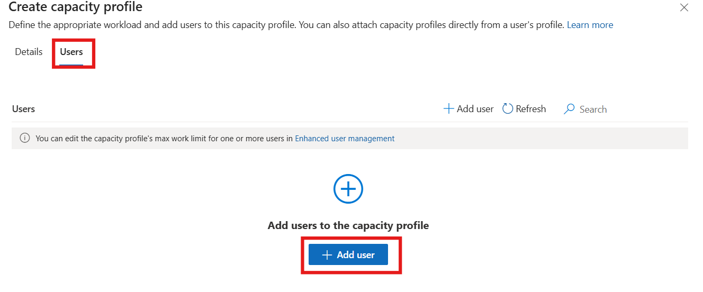
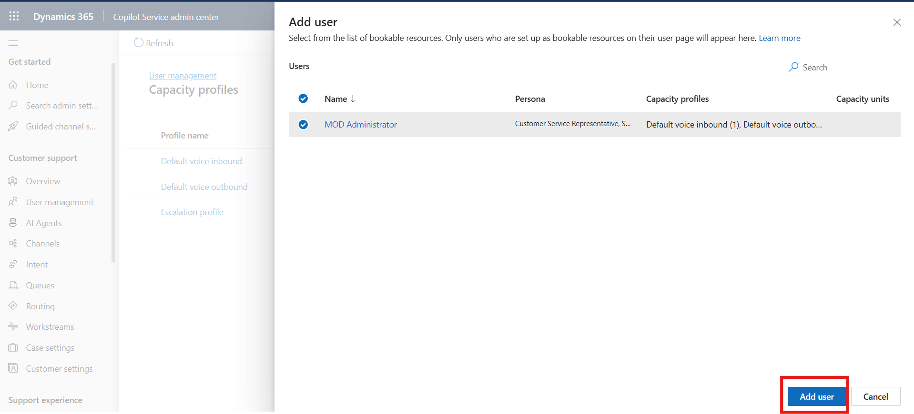
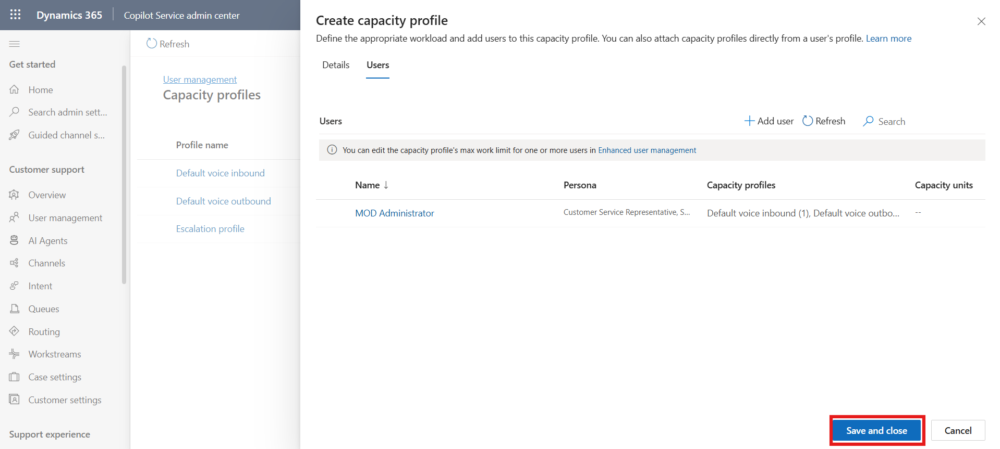

## Lab 3 - Create a capacity profile and assign to users

### Introduction

This lab guides you through creating and managing a capacity profile in
the Copilot Service admin center. You will learn how to define capacity
settings such as work item limits, reset frequency, and assignment
rules, and then assign the created profile to users. This ensures better
workload management and efficient distribution of tasks among agents.

1.  On the Copilot Service admin center, select **User
    management** under **Customer support**.

    

2.  Select the **Manage** option for **Capacity profile**.

    

3.  On the **Capacity profiles** page, select **Create new**.

    

4.  On the **Details** tab of the **Create capacity profile** dialog
    box, enter the following details:

    - **Profile name**: Name for the capacity profile as `Demo`

    - **Work item limit**: Number of units of the work type that you can
      assign to the agent. – Enter - 5

    - **Reset frequency**: Period after which capacity consumption is
      reset for agents. Select **Immediate**

      > **Note** - Once configured, you must recreate the capacity profile
      if you want to change the reset frequency.

    - **Assignment blocking**: Set the toggle to **Yes**. When the work
      item limit is met, the agent isn’t assigned a new work item
      automatically.
  
      

5.  Select the capacity profile created. Select the **Users** Tab and
    Select **Add user**

    

6.  Select the admin user and then click on **Add user.**

    

7.  Select **Save and Close.** The capacity profile is assigned to the
    admin user.
    
    

### Conclusion

By completing this lab, you created a capacity profile and successfully
assigned it to a user. This setup helps control workload distribution,
prevents over-assignment, and improves overall agent productivity.

