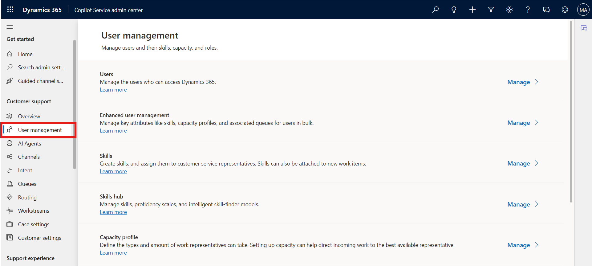
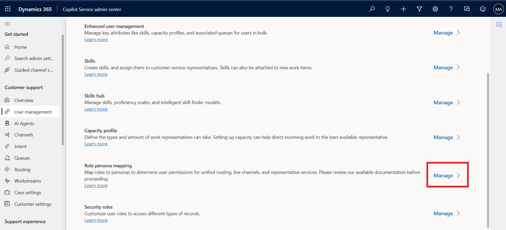
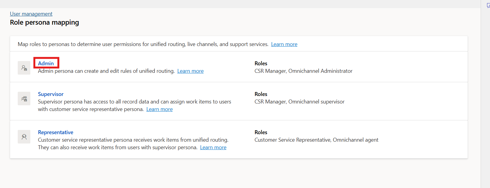
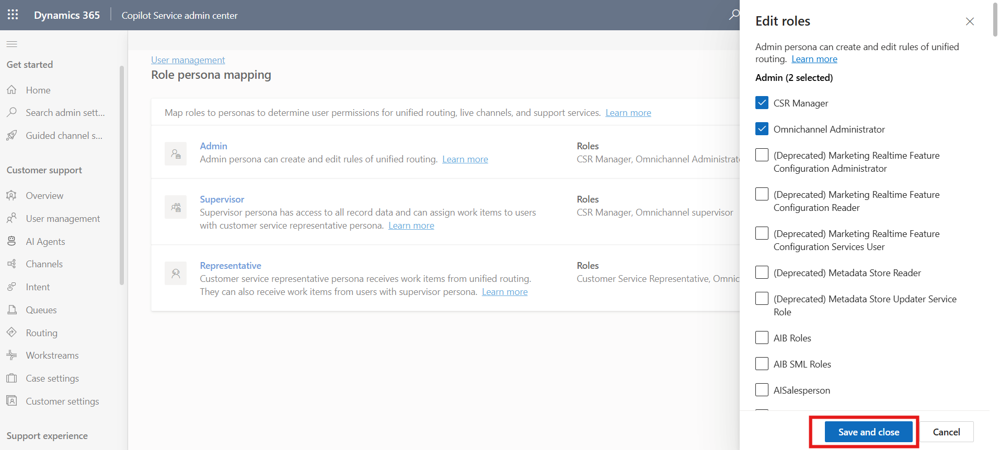

## Lab 4 - Manage Personas and custom security roles in Customer Service

### Introduction

In this lab, you will learn how to manage personas and customize
security roles within the Customer Service app. By exploring
persona-to-role mapping, you will understand how security roles are
assigned or modified to control access and permissions for different
types of users in the system.

1.  Open Copilot Service admin center page, From the left navigation pane, select **User
    management** in **Customer support** again.

    

2.  Select **Manage** for **Role persona mapping**.

    

3.  Select the persona – **Admin** to add or remove security roles.
    The **Edit roles** pane displays the list of roles.

    

4.  Select or clear the selection from the checkboxes for the required
    security roles.

    

    > **Note** – For this lab, we are not adding or removing any roles for
  the persona

5.  Select **Save and Close** after you have made any changes.

    

### Conclusion

By completing this lab, you reviewed persona-role mapping in the
Customer Service app and explored how security roles can be managed.
This process ensures that users have the right permissions aligned with
their responsibilities, enhancing security and role-based access
control.

