# Lab 5 - Create and manage Workstreams and Queues

### Introduction

In this lab, you will learn how to create and manage **workstreams and
queues** in the Copilot Service admin center. Through practical
exercises, you will set up a new workstream for Contoso chat, configure
its distribution mode and fallback queue, and then manage existing
workstreams. Additionally, you will create and manage queues for unified
routing, including defining queue priorities, adding users, and
configuring operation hours. These steps ensure that customer
interactions are efficiently routed and handled by the right agents.

## Exercise 1 - Create and Manage Workstream

### Task 1 - Create a workstream

1.  In the site map of **Copilot Service Admin center**, select
    **Workstreams** under **Customer support**.

    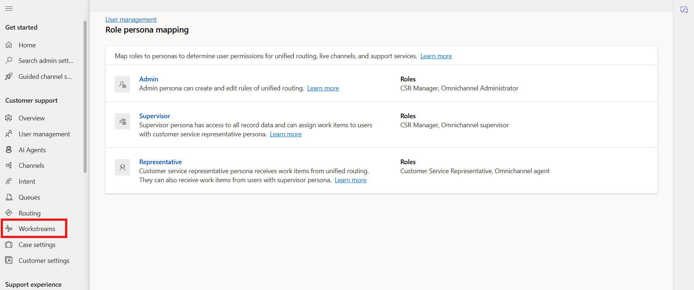

2.  Select + **New workstream** from top of the screen.

    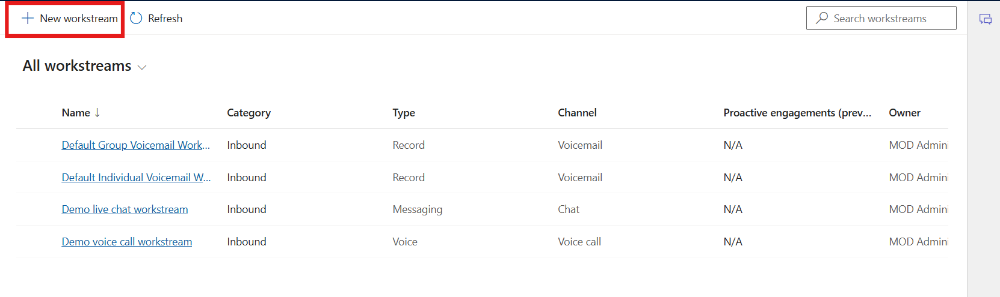

3.  On the **Create a workstream** dialoge, select Inbound and then
    select **Next**.

    

4.  Enter the following details:

    - **Name**: Enter an intuitive name - !!Contoso chat workstream!!.

    - **Type**: Select **Messaging**

    - **Channel**: This box appears if you select the type
      as **Messaging**. Select **Chat**

    - Select **Persistent** **Chat** checkbox.

    - **Work distribution mode**: Select **Push** 

    - In **Fallback queue** – Select **Choose existing**: Select Default
      messaging queue ( All users)

    - Select **Create**.

      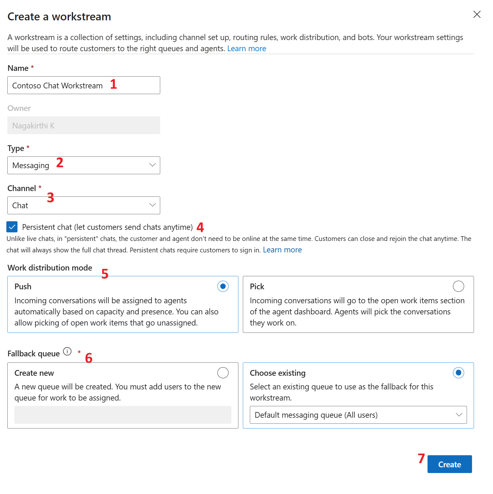

      The workstream that you created is displayed with the option to
    configure the selected channel instance.

      

### Task 2 - Manage workstreams

1.  Select **Workstreams** on the left navigation pane under **Customer
    Support**.

2.  Select **Contoso chat workstream** on the **All workstreams** page
    and select **Edit** on the command menu to edit the workstream.

    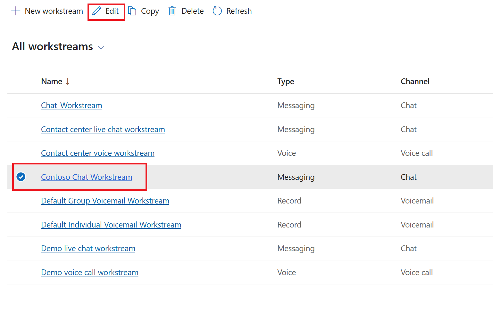

3.  To copy the **Contoso chat workstream**, select the workstream and
    click **Copy** on the command menu.

    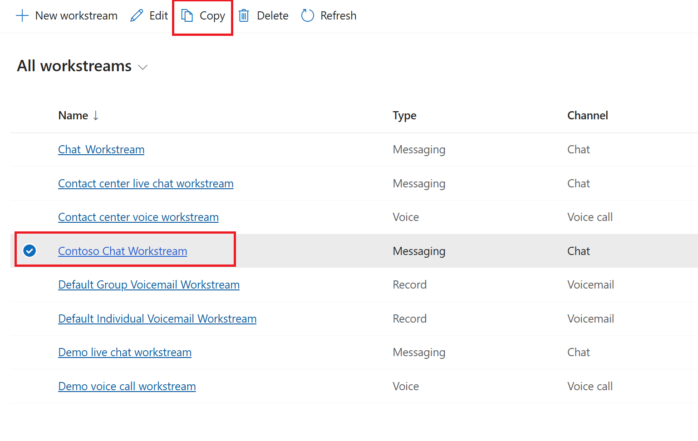

4.  Select **Copy** in the ***Do you want to copy this
    workstream?*** dialog.

    

5.  The workstream is copied and inherits the settings of the workstream
    you copied from, including its name, prefixed with **Copy of Contoso
    chat workstream.**

    

6.  To delete the workstream, select the workstream and click
    **Delete.**

    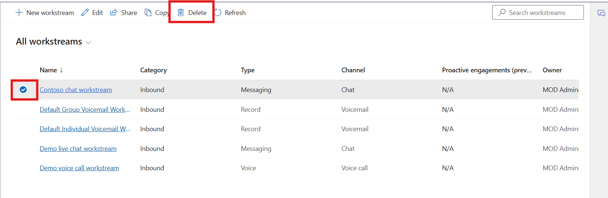

## Exercise 2 - Create and Manage Queues

### Task 1 - Create a queue for unified routing

1.  In the site map of **Copilot Service admin center**,
    select **Queues** in **Customer support**.

2.  On the **Queues** page, select **Manage** for **Advanced queues**.

    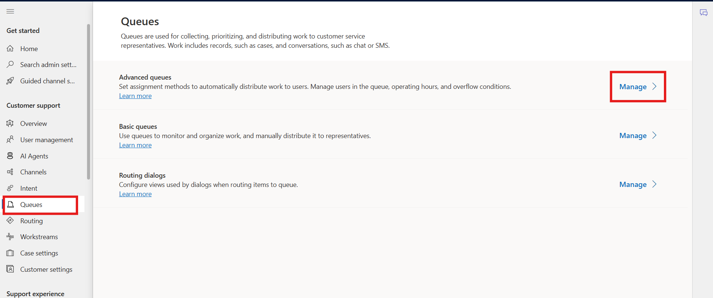

3.  On the **Queues** page, Select **New** **Queue**

    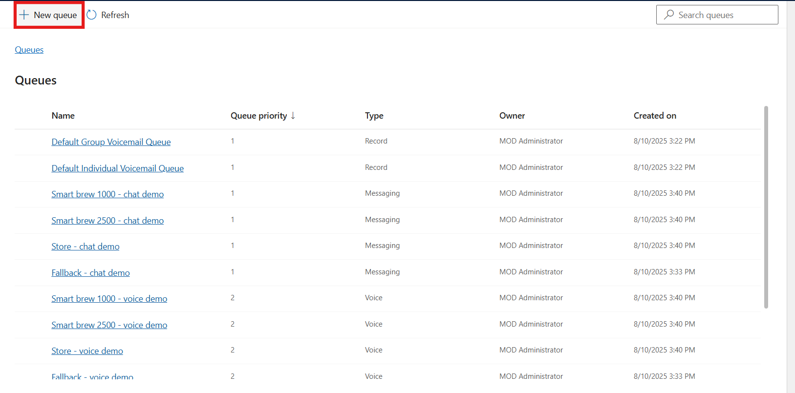

4.  In the **Create a queue** dialog, enter the following details:

    - **Name**: !!**Contoso queue for supervisors**!!

    - **Type**: Select **Messaging**

    - **Queue Priority**: !!**1**!!

    - Select **Create**

    

5.  The queue that you created is displayed.

6.  Select **Add users**, and in the flyout menu, select the **MOD
    Administrator**, and then select **Add**.

    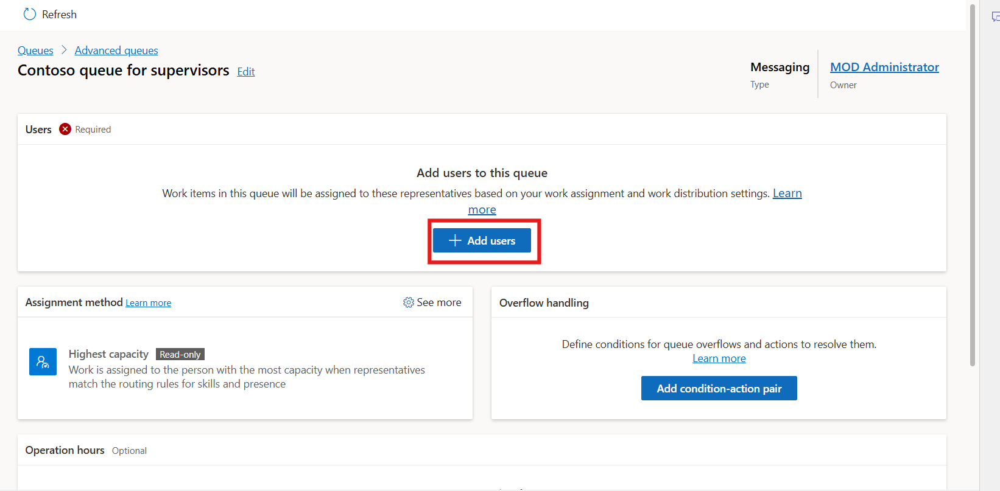

    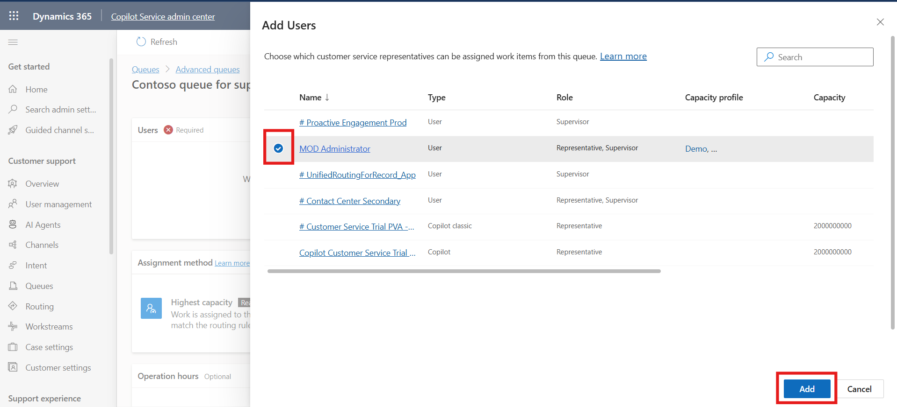

7.  The **MOD Administrator** is added to the queue.

    

8.  In **Assignment method**, You can see **Highest capacity** with
    **Read-only**

    

9.  To set the operating hours, in **Operation hours**, scroll down and
    select **Set operation hours**.

    

10. On the **Set operation hours** dialog that appears, click the
    dropdown next to **Select operation hours** and then click **+
    Create new**.

    

11. On the **New Operating Hour** page, enter !!**Contoso operation
    hours**!! in the **Name** field and !!**Description**!! field.

12. Click **Save & Close** to navigate back to the **Contoso queue for
    supervisors** page.

    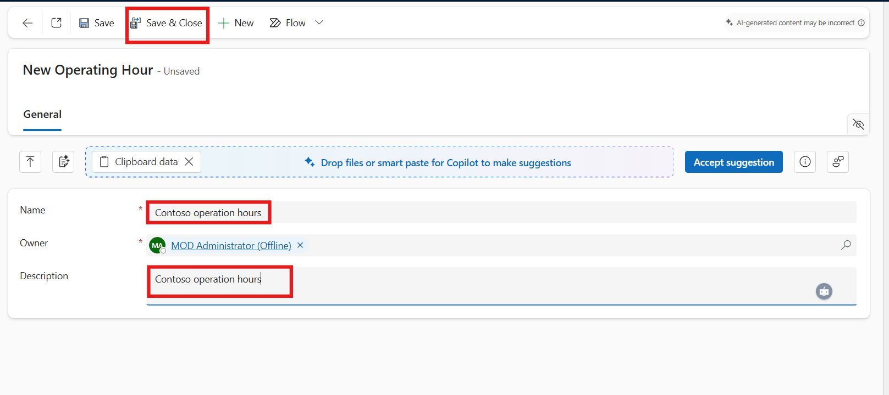

    > **Note:** If popup windows appear, click on **Continue anyways**.

    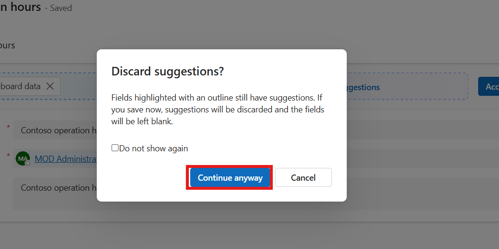

13. On the **Contoso queue for supervisors** page, click **+** **Set
    operation hours** again.

14. On the **Set operation hours** pane, search for and select **Contoso
    operation hours** and click **Save and close.**

    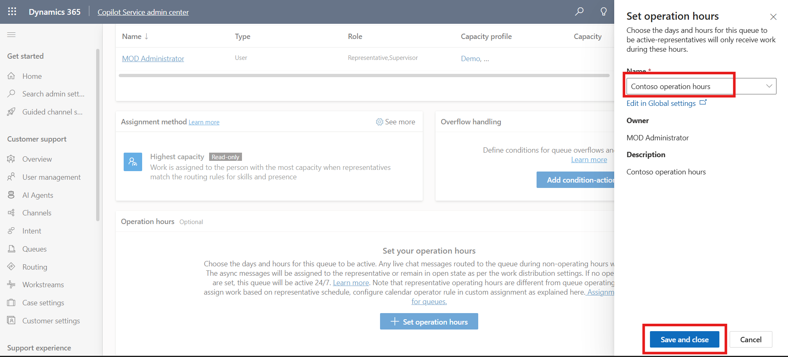

15. The operation hours record that you selected is configured for the
    queue.

    

### Task 2 - Manage queues for unified routing

1.  Navigate to queue, select contoso queue and then
    select **Copy** from top bar. Again click on the **Copy
    Queue** dialog.

    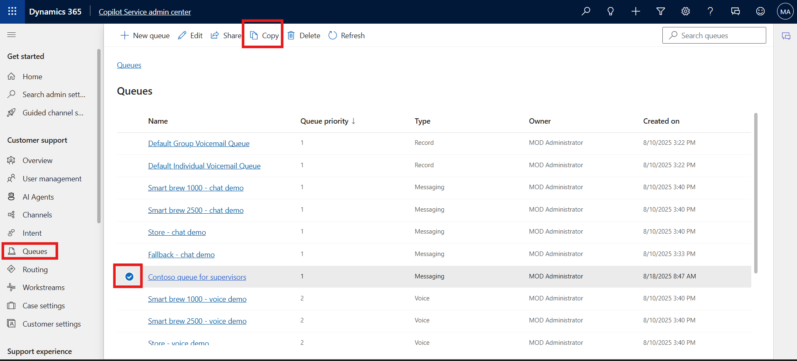
    
    

2.  The queue is copied and inherits the settings of the queue you
    copied from, including its name, prefixed with **Copy of Contoso
    queue for supervisors**.

    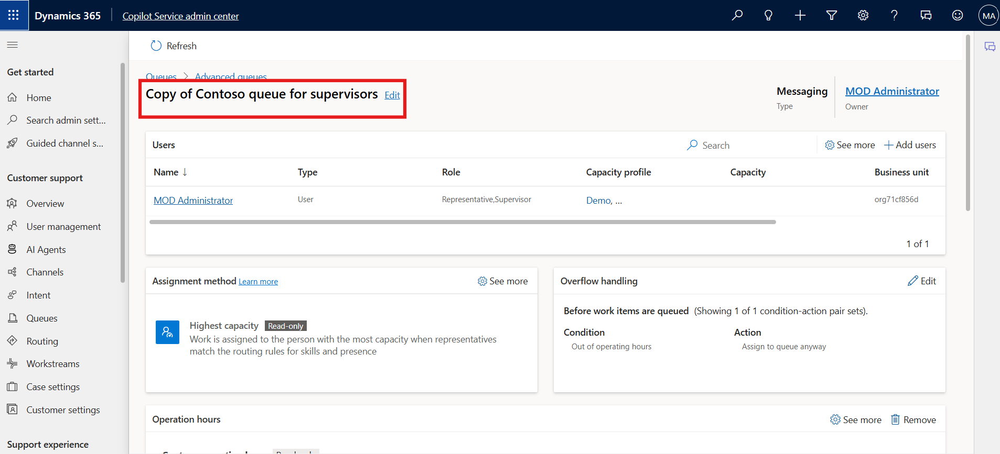

### Conclusion

By completing this lab, you created and managed workstreams and queues, enabling structured routing of customer interactions. This setup helps improve operational efficiency, ensures timely responses, and supports better workload management for agents.
