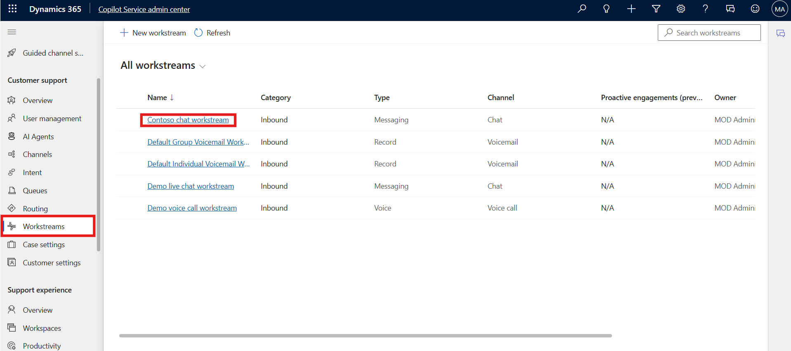
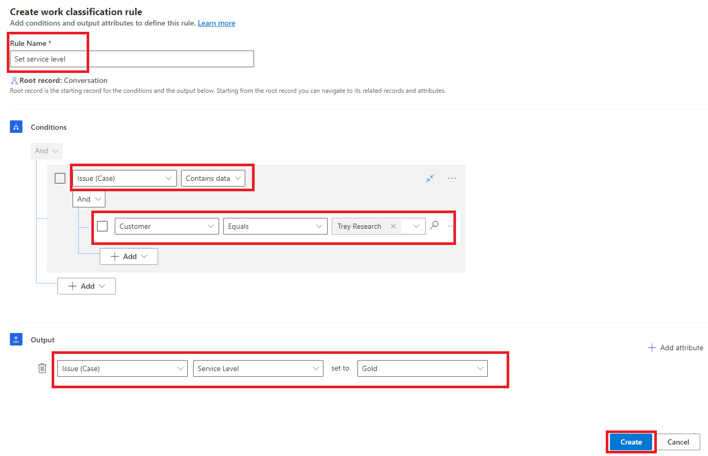
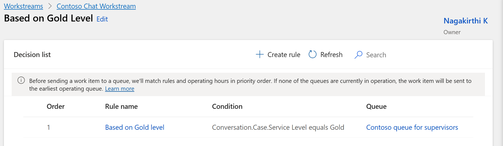

# Lab 6 - Configure work classification rulesets for Unified Routing 

**Duration:** 20 mins

## Introduction:

In this lab, you will learn how to configure work classification and
routing rules in the Copilot Service admin center. These rules help
automate how customer issues are categorized and routed to the
appropriate queues based on predefined conditions, such as customer type
or service level. You will create a work classification ruleset and a
route-to-queue ruleset to streamline case management within the contact
center.

## Task 1 - Create a Work Classification Ruleset

In this task, you will create a logical ruleset named Contoso ruleset to
classify incoming cases based on customer details. You will define a
condition that sets the service level to Gold when the customer is Trey
Research, helping prioritize high-value customer requests.

1.  In **Copilot Service admin center**, navigate to **Workstreams**
    under **Customer support** group and select **Contoso chat
    workstream**.

    

2.  On the **Contoso chat workstream** page, in the **Routing
    rules** area, select **+ Create ruleset** next to **Work
    classification (optional)** option.

    

3.  On the **Work classification** page, select **Create new.**

    

4.  In the **Create work classification ruleset** dialog, select
    **Logical rules** under **Rule type** and then enter the following
    details.

    - **Name –** !!Contoso ruleset!!

    - **Description –** !!Contoso ruleset!!

    - Click **Create**

    

5.  In the **Decision list** area, select **+** **Create Rule.**

    

6.  On the **Create work classification rule** dialog, enter the
    following details in the **Conditions** area.

    - **Rule Name** - !!Set service level!!

    - Select **+ Add** and then select **Add related entity**.

    

7.  Add **Issue (Case)** entity in the first block.

8.  Create the following condition: Customer **Equals** Trey Research

9.  In the **Output** area, enter the following: **Issue (Case), Service
    Level** set to **Gold.**

10. Click **Create**.

    

11. The **Set service level** rule is listed under **Decision list**.

    

## Task 2: Create a Route-to-Queue Ruleset

In this task, you will configure a routing ruleset named Based on Gold
Level to automatically direct cases with a Gold service level to the
Contoso queue for supervisors. This ensures that priority cases are
assigned to the right support team promptly.

1.  In Dynamics 365 Copilot Service admin center, from top select
    **Contoso chat workstream.**

    

2.  In the **Routing rules** area, select **+** **Create ruleset** next
    to **Route to queues.**

    

3.  On the **Create route-to-queues ruleset** pane, in the **Name**
    field enter!!**Based on Gold Level**!!. In the **Description** field
    enter !!**Rule based on Gold level**!!.

4.  Select **Create**.

    

5.  In the **Decision list** area, select **+** **Create Rule.**

    

6.  On the **Create route to queue rule** dialog, enter the following
    details.

    - **Name** – !!Based on Gold level!!

    - Select **+ Add** and then select **Add related entity**.

    

7.  Add **Issue (Case)** entity in the first block.

8.  Create the following condition: Service level **Equals** Gold.

9.  In the **Route to queues** area, select **Contoso queue for
    supervisors**.

10. Click **Create**.

    

11. The **Based on Gold level** rule is listed under **Decision list**.

    

## Conclusion:

By completing this lab, you have successfully created and configured
both work classification and routing rules in the Copilot Service admin
center. These rules enable automated case prioritization and intelligent
routing, ensuring efficient handling of customer interactions based on
service levels and predefined business logic.
