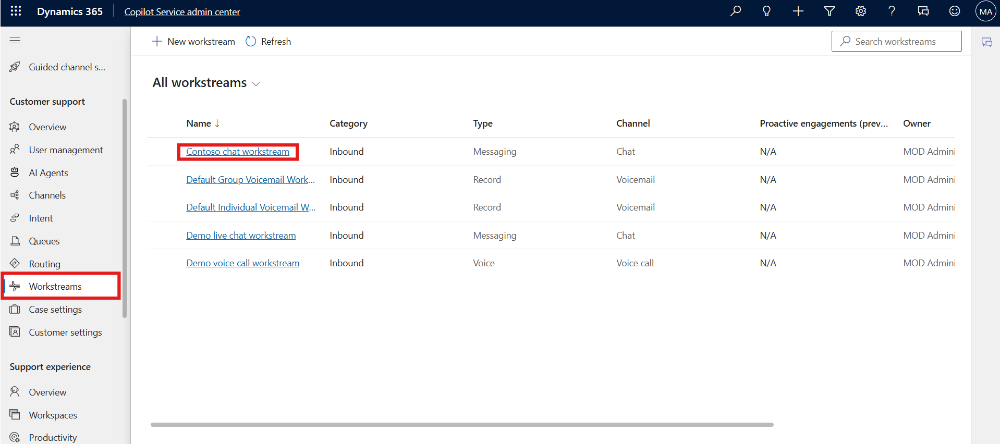

# Lab 6 - Configure work classification rulesets for unified routing

### Introduction

This lab focuses on configuring **work classification and
route-to-queues rulesets** for unified routing in Dynamics 365 Customer
Service. You will learn how to define logical classification rules that
set work item attributes based on specific conditions and create routing
rules that direct cases to the appropriate queues. These configurations
help ensure that customer issues are prioritized and routed efficiently
to the right agents.

## Task 1 - Create work classification rulesets

Logical classification rules are run to update work item attributes.
They’re written in the format of “if defined condition satisfies, then
set the output attributes to certain values.” You can create conditions
to define rules based on multiple entity attributes. Routing rules are
written as rulesets that consist of rule items.

1.  In **Copilot Service admin center**, navigate to **Workstreams**
    under **Customer support** group and select **Contoso chat
    workstream**.

    

2.  On the **Contoso chat workstream** page, in the **Routing
    rules** area, select **+ Create ruleset** next to **Work
    classification (optional)** option.

    

3.  On the **Work classification** page, select **Create new.**

    

4.  In the **Create work classification ruleset** dialog, select
    **Logical rules** under **Rule type** and then enter the following
    details.

    - **Name –** !!Contoso ruleset!!

    - **Description –** !!Contoso ruleset!!

    - Click **Create**

    

5.  In the **Decision list** area, select **+** **Create Rule.**

    

6.  On the **Create work classification rule** dialog, enter the
    following details in the **Conditions** area.

    - **Rule Name** - !!Set service level!!

    - Select **+ Add** and then select **Add related entity**.

    

7.  Add **Issue (Case)** entity in the first block.

8.  Create the following condition: Customer **Equals** Trey Research

9.  In the **Output** area, enter the following: **Issue (Case) Service
    Level** set to **Gold**

10. Click **Create**.

    

11. The **Set service level** rule is listed under **Decision list**.

    

## Task 2: Configure route-to-queues rulesets and rules

1.  In Dynamics 365 Copilot Service admin center, select **Contoso chat
    workstream**, and in the **Routing rules** area, select **+**
    **Create ruleset** next to **Route to queues.**

    

2.  On the **Create route-to-queues ruleset** pane, in the **Name**
    field enter !!**Based on Gold Level**!!. In the **Description**
    field enter !!**Rule based on Gold level**!!.

3.  Select **Create**.

    

4.  In the **Decision list** area, select **+** **Create Rule.**

    

5.  On the **Create route to queue rule** dialog, enter the following
    details.

    - **Name** – !!Based on Gold level!!

    - Select **+ Add** and then select **Add related entity**.

    

6.  Add **Issue (Case)** entity in the first block.

7.  Create the following condition: Service level **Equals** Gold.

8.  In the **Route to queues** area, select **Contoso queue for
    supervisors**.

9.  Click **Create**.

    

10. The **Based on Gold level** rule is listed under **Decision list**.

    

### Conclusion

By completing this lab, you successfully created work classification and
route-to-queues rulesets. This configuration enables intelligent routing
of customer interactions, ensuring that high-priority cases are directed
to the right queues and handled effectively.
