# Lab 8 - Set up Skill-based routing in unified routing

### Introduction

This lab focuses on configuring **skill-based routing** in unified
routing for Dynamics 365 Customer Service. You will create new skills,
build rating models with defined rating values, and set up agents as
bookable resources. Finally, you will assign agents to the skills with
rating values to ensure cases are routed to the right agents based on
language proficiency or other required competencies.

## Task 1: Create Skills

1.  In the **Copilot Service admin center** navigate to the site map and
    select **User management** under the **Customer support** group.

2.  On the **User management** page, select **Manage** next to
    **Skills**.

    

3.  Select **+ New** to create new skill.

    

4.  Specify the following in the **New Characteristic** page.

    - **Name** - !!Spanish!!

    - **Type** - Skill

    - **Description** - !!This record is used to define the skill level of the Spanish language!!
!
5.  Select **Save & Close** from top bar.

    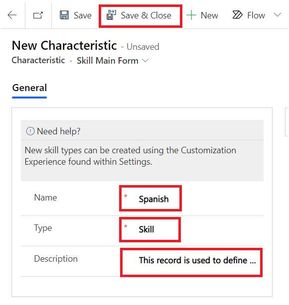

## Task 2: Create a rating model and rating value

1.  In the **Copilot Service admin center** navigate to the site map and
    select **Routing** under the **Customer support** group.

2.  Select **Manage** next to the **Skill-based routing**.

    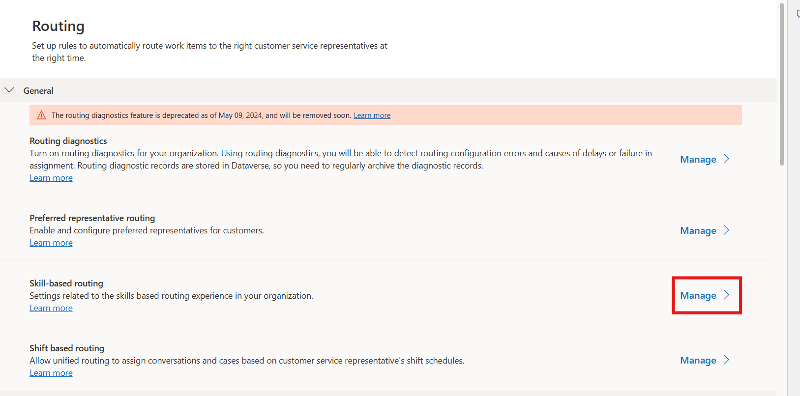

3.  On the **Omnichannel Configuration** page, set the toggle for
    **Enable update skill control** to **Yes**. In the **Rating
    Model** section, Click on the ellipsis icon on the rating model and select **+ New Rating Model**.

    

4.  Specify the following in the **New Rating Model** page.

    - **Name** - !!Language rating model!!

    - **Min Rating Value** - !!1!!

    - **Max Rating Value** - !!10!!

5.  Select **Save**.

    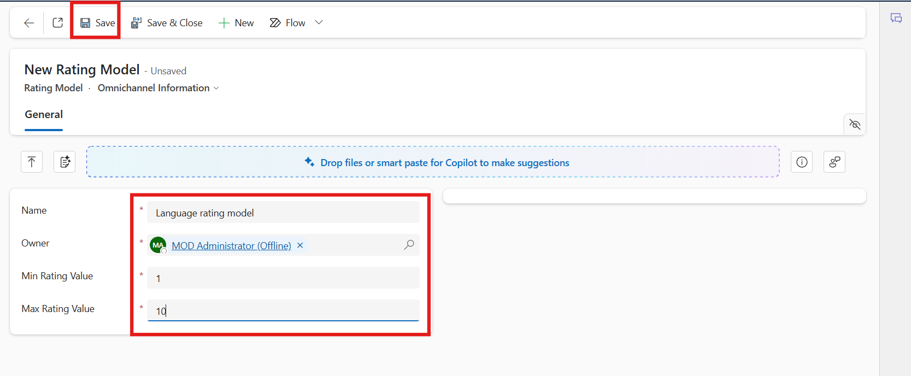

6.  The **Rating Values** section appears. Select **+** **New Rating
    Value**.

    

7.  The **New Rating Value** page appears.

8.  Specify the following.

    - **Name** - !!Language rating value!!

    - **Value** - !!10!!

9.  Select **Save & Close** to save and add the rating value to the
    grid.

    

10. Select **Save & Close** on the top of Language rating model page to
    navigate back to the Omnichannel Configuration page.

    

11. On the **Omnichannel Configuration** page, click **Save & Close**

    

## Task 3: Add agent as bookable resource

1.  In **Dynamics 365 Copilot Service admin center**, in the site map,
    select **User management** under the **Customer support** group.

2.  On the **User management** page, select **Manage** next
    to **Users**.

    

3.  Click the dropdown next to **Enabled Users** and select
    **Omnichannel Users**.

    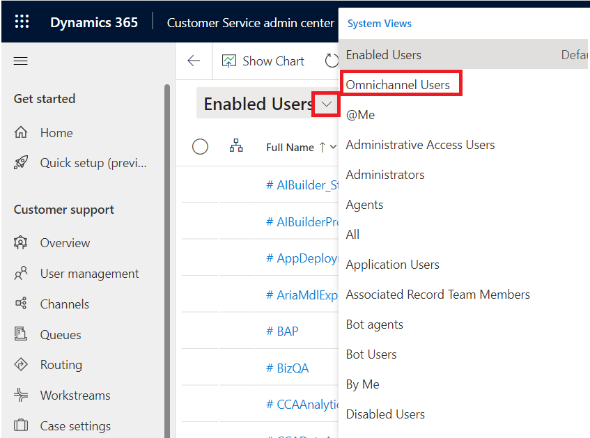

4.  On the **Omnichannel Users** page, select **MOD Administrator** from
    the list.

    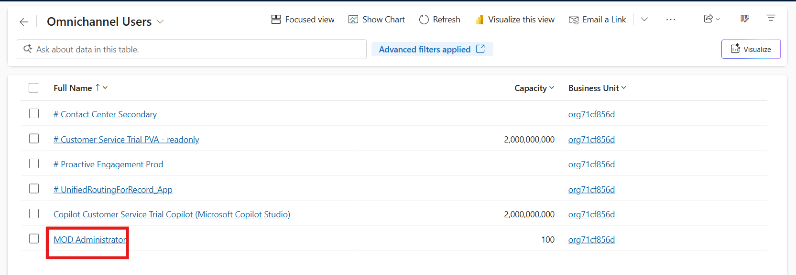

5.  Select the **Omnichannel** tab from top commnad bar. If the option is not visible click on the ellipsis icon and select the option.

    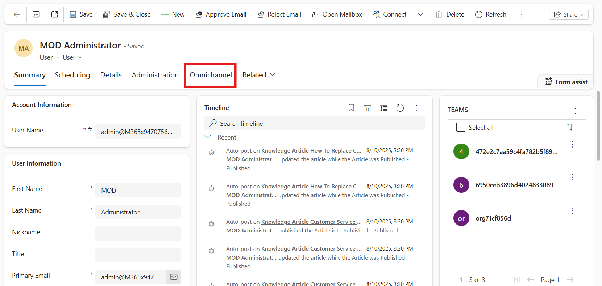

6.  Select **Trial User** under the **Skills Configuration** section.

    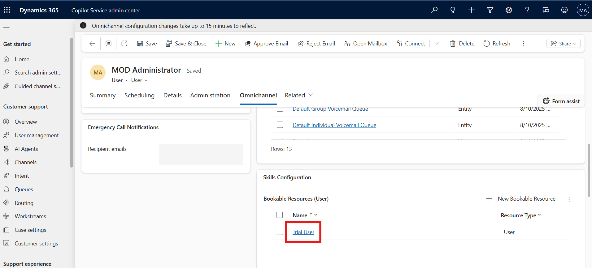

7.  On the **New Bookable Resource** page, change the **Name** to !!Mark Brown!!. Select **Save**.

    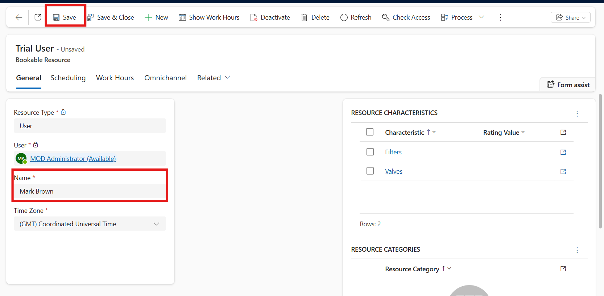

8.  Click the **Work Hours** tab to see the details of the agent **Mark
    Brown**.

    

9.  Select the **General** tab and then select **Save & Close** to
    navigate back to your admin User page.

    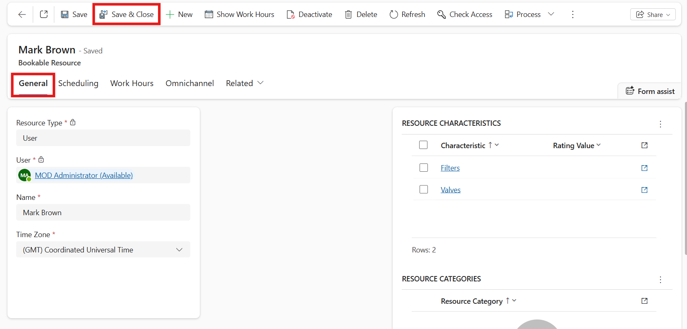

10. On the **MOD Administrator** page, select **Save & Close**.

    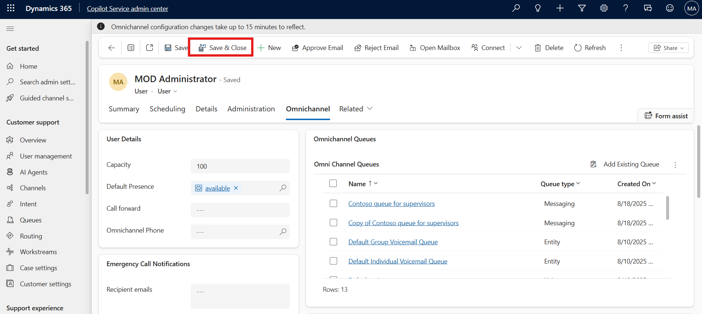

## Task 4: Assign agents to skill

1.  In the **Copilot Service admin center** navigate to the site map and
    select **User management** under the **Customer support** group.

2.  On the **User management** page, select **Manage** next
    to **Skills**.

    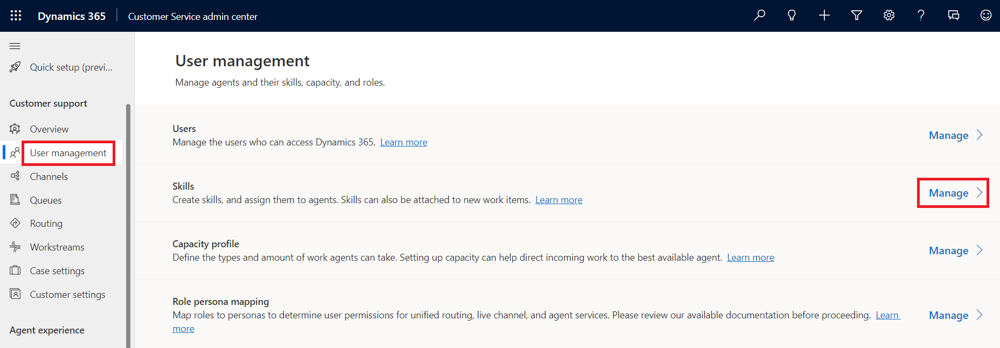

3.  Select a skill **Spanish** from the list for which you want to
    assign the agents.

    

4.  Select **+ New Bookable Resource Characteristic** from the right side of the screen in the **Users
    (Agents)** section. If the option is not visible click on the elipsis icon and select the option.

    

5.  On the **New Bookable Resource Characteristic** page, Click on the
    rating value field, press enter button and select **Language rating
    value** for the **Rating Value** field and select **Mark Brown** for
    the **Resource** field.

6.  Select **Save and Close**.

    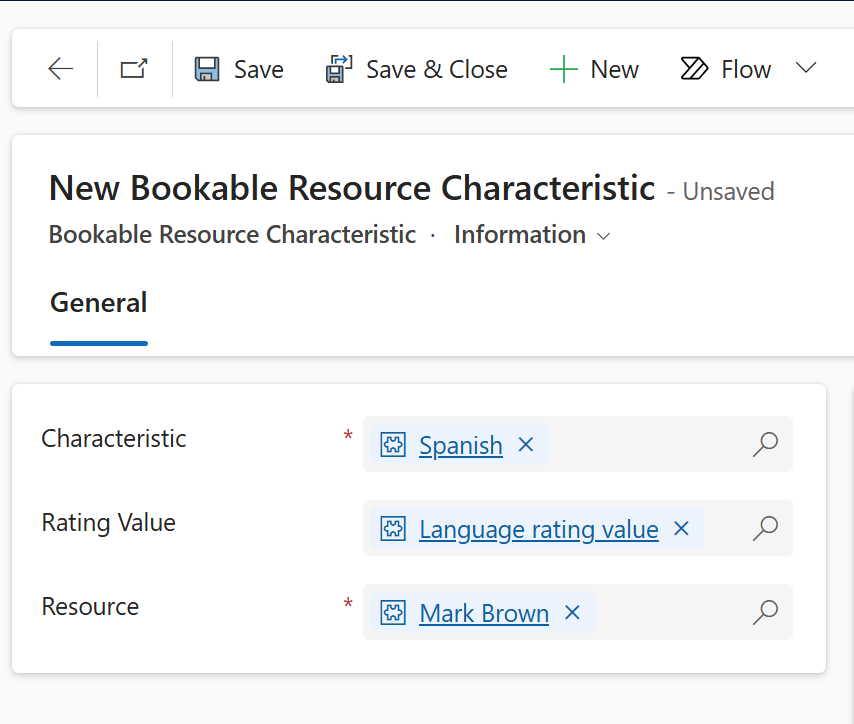

7.  On the **Spanish** Characteristic page, select **Save**.

    

### Conclusion

By completing this lab, you successfully set up skill-based routing by
defining skills, creating rating models, and assigning agents to those
skills. This ensures that customer cases are directed to the most
qualified agents, improving resolution quality and enhancing the overall
customer experience.

