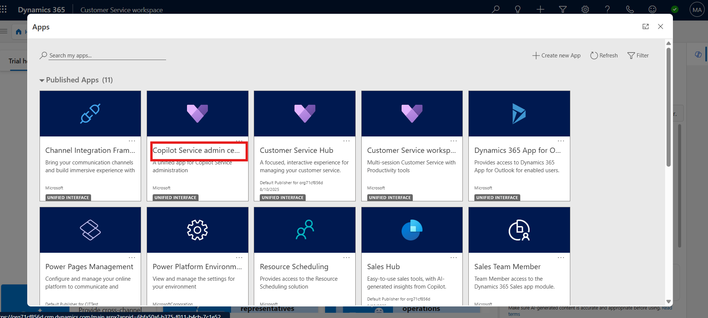
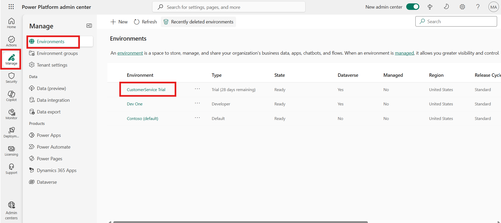
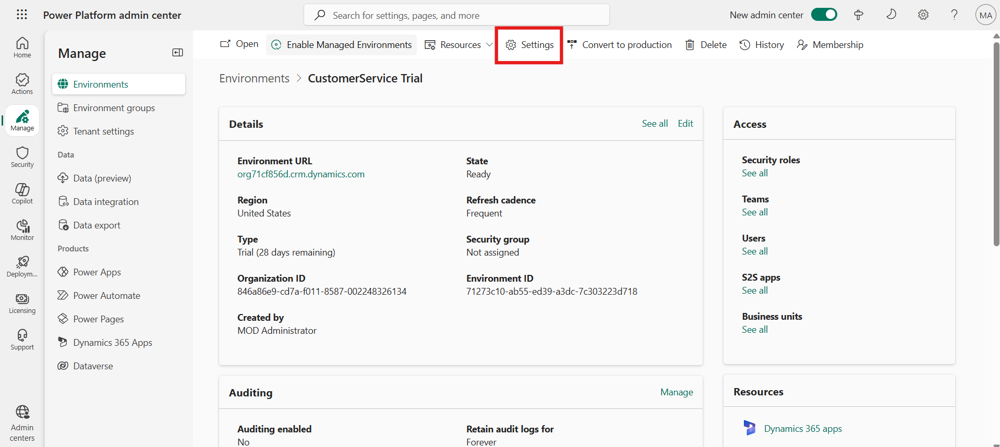
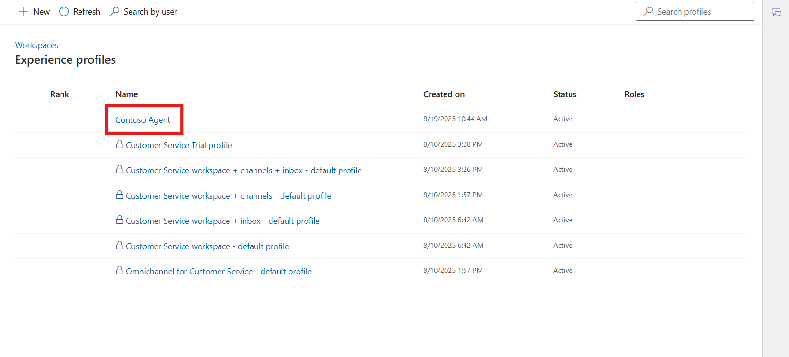
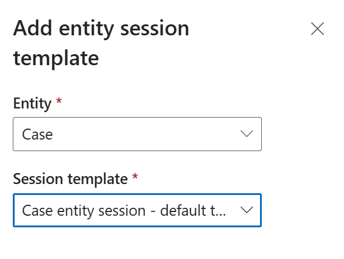

# Lab 9 - Create and use Experience profiles

**Introduction**

In this lab, you will learn how to create and configure **Experience
Profiles** in the **Copilot Service Admin Center**. Experience Profiles
help organizations customize the agent experience by defining roles,
permissions, and productivity tools available to users.

You will perform tasks such as creating a new Experience Profile, adding
users, enabling productivity tools, and setting rank and roles to define
agent access and capabilities.

## Task 1 – Create an Experience Profile

In this task, you will create a new Experience Profile in the Copilot
Service Admin Center. This profile will define the settings and
characteristics of agents who will use the Copilot system.

1.  Open a new tab in the browser. Sign in to the Power Platform admin
    center - !!https://admin.powerplatform.microsoft.com/!! with the
    credentials provided to execute the lab in the home tab. Select **\>
    Environments\> ContactCenter Trial environment\> Environment URL.**

    

    

2.  You will be navigated to the **Copilot** **Service admin center.**

    > Note: If you do not navigate to the Copilot service admin center. Click on **App selector** from the top and then select the app.

    

3.  Navigate to **Workspaces** under **Support experience**. In the
    **Experience profile** section click on the **Manage** option.

    

4.  Click on the **+ New** from top bar to create new experience
    profile.

    

5.  Enter the following details on the **Create a new experience
    profile** dialog.

    - **Name:**  !!Contoso Agent!!

    - **Unique name:** !!msdyn_custom_chatagent!!

    - **Description:** !!Contoso Agent!!

    - Select **Create**.

    &nbsp;

    - 

6.  An Experience profile is created.

- 

## Task 2 – Assign a User and Enable Productivity Tools

In this task, you will assign a user to the Experience Profile and
enable productivity tools. Assigning users helps ensure that the right
agents have access to the right tools and permissions.

1.  Open a new tab in the browser. Sign in to the Power Platform admin
    center - !!https://admin.powerplatform.microsoft.com/!! with the
    credentials provided to execute the lab in the home tab.

2.  In the left side panel, select **Environments**.

3.  Select your **ContactCenter Trial** environment.

    

4.  Select **Settings** from the upper menu.

    

5.  Select **Users + permissions ** to expand drop down and then click
    on the **Users** option.

    

6.  From the upper menu, select **Add user**.

>   

7.  In the Add user pane, search for and select **Megan Bowen**. Select
    **Add**.

    

8.  In the Manage security roles page, select the **System
    administrator** role. Select **Save**.

    

9.  Switch back to the Copilot Service admin center tab. Navigate to
    **Support experience \> Workspaces** and then click on the Manage
    option in **Experience** Profile section.

    

10. Click on the **Contoso Agent** profile.

    

11. In the **Users** section, specify the agents this profile must be
    associated with. Select **Add Users.**

    

12. Select the user **Megan Bowen**. Select **Add.**

    

    

13. In the **Productivity pane**, select **Turn on** 

    

14. Turn on the toggle against the option in the **Productivity
    Pane** as per the screenshot to enable it for the agent.

15. Enable the available productivity tools that the agents can access
    when they work on their assigned tasks.

16. Select **Save and Close**

    
    
    

## Task 3 - Set Rank and Roles

In this task, you will define the rank and roles for the Experience
Profile. Ranking helps prioritize agent profiles, while roles determine
their level of access and permissions.

1.  Navigate back to the Experience Profile page – to access all created
    profiles for configuration.

2.  Select the Contoso Agent Experience Profile – to modify its specific
    rank and role settings.

3.  Click on Set Rank and Roles from the top bar – to open the
    configuration panel for ranking and role assignment.

    

4.  **Enter the rank number, select the security role, and click *Save
    and Close*** – to define profile priority and assign the appropriate
    permissions.

    

    

**Conclusion**

In this lab, you learned how to create and configure an Experience
Profile in the Copilot Service Admin Center. You started by creating a
new profile called **Contoso Agent**, defining its name, description,
and unique identifier. Next, you assigned a user to the profile, granted
appropriate security roles, and enabled productivity tools to enhance
agent efficiency. Finally, you set the rank and roles to determine the
priority and access permissions associated with the profile. By
completing this lab, you gained a clear understanding of how Experience
Profiles help manage user access, define agent capabilities, and
streamline the overall support experience within the Copilot
environment.

