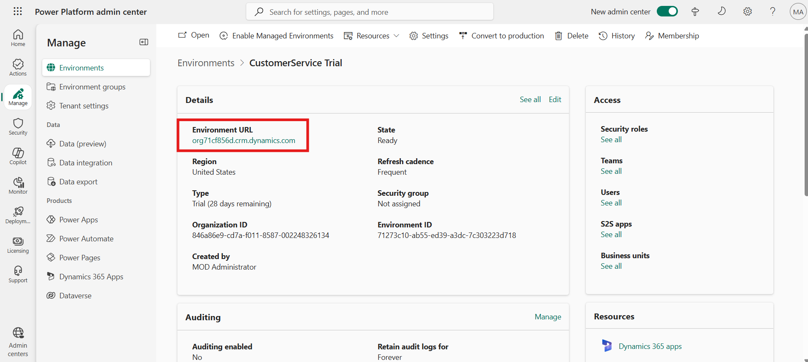
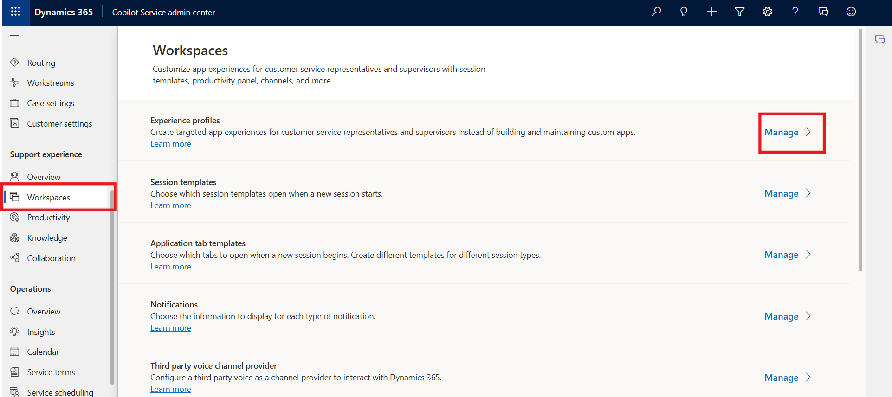
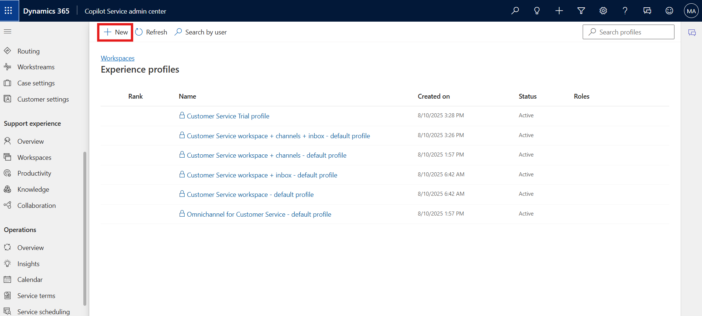
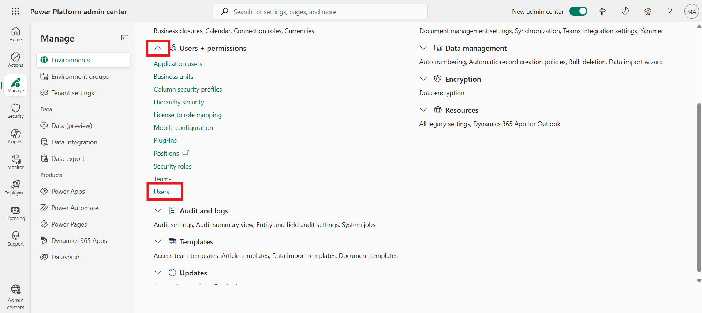
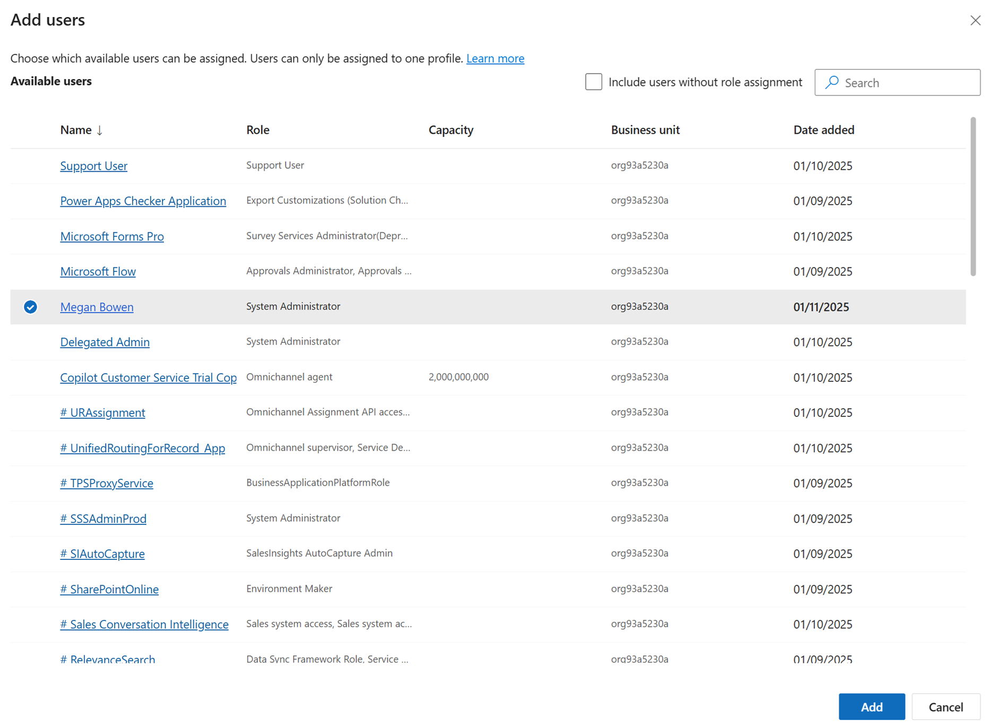
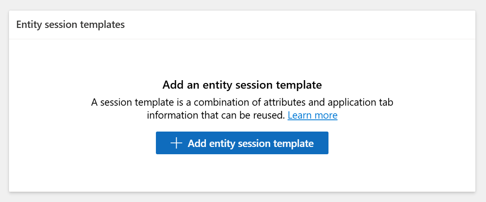

# Lab 9 - Create and use Experience profiles

**Introduction**

In this lab, you will create and configure an Experience Profile in the
Copilot Service workspace. Experience profiles help define the agent
workspace settings, assign users, and enable productivity tools that
support efficient service operations. You will create a new profile
named Contoso Agent and assign a user to this profile to enable tailored
agent experiences.

## Task 1 - Create a New Experience Profile

In this task, you will access the Copilot Service admin center through
the Power Platform admin center and create a new Experience Profile
named Contoso Agent. You will define its name, unique identifier, and
description to establish a workspace configuration for agents.

1.  Open a new tab in the browser. Sign in to the Power Platform admin
    center - !!https://admin.powerplatform.microsoft.com/!! with the
    credentials provided to execute the lab in the home tab. Select
    **Environments > ContactCenter Trial environment > Environment URL.**

    
    

2.  You will be navigated to the **Copilot** **Service admin center.**

    > Note: If you do not navigate to the Copilot service admin center.
Click on **App selector** from the top and then select the app.

    

3.  Navigate to **Workspaces** under **Support experience**. In the
    **Experience profile** section click on the **Manage** option.

5. Click on the + new from top bar to create new experience profile.

    

4.  Enter the following details on the **Create a new experience
    profile** dialog.

    - **Name:**  !!Contoso Agent!!

    - **Unique name:** !!msdyn_custom_chatagent!!

    - **Description:** !!Contoso Agent!!

    - Select **Create**.

    

5.  An Experience profile is created.

    

## Task 2 - Add Users and Configure the Experience Profile

In this task, you will add a new user (Megan Bowen) to your environment,
assign the necessary security roles, and link the user to the Contoso
Agent Experience Profile. You will also associate a session template
with the profile and enable productivity pane tools to optimize the
agent’s workspace.

1.  Open a new tab in the browser. Sign in to the Power Platform admin
    center - !!https://admin.powerplatform.microsoft.com/!! with the
    credentials provided to execute the lab in the home tab.

2.  In the left side panel, select **Environments**.

3.  Select your **CopilotService Trial** environment.

    

4.  Select **Settings** from the upper menu.

    

5.  Select **Users + permissions ** to expand drop down and then click
    on the **Users** option.

    

6.  From the upper menu, select **Add user**.

    

7.  In the Add user pane, search for and select **Megan Bowen**. Select
    **Add**.

    

8.  In the Manage security roles page, select the **System
    administrator** role. Select **Save**.

    

9.  Switch back to the Copilot Service admin center tab. Navigate to
    **Support experience \Workspaces** and then click on the Manage
    option in **Experience** Profile section.

    

10. Click on the **Contoso Agent** profile.

    

11. In the **Users** section, specify the agents this profile must be
    associated with. Select **Add Users.**

    

12. Select the user **Megan Bowen**. Select **Add.**

    

    

13. In the **Productivity pane**, select **Turn on** 

    

14. Turn on the toggle against the option in the **Productivity
    Pane** as per the screenshot to enable it for the agent.

15. Enable the available productivity tools that the agents can access
    when they work on their assigned tasks.

16. Select **Save and Close**

    

    

### Conclusion

In this lab, you successfully created and configured an Experience
Profile in Copilot Service. You created a custom profile for Contoso
agents, added a user, assigned security roles, and enabled productivity
features. This configuration ensures agents receive a tailored workspace
with the tools needed for efficient case handling and improved service
performance.
