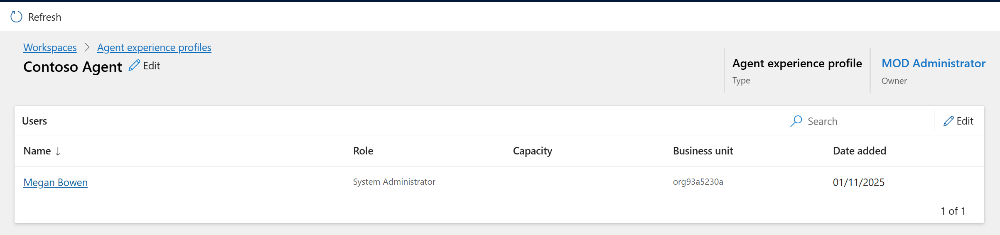

# Lab 9 - Create and use experience profiles

### Introduction

In this lab, you will create and configure experience profiles within
the Copilot Service admin center. These profiles allow organizations to
deliver tailored app experiences for agents and supervisors by assigning
users, linking templates, enabling productivity tools, and managing
communication channels.

## Task 1 - Create experience profiles in Copilot Service admin center

By using agent profiles, you can create targeted app experiences for
agents and supervisors. Profiles help access the features that your
agents and supervisors can use in their daily tasks to resolve customer
issues.

1.  Open a new tab in the browser. Sign in to the Power Platform admin
    center - !!https://admin.powerplatform.microsoft.com/!! with the
    credentials provided to execute the lab in the home tab. Select **\>
    Environments > CustomerService Trial environment > Environment
    URL.**

    

    

2.  You will be navigated to **Copilot Service workspace**. Click on
    **App selector** to display the list of apps.

    

3.  Select **Copilot Service Admin center** from the list of Apps.

    

4.  Navigate to **Workspaces** under **Support experience**. In the
    **Experience profile** section click on the **Manage** option.

    

6. Click on the + new from top bar to create new experience profile.

    

5.  Enter the following details on the **Create a new experience
    profile** dialog.

    - **Name:**  !!Contoso Agent!!

    - **Unique name:** !!msdyn_custom_chatagent!!

    - **Description:** !!Contoso Agent!!

    - Select **Create**.

      

6.  An Experience profile is created.

    

## Task 2 - Assign users, templates, configure productivity pane, channels

For the profile that you created, you can add users and configure option
such as specific session templates, conversation channels, and
productivity tools.

1.  Open a new tab in the browser. Sign in to the Power Platform admin
    center - !!https://admin.powerplatform.microsoft.com/!! with the
    credentials provided to execute the lab in the home tab.

2.  In the left side panel, select **Environments**.

3.  Select your **Customer Service Trial** environment.

    

4.  Select **Settings** from the upper menu.

    

5.  Select **Users + permissions** to expand drop down and then click
    on the **Users** option.

    

6.  From the upper menu, select **Add user**.

    

7.  In the Add user pane, search for and select !!**Megan Bowen**!!. Select
    **Add**.

    

8.  In the Manage security roles page, select the **System
    administrator** role. Select **Save**.

    

9.  Switch back to the Copilot Service admin center tab. Navigate to
    **Support experience \> Workspaces** and then click on the Manage
    option in **Experience** Profile section.

    

10. Click on the **Contoso Agent** profile.

    

11. In the **Users** section, specify the agents this profile must be
    associated with. Select **Add Users.**

    

12. Select the user **Megan Bowen**. Select **Add.**

    

    

13. Select **Add entity session template** to link a session template to
    the profile.

    

14. On the **Entity session templates** pane, Select **Add.**

    

15. Select **Case** under **Entity.** Select **Case Entity Session –
    Default Template** as **Session Template**.

    

16. Select **Add** Select **Save and Close.**

    

    

17. In the **Productivity pane**, select **Turn on** 

    

18. Turn on the toggle against the option in the **Productivity
    Pane** as per the screnshot to enable it for the agent.

19. Enable the available productivity tools that the agents can access
    when they work on their assigned tasks.

20. Select **Save and Close**

    

    

### Conclusion

By completing this lab, you successfully created a new experience
profile for the Contoso Agent, assigned users and roles, and linked
session templates to the profile. Additionally, you enabled the
productivity pane and related tools, ensuring that agents have access to
the right resources and streamlined experiences to perform their tasks
efficiently.

