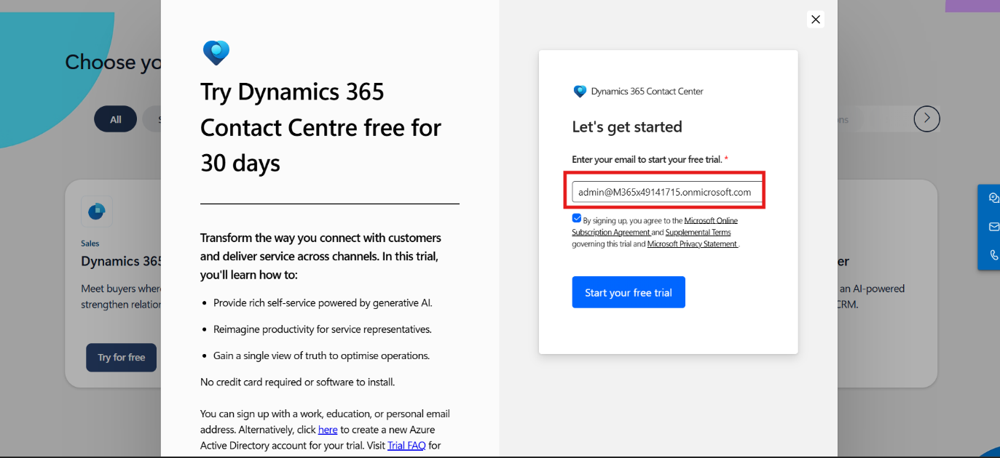
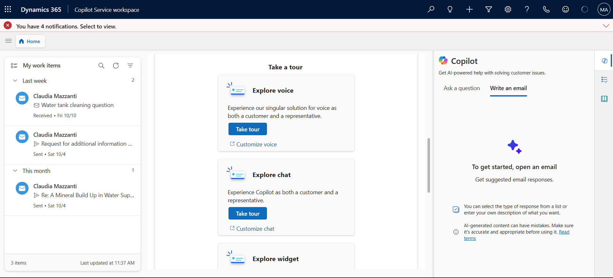
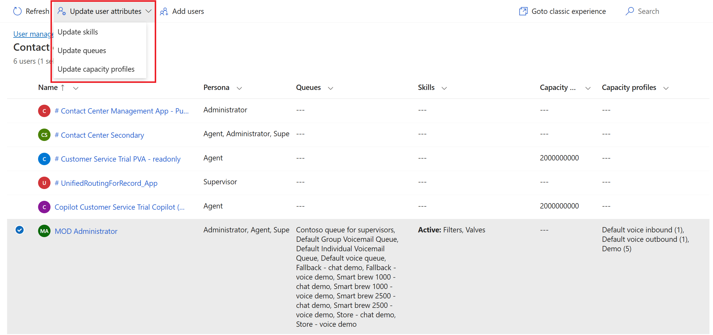
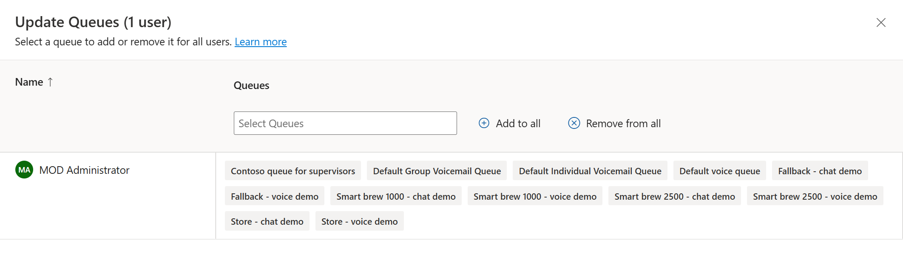

# Lab 1 - Set up your environment 

**Duration:** 20 mins

## Introduction

In this lab, you will learn how to activate the Dynamics 365 Contact
Center trial license and explore the Copilot Service workspace. You will
also navigate through the Copilot Service admin center to manage
channels, view enabled communication options, and update user attributes
such as skills, queues, and capacity profiles.

## Task 1 - Enable Dynamics 365 Contact Center Trial

In this task, you will activate the Dynamics 365 Contact Center trial
license using the Microsoft website and access the Copilot Service
workspace.

1.  Open the Edge browser in the VM and paste the link
    !!https://www.microsoft.com/en-in/dynamics-365/free-trial!! for
    enabling the Dynamics 365 Contact Center **Trial license.**

2.  Scroll down and select **Dynamics 365 Contact Center**. Click on
    **Try for free**.

    

3.  Enter the admin tenant, select the **agreement terms**, and then select
    **Start your free trial**.

    

4.  Select **Country/Region** - **United States**, enter your phone
    number and **submit**.

    

    > **Note:** If navigating to the direct sign-in page, enter the ID password in the field and then click on the **Sign-in** button.

5.  You will be navigated to the **Copilot Service workspace**.

    > **Note** - If you are prompted with a pop-up for using a microphone, click **Allow while visiting the site**. If you are not prompted, you can proceed to the next step.

    

## Task 2 - Explore Channels in Copilot Service Admin Center

In this task, you will navigate to the Copilot Service admin center to
view and manage the available communication channels under Customer
Support.

1.  Click on the **App selector** from the top.

    

2.  Select **Copilot Service admin center** from the list of apps.

    

3.  Select **Channels** under **Customer Support** on the left
    navigation panel.

    

4.  Select **Manage** for **Manage channels**. The Manage Channels page
    appears.

    

5.  You can view the channels that are enabled.

    

## Task 3 – Manage Users and Update Attributes

In this task, you will access the User Management section in the Copilot
Service admin center. You will update user skills, queues, and capacity
profiles to configure user capabilities and workload distribution
effectively.

1.  Select **User management** under **Customer support** in the site
    map.

    

2.  On the page that appears, select **Manage** for **Enhanced user
    management**. The ‘**Contact center users’** view displays the users
    that have been configured in the Power Platform admin center.

    

3.  Hover the pointer over the rows of your **MOD Administrator** users
    and select the check boxes.

    

4.  To update user attributes, select **Update user attributes**, and
    you will see three options available. You can select one of the
    options based on your requirements.

    

5.  **Update skills**: On the dialog box that appears, review and note
    the options available:

    1.  **Add skills to users:** In the **Skills** box, select the
        skills that you want to add, select proficiency, and then
        select **Add to all**. The selected skill and proficiency are
        added to the users list. To have a different proficiency in the
        skills, select one skill at a time.

    2.  **Activate or deactivate**: Select a skill in the **Skills box
        and** select the ellipses to select **Activate for
        all** or **deactivate for all**. Users with a deactivated skill
        will not be considered during assignment if the skill
        requirement of a work item matches the deactivated skill.

    3.  **Remove skills**: To remove a skill from the list of users,
        select the skill in the **Skills** box, and select **Remove from
        all**. Save your changes. The selected skills are removed for
        the users.

    

6.  Click on **Close**.

7.  Now select your **Admin \> Update user attributes \> Update
    queues**.

8.  **Update queues**: On the dialog box that appears, in
    the **Queues** box, review and note the options available.

    

9.  Click on **Close**.

10. Now perform step 7 again and select **the Update capacity profile**.

11. On this dialog box, in the **Capacity profiles** box, select the
    profiles, review and note the options available.

    

12. Click on **Close.**

## Conclusion

By completing this lab, you successfully activated the Dynamics 365
Contact Center trial, explored the Copilot Service workspace, and
learned how to manage users and their attributes, including skills,
queues, and capacity profiles. These steps are essential for setting up
and managing a functional customer support environment within Dynamics
365 Copilot Service.
