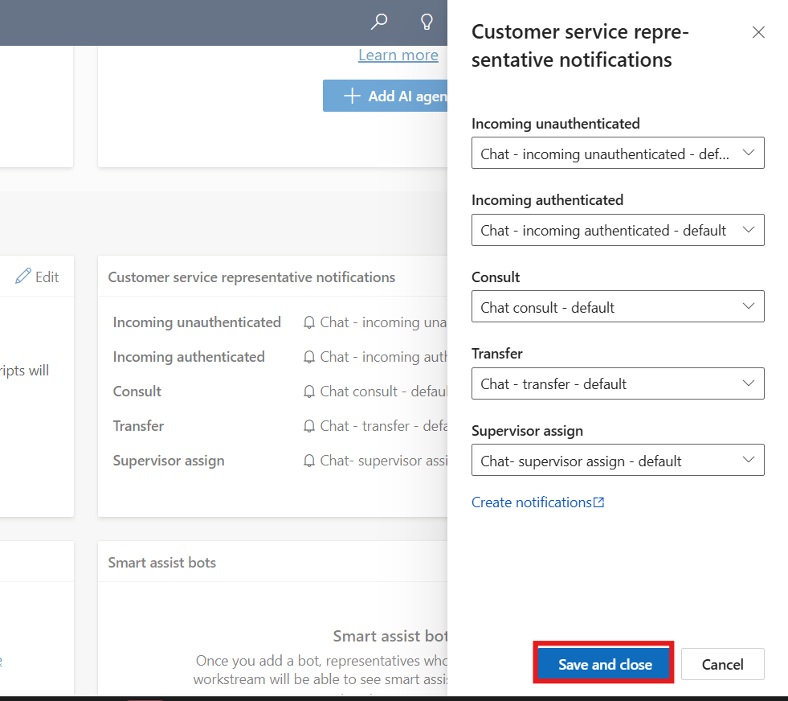

# Lab 10 - Work with Session Templates and associate template with workstreams

### Introduction

In this lab, participants will explore how to create and configure
session templates in Copilot Service admin center and associate them
with workstreams. Session templates are essential for defining how
customer service sessions are managed, including pre-configured
application tabs, agent scripts, and session behaviors. By working
through the tasks, participants will learn to create a new session
template, link it with application tabs and scripts, and finally
associate it with workstreams to streamline customer interactions. This
ensures agents follow consistent workflows while handling customer
cases, improving efficiency and enhancing the overall support
experience.

## Task 1 - Create a session template

daily tasks to resolve customer issues.

1.  Open a new tab in the browser. Sign in to the Power Platform admin
    center - !!https://admin.powerplatform.microsoft.com/!! with the
    credentials provided to execute the lab in the home tab. Select **\>
    Environments\> CustomerService Trial environment\> Environment
    URL.**

    

    

2.  You will be navigated to **Customer Service workspace**. Click on
    **App selector** to display the list of apps.

    

3.  Select **Copilot Service Admin center** from the list of Apps.

    

4.  Select **Workspaces** under Support experience  and then select **Manage** for **Session
    templates**.

    

5.  Select **New** on the **Active Session Templates** page.

    

6.  Specify the following on the **New Session Templates** page on the
    **General** Tab

    1.  **Name** – !!Contoso Session!!

    2.  **Unique Name** - !!msdyn_chat_custom!!

    3.  **Type** - Entity

    4.  **Entity** – Case

    5.  **Title** – !!{CustomerName}!!

    6.  **Communication panel mode** – Hidden

    7.  **Apply session title to anchor tab** – Yes

    8.  Select **Save** from top command bar.

    

## Task 2 - Associate application tabs, agents scripts with session templates

We will associate application tabs that need to open when a session is
started. Agents can’t close these application tabs.

1.  On the session template page in the **Additional Tab** section,
    Select **Add Existing Application Tab Template**. The **Lookup
    Records** pane appears. if option is not visible click on the ellipsis icon and select the option.

    

2.  Search for and select !!Customer Summary!!. Select **Add**. The
    application tabs are added to the session template.

    

    

3.  Select the **Scripts** tab and set the **Enable build
    expression** toggle to **Yes** to define the expression to set an
    agent script as default for a particular session template.

    

4.  Select **Save and close** from top command bar.

## Task 3 - Associate or modify templates with workstreams

1.  In the Copilot Service Admin Center site map,
    select **Workstreams** under customer support.

2.  Select the **Contoso Chat workstream**

    

3.  Scroll down and expand the **Show advanced settings** section and
    then Select **Edit** beside **Sessions.**

    

4.  On the **Sessions** panel that appears, select **Chat session -
    default** in the **Default template** field. Select **Save and
    close** , If the **Save and close** button is disabled, select
    **Cancel**.

    

5.  Select **Edit** beside **Customer service representative
    notifications.**

    

6.  On the **Customer service representative notifications** panel that
    appears, you can select the templates based on your requirements.

7.  Select **Save and close**. If the **Save and close** button is
    disabled, select **Close**.
    
    

### Conclusion

This lab demonstrated the end-to-end process of managing session
templates in Copilot Service. Participants created a custom session
template, configured it with application tabs and agent scripts, and
successfully associated it with a workstream. By completing these steps,
they gained practical skills in customizing session management to
provide structured and guided customer support.
