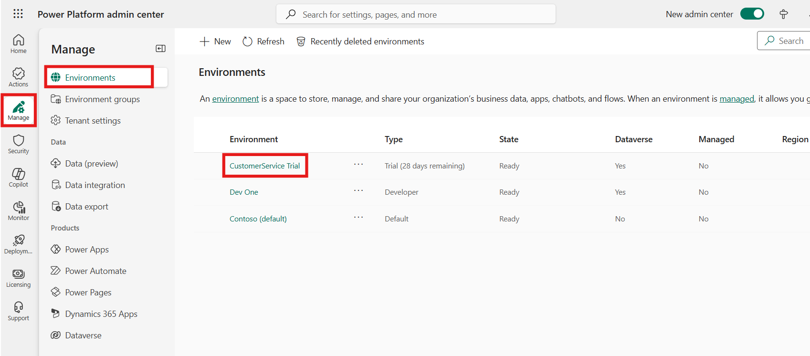
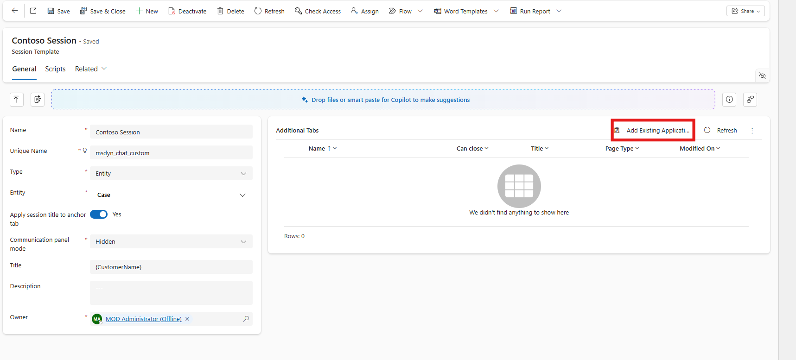
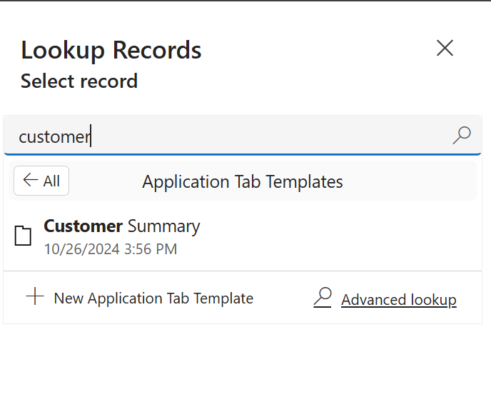
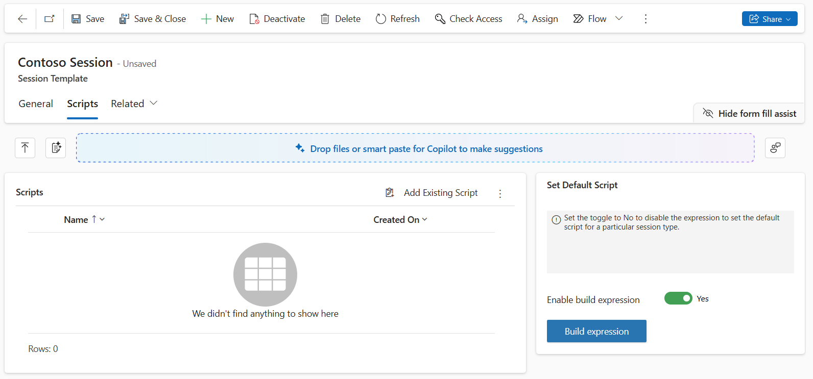

# Lab 10 - Work with session templates and associate templates with workstreams

**Introduction:**

In this lab, you will learn how to create and configure a **Session
Template** in the Copilot Service admin center. Session templates define
how customer cases or conversations are displayed to agents within a
workspace. You will create a session template, associate application
tabs, and configure session settings in a workstream.

## Task 1 - Create a New Session Template

In this task, you will create a new session template named *Contoso
Session* and define its general properties such as name, type, entity,
and title format.

1.  In the site map of Copilot Service admin center,
    select **Workspaces** in **Support experience** group.

2.  On the **Workspaces** page, select **Manage** for **Session
    templates**.

    

3.  Select + **New** on the **Active Session Templates** page.

    

4.  Specify the following on the **New Session Templates** page on the
    **General** Tab

    1.  **Name** – !!Contoso Session!!

    2.  **Unique Name** - !!msdyn_chat_custom!!

    3.  **Type** - Entity

    4.  **Entity** – Case

    5.  **Title** – !!{CustomerName}!!

    6.  **Communication panel mode** – Hidden

    7.  **Apply session title to anchor tab** – Yes

    8.  Select **Save**

        

## Task 2 - Add Application Tabs and Enable Agent Script Expression

In this task, you will add an application tab to the session template
and enable the build expression feature for agent scripts.

1.  On the session template page in the **Additional Tab** section,
    Select **Add Existing Application Tab Template**. The **Lookup
    Records** pane appears.

    

2.  Search and select **Customer Summary**. Select **Add**. The
    application tabs are added to the session template.

    

    

3.  Select the **Scripts** tab and set the **Enable build
    expression** toggle to **Yes** to define the expression to set an
    agent script as default for a particular session template.

    

4.  Select **Save and close**.

## Task 3 - Configure the Session Template in Workstream

In this task, you will assign the newly created session template to an
existing workstream and configure agent notifications.

1.  In the Copilot Service Admin Center site map,
    select **Workstreams**.

2.  Select the **Contoso Chat workstream**

    

3.  Scroll down and expand the **Show advanced settings** section and
    then Select **Edit** beside **Sessions.**

    

4.  On the **Sessions** panel that appears, select **Chat session -
    default** in the **Default template** field. Select **Save and
    close** , If the **Save and close** button is disabled, select
    **Cancel**.

    

5.  Select **Edit** beside **Customer service representative
    notifications.**

    

6.  On the **Customer service representative notifications** panel that
    appears, you can select the templates based on your requirements.

7.  Select **Save and close**. If the **Save and close** button is
    disabled, select **Close**.

    

### Conclusion

By completing this lab, you have successfully created and configured a
**Session Template** in the Copilot Service admin center. You also
linked application tabs, enabled script expressions, and associated the
template with a workstream to streamline agent case management and
improve customer service efficiency.
