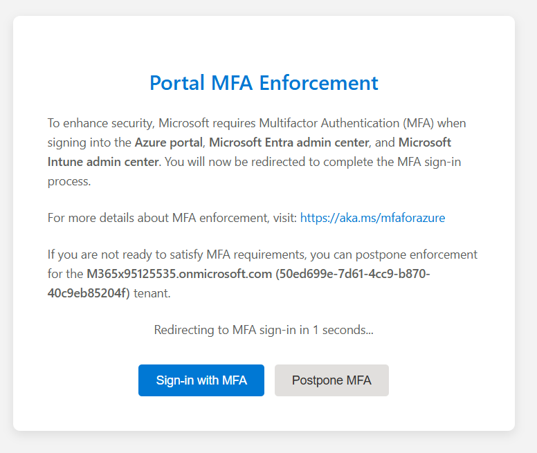
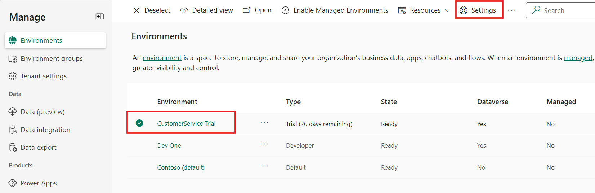
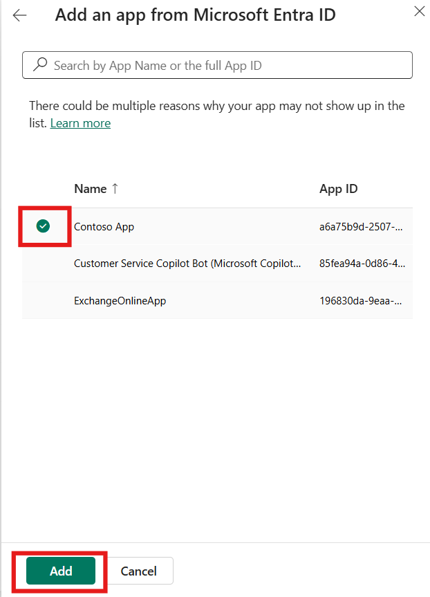
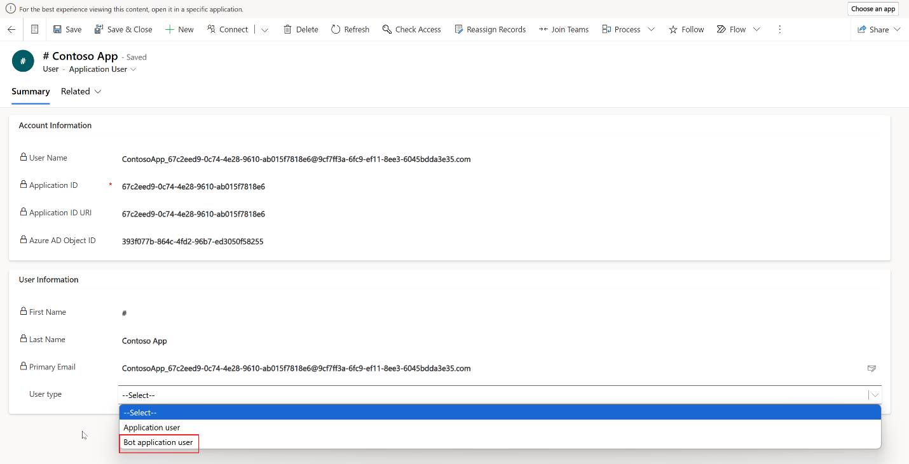
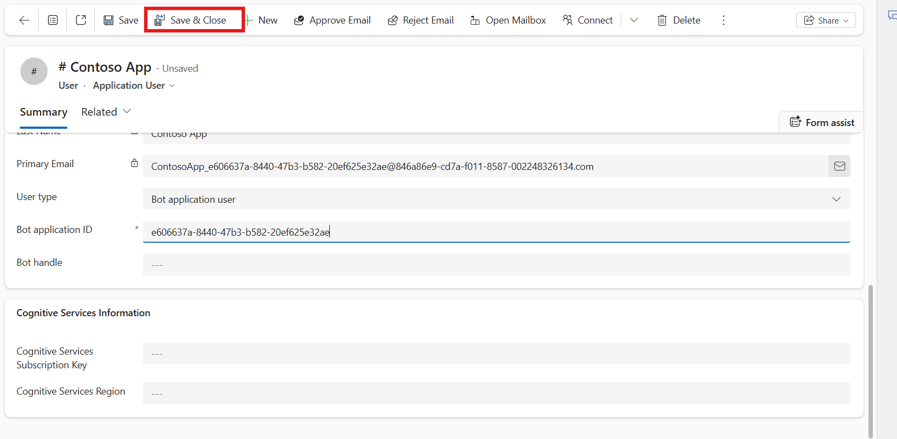
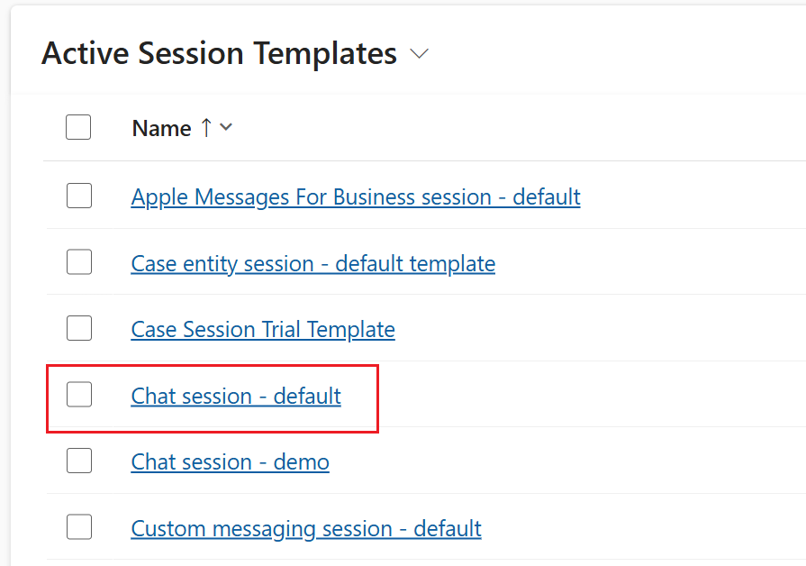

# Lab 11 - Enable Smart assist for the bot framework and guide representatives with scripts​

### Introduction

In this lab, participants will learn how to enable **Smart Assist** for
the bot framework and configure it to provide real-time guidance to
customer service agents in Omnichannel for Customer Service. Smart
Assist helps agents by offering contextual suggestions, enhancing
productivity, and ensuring consistent customer experiences. Participants
will begin by registering an app in Microsoft Entra and configuring the
bot user as an omnichannel agent. Next, they will add the smart assist
bot to a workstream, allowing agents to receive intelligent
recommendations while managing customer interactions. In the second
exercise, participants will focus on guiding agents with predefined
scripts. They will create agent scripts, configure script steps, and
associate these scripts with session templates to deliver structured and
repeatable guidance during customer sessions.

## Exercise 1 - Enable smart assist for the bot framework in Omnichannel for Customer Service

### Task 1 – Register an app in Microsoft Entra

1.  Open a new tab and open Microsoft Entra Admin center -
    !!https://entra.microsoft.com!!. Select **Postpone MFA** on the
    **Portal MFA Enforcement**. Select **Confirm** postponement. Select
    Continue **sign-in without MFA**.

    

    

2. Select Continue sign-in without MFA

    

2.  Under Entra ID, navigate to App registration and then click on the
    **+ New registration.**

    

3.  Enter the name of the app as !!Contoso App!! and click on
    **Register**.

    

4.  You will be navigated to the **Contoso App** page.

    

### Task 2 - Configure the bot user as an omnichannel agent

1.  Open a new tab in the browser and launch the PowerPlatform admin
    center - !!https://admin.powerplatform.com/!!.

2.  Select **Manage \> Environments** on the left navigation pane.

    

3.  Select the **Customer Service Trial** environment and then
    select **Settings**.

    

4.  On the **Settings** page, select **Users + permissions**, and then
    select **Application users**.

5.  On the **Application users** page, select **New app user**.

    

6.  In the **Create a new app user** dialog that opens. Select **Add an
    app**.

    

7.  Select the **Contoso App** and then select **Add**.

    

8.  Enter !!Org!! in the business unit field and select your trial
    environment **Business unit**.

9.  Select **Edit** on the **Security roles** field.

    

10. On the **Add security roles** page, select **Omnichannel
    agent** from the dropdown list and select **Save** to go back and
    then click on **Create** to create a new app.

    

    

11. Go to **Copilot Service Admin Center \> User Management**. Click
    **Manage** at **Users**.

    

12. Select the dropdown for **Enabled Users** and select **Application
    Users**.

    

13. Click on the **Contoso App**.

    

14. Select the dropdown for **Users** below the app name and then select
    **Application Users**.

    

15. Select **Bot Application user** for **User Type**.

    

16. Switch back to the Entra admin center, copy the App ID of the app
    that is created in the previous task.

    

17. For Bot application ID enter the application ID of the app that is
    created in Entra Admin center.

    

18. Select **Save & Close**.

    

### Task 3 - Add a smart assist bot to a workstream

After you create a bot user, you need to add the bot to the workstream
so that agents who use the channel of this workstream can see the
suggestions.

1.  Switch back to Copilot Service admin center, go
    to **Workstreams** in **Customer support**.

2.  Select the workstream – **Contoso Chat Workstream** in which you
    want to add the smart assist bot.

    

3.  Scroll down and expand **Show** **Advanced settings** and
    select **Add bot** in the **Smart Assist bots** area.

    

4.  In the **Add from existing** panel, select a **Contoso App** bot
    user from the list, and then select **Add**.

    

You can add multiple bots to a workstream based on your requirements.

## Exercise 2 - Guide agents with scripts

### Task 1 - Create agent scripts

1.  On the **Copilot Service admin center**,
    select **Productivity** in **Support experience**.

2.  On the **Productivity** page, select **Manage** for **Scripts**.

    

3.  On the **Scripts** page, from top bar select + **New**.

    

4.  On the **New Script** page, specify the following:

    1.  Name – !!Chat session script!!

    2.  Unique Name – !!Contoso_script!!

    3.  Description - !!This agent script is used for chat sessions.!!

5.  Select **Save**. The **Script steps** appear.

    

6.  In the **Script steps** section, select **New Script step**. 

    

7.  Specify the following fields in the **New Script step** form.

    1.  Name - !!Greet the customer!!

    2.  Unique Name - !!Greet_script!!

    3.  **Order** – !!1!!

    4.  **Action type** – Text

    5.  **Text instructions** -
        `Greet the customer with the welcome message`

8.  Select **Save and Close** to add, save, and close the quick-create
    form.

    

9.  Select **Save & Close** to save the changes.

    

### Task 2 - Associate an agent script with a session template

After you configure the agent script and add the field to a form, you
need to associate the agent script with a session template so that the
agent script will load for agents based on the type of session they’ve
opened.

1.  Click on the Workspace under support experience and then
    select **Manage** for **Session templates**.

    

2.  Select the **Chat session** **– default** template.

    

3.  Select the **scripts** tab.

4.  In the **scripts** section, select **Add Existing script**.
    The **Lookup Records** pane appears.

    

5.  In the **Look for Records** box, select the search icon. Select the
    **Chat session script** from the list, and then select **Add**.

    

6.  Select **Save & Close**.

    

The agent script is associated with the session template.

### Conclusion

This lab demonstrated the process of enabling Smart Assist and
configuring agent scripts within Copilot Service. Participants
successfully registered and configured a bot application, added it to a
workstream for delivering intelligent recommendations, and created
structured scripts to guide agents during customer sessions. By
completing these steps, participants gained valuable skills in combining
automation and scripting to enhance agent productivity and deliver
consistent, high-quality customer service experiences.
