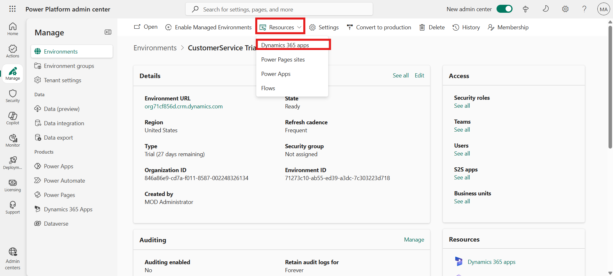
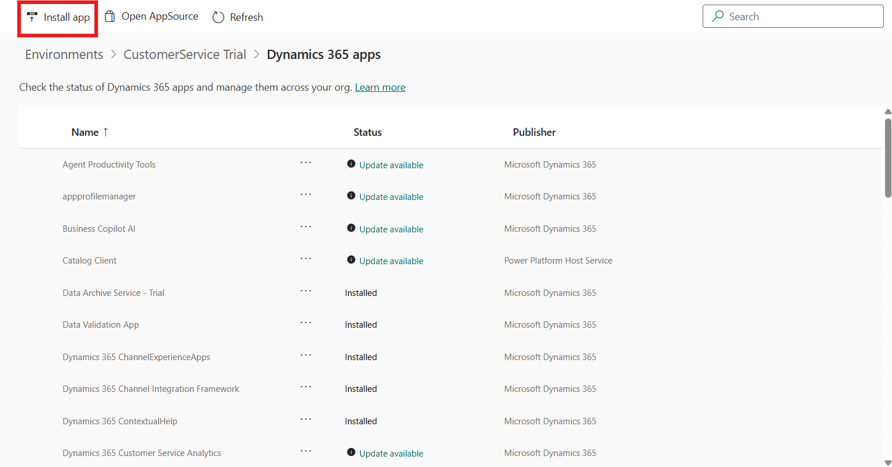
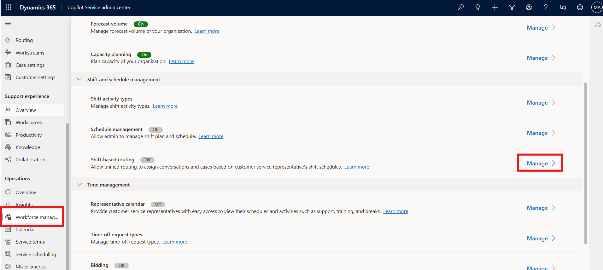
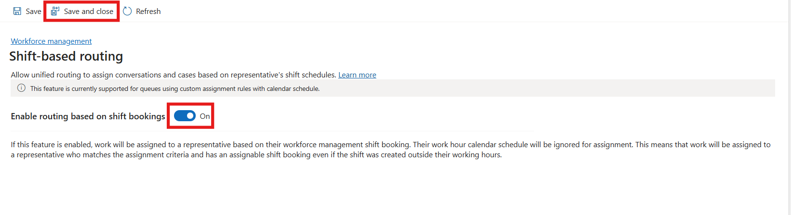

# Lab 12 - Configure Workforce Management and Shift-based Routing 

**Introduction:**

In this lab, you will install the Workforce Management for Customer
Service app from the Power Platform admin center and configure
Shift-based routing in the Copilot Service admin center to optimize
agent availability and workload distribution.

## Task 1 - Install Workforce Management for Customer Service App

In this task, you will access the Power Platform admin center to install
the Workforce Management for Customer Service app. This app enhances
customer service experience by providing scheduling, forecasting, and
workload management capabilities within the Copilot Service environment.

1.  Navigate to your environment in Power Platform admin center -
    !!**https://admin.powerplatform.microsoft.com/**!! with the
    credentials provided to execute the labs.

2.  Navigate to Manage > Environment > ContactCenter service trial.

    

3.  On the command bar, select **Resources** \> **Dynamics 365 apps**.
    The Dynamics 365 apps page is displayed.

    

4.  Click on **Install app** and the select **Workforce Management for
    Customer Service** app. Click on the **Next** button to proceed.

    

    

5.  Select Agree to the terms of service check box, and then
    select **Install**.

    

6.  Wait until the **Workforce Management for Customer Service** is
    installed on the **Dynamics 365 apps** page.

    > **Note** – The installation approximately takes 10 minutes to
  complete.

## Task 2 - Enable Shift-Based Routing

In this task, you will enable the Shift-based routing feature in the
Copilot Service admin center. This feature ensures that work items and
customer cases are automatically routed to agents who are available
during their assigned shifts.

1.  Switch back to the Copilot Service admin center site map, refresh
    the portal, and then select **Workforce
    management** under **Operations**.

2.  In the **Shift**-based **routing (preview)** section,
    select **Manage**.

    

3.  On the **Shift based routing** page, turn on the **Enable routing
    based on shift bookings** toggle, and then select **Save and
    Close**.

    

### Conclusion

By completing this lab, you have successfully installed the Workforce
Management for Customer Service app and enabled Shift-based routing.
These capabilities help align workforce scheduling with real-time
customer support demands, improving efficiency and service delivery
within the Copilot Service environment.
