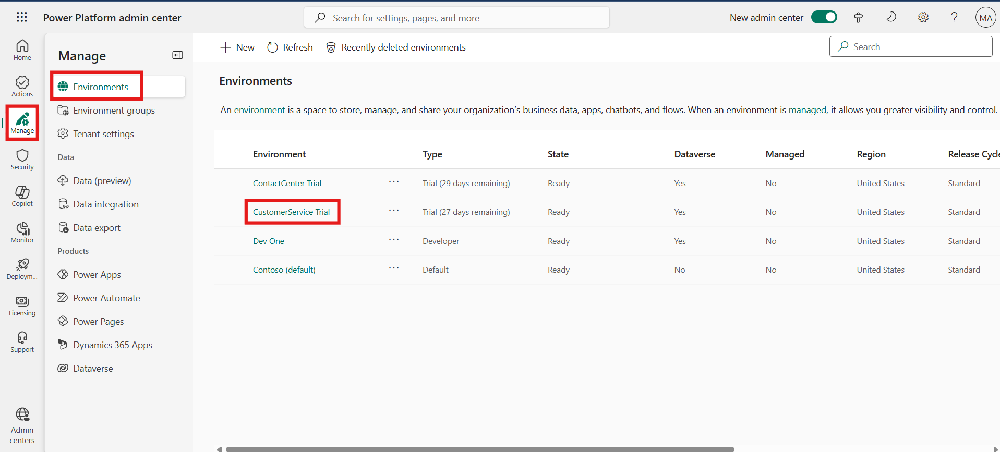

# Lab 12 - Configure routing based on external schedules

### Introduction

In this lab, participants will learn how to configure routing based on
external schedules by enabling Workforce Management and setting up
shift-based routing in Copilot Service. Workforce Management ensures
that customer service operations align with representative availability,
while shift-based routing allows cases to be assigned to representative
according to their scheduled working hours. By completing the exercises,
participants will gain practical experience in installing and enabling
Workforce Management, as well as configuring shift-based routing to
optimize workload distribution and improve service efficiency.

## Task 1 - Enable workforce management

To enable Workforce Management, complete the following steps:

1.  Navigate to your environment in Power Platform admin center -
    !!**https://admin.powerplatform.microsoft.com/**!! with the
    credentials provided to execute the labs.

2.  Navigate to Manage \> Environment \> Customer service trial.

    

3.  On the command bar, select **Resources**  > **Dynamics 365 apps**.
    The Dynamics 365 apps page is displayed.

    

4.  Click on **Install app** and the select **Workforce Management for
    Customer Service** app. Click on the **Next** button to proceed.

    

    

5.  Select Agree to the terms of service check box , and then
    select **Install**.

    

6.  Wait until the **Workforce Management for Customer Service** is
    installed on the **Dynamics 365 apps** page.

    > **Note** – The installation approximately takes 10 minutes to
  complete.

## Task 2 - Enable shift-based routing

1.  Switch back to the Copilot Service admin center site map, refresh
    the portal and then select **Workforce
    management** under **Operations**.

2.  In the **Shift based routing (preview)** section, select **Manage**.

    

3.  On the **Shift based routing (preview)** page, turn on the **Enable
    routing based on shift bookings** toggle, and then select **Save and
    Close**.

    

### Conclusion

This lab guided participants through the process of enabling Workforce
Management and configuring shift-based routing in Copilot Service.
Participants installed the Workforce Management app in Dynamics 365 and
activated shift-based routing to ensure that customer requests are
handled according to representative schedules. Through these steps,
participants gained valuable skills in managing resource availability
and aligning customer service operations with workforce planning for
improved efficiency and service quality.
