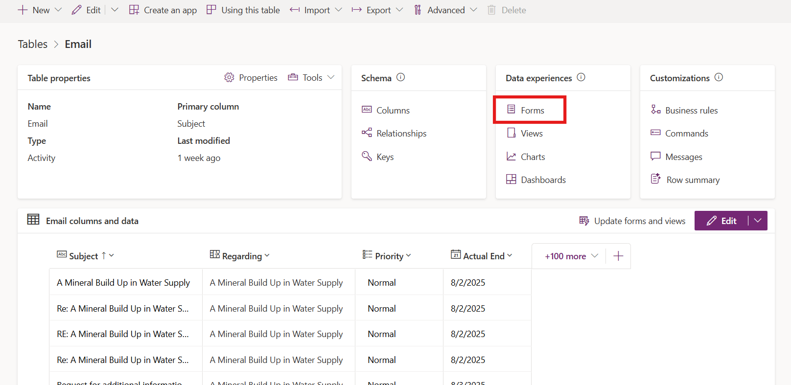
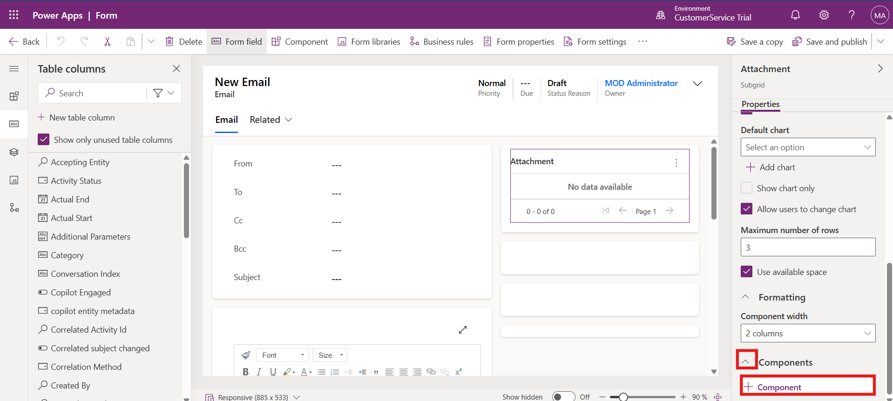

# Lab 13 - Configure Email and enable enhanced experience for email attachments 

## Introduction

In this lab, you will explore how to configure **email settings** and
**attachment controls** in Power Apps and Copilot Service Admin Center.
These configurations improve the agent experience by enabling enhanced
email functionality, managing attachment limits, and customizing email
forms to support multitasking within the timeline view.

## Task 1 - Start a Power Apps Free Trial

In this task, you will sign up for a Power Apps free trial and access
your existing environment to start customizing and configuring email
features.

1.  Open a tab and paste the link of the Power Apps -
    !!https://powerapps.microsoft.com/!! and then click on **Try for
    free** to start a free trial.

    

2.  Enter the admin email ID, select the agreement check box, and click
    on **Start free**.

    

3.  Select the **ContactCenter Trial** environment from top right corner
    of the home page.

    

## Task 2 - Set Enhanced Email as Default Form

In this task, you will access Advanced Settings in Power Apps and set
the Enhanced Email form as the default layout for all email activities.

1.  In Power Apps, go to **Settings** \> **Advanced Settings**.

    

2.  From the top menu, select **Settings** \> **Customizations\>
    Customizations.**

    

3.  Select **Customize the System**.

    

4.  Expand **Entities**.

    

5.  Select and expand **Email** and then select **Forms**.

    

6.  On the command bar, select **Form Order**, and then select **Main
    Form Set** from the drop-down list.

    

7.  The **Form Order** window appears, which displays the enabled email
    forms that are available. If **Enhanced email** doesn’t display at
    the top of the list, use the arrows to move it up so it displays
    first on the list, and then select **OK**.

    

8.  When you complete your updates, select **Publish All
    Customizations** in the top-left corner to display the changes.

    

## Task 3 - Enable Enhanced Email in Copilot Service

In this task, you will enable the Enhanced Email functionality in the
Copilot Service Admin Center, allowing agents to multitask and save
drafts within email pop-up windows.

1.  Open your **Copilot Service Admin Center** App. In the app, go
    to **Settings** \> **Advanced Settings**.

    

2.  Select **System** \> **Email Configuration**. On the **Email
    Configuration** page select **Email Tracking** tab.

    

3.  Scroll down to the **Enhanced email for Timeline** section, and then
    select the check box (Multitask, compose, and save drafts using
    email pop-up windows when creating email from timeline.).

4.  Select **OK** to save your global organizational setting and close
    the window.

    

## Task 4 - Verify Attachment File Size Limit

This task involves reviewing the default file size limit for email
attachments to ensure compliance with organizational policies.

1.  In Power Apps portal, select **Settings \> Advanced Settings.**

    

2.  Click on the down arrow next to **Settings**, select **System \>
    Email Configuration.**

    

3.  Select **Email Configuration Settings**.

    

4.  Scroll down to the **Set file size limit for attachments** section,
    the default value is 5,120. Keep the default value and
    select **OK**.

    

## Task 5 - Change the number of attachments to show per page

You can configure the maximum number of attachments to show per page.
Adjust the settings on the **Formatting** tab of the **List or Chart
properties** dialog. For example, if you set the **Number of
Rows** property to 4, and then have more than four attachments per
email, the rest of the attachments paginate, and you can then use the
arrow buttons to view them.

## Task 6 – Review Blocked File Extensions

This task helps administrators control which file types are restricted
for upload in email attachments.

1.  In Power Apps, go to **Advanced settings**. Click on the down arrow
    next to setting and then select **Administration.**

    

2.  On the Administration window click on the **System Settings**.

    

3.  On the **General** tab, scroll down to **Set blocked file extensions
    for attachments**.

4.  You can type one or more file extensions you want to block. Don’t
    make any change for this scenario, Select **OK**

    

## Task 7 - Add Attachment Control in Email Form

In this task, you will add an Attachment Control to the Email table in
Power Apps, allowing users to manage attachments directly from the form.

1.  In Power Apps - !!**https://make.powerapps.com/**!!, select the
    **ContactCenter Trial** environment that contains your solution.
    Click on the Table from the left-hand menu.

    

2.  In the Table windows, scroll down and select **Email** table.

    

3.  Select **Forms** under **Data experiences**.

    

4.  Click on the **Email** form.

    

5.  Select **Attachment** and the subgrid displays on the right-hand
    side of the page.

    

6.  Scroll down and expand **Components** select **+ Component**.

    

7.  Select **Get More Components**.

    

8.  Scroll down and select **Attachment control** then click on the
    **Add** button.

    

9.  From the top right corner click on the **Save and publish**.

    

### Conclusion

By completing this lab, you configured enhanced email functionality and
customized attachment controls in Power Apps. These settings improve
multitasking, ensure proper email tracking, and enhance the overall
productivity of agents working within the Copilot Service environment.
