# Lab 13 - Configure email and enable enhanced experience for email attachments

### Introduction

In this lab, participants will learn how to configure email
functionality and enable the enhanced experience for email attachments
in Copilot Service and Power Apps. The lab begins with enabling a Power
Apps free trial and configuring the email form order to ensure email is
properly accessible for users. Participants will then enable enhanced
email features, such as multitasking, composing drafts, and using email
pop-up windows from the timeline. Additionally, they will configure
important settings like attachment size limits, number of attachments
per page, and blocked file types. Finally, the lab covers enabling the
enhanced email attachment control to provide a consistent and improved
experience for managing email attachments across forms.

## Task 1 - Enable Power Apps free trial

1.  Open a tab and paste the link of the Power Apps -
    !!https://powerapps.microsoft.com/!! and then Click on **Try for
    free** to start free trial.

    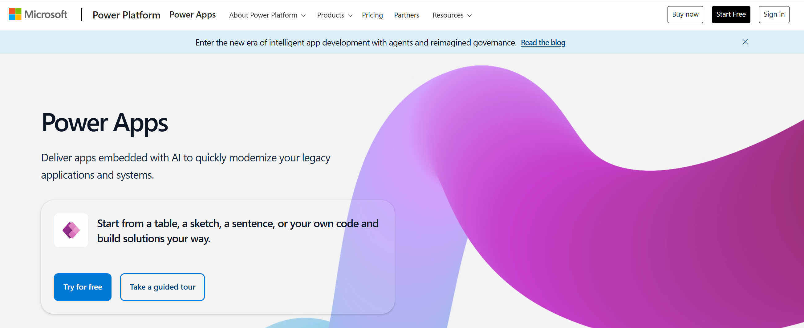

2.  Enter the admin email ID, select the signing up check box and then
    click on **Start free**.

    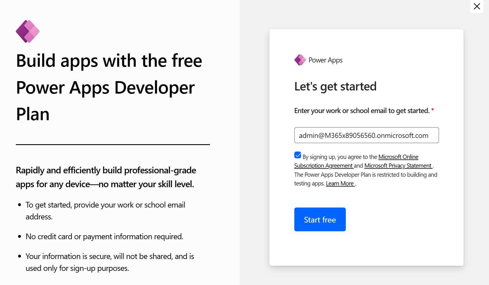

    > **Note:** After clicking **Start trial**, if prompted, provide the
  required preliminary information to begin the trial, then continue
  with the process.

3.  Select the **Customer Service Trial environment** from top right corner
    of the home page.

    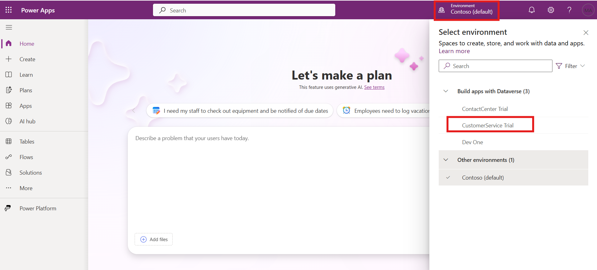

## Task 2 - Configure the email form order

Email must be enabled for users so they can view and access it. When
email is enabled, it shows as an option on the command bar.

1.  In Power Apps, go to **Settings** \> **Advanced Settings**.

    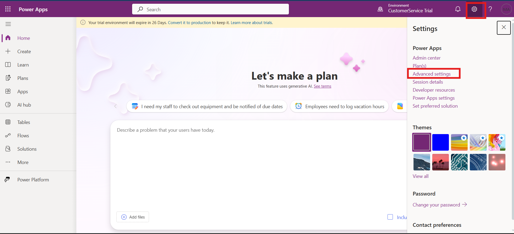

2.  From the top menu, select **Settings** \> **Customizations\>
    Customizations.**

    

3.  Select **Customize the System**.

    

4.  Expand **Entities**.

    

5.  Select and expand **Email** and then select **Forms**.

    

6.  On the command bar, select **Form Order**, and then select **Main
    Form Set** from the drop-down list.

    

7.  The **Form Order** window appears, which displays the enabled email
    forms that are available. If **Enhanced email** doesn’t display at
    the top of the list, use the arrows to move it up so it displays
    first on the list, and then select **OK**.

    

8.  When you complete your updates, select **Publish All
    Customizations** in the top-left corner to display the changes.

    

## Task 3 - Enable the enhanced email experience

Enhanced email is the default setting, but you must enable email for
users to access and use the features.

1.  Open your **Copilot Service Admin Center** App. In the app, go
    to **Settings** \> **Advanced Settings**.

    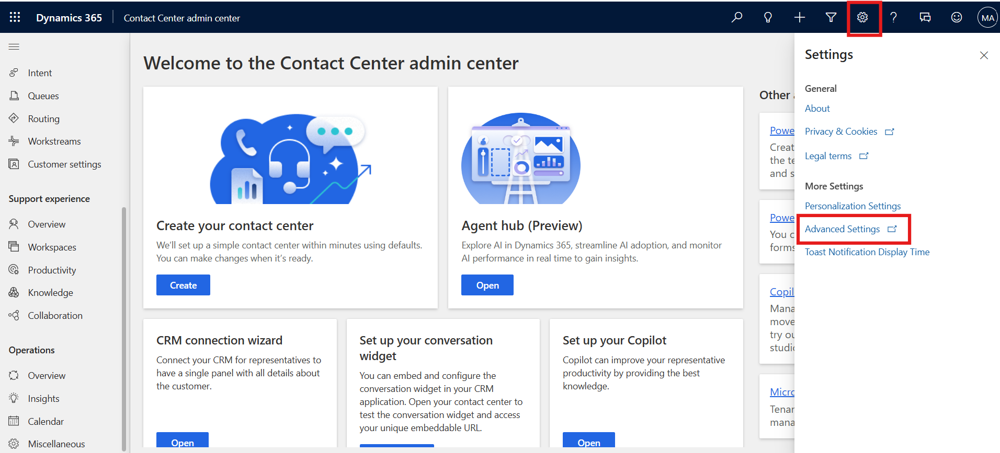

2.  Select **System** \> **Email Configuration**. On the **Email
    Configuration** page select **Email Tracking** tab.

    

3.  Scroll down to the **Enhanced email for Timeline** section, and then
    select the check box (Multitask, compose, and save drafts using
    email pop-up windows when creating email from timeline.).

4.  Select **OK** to save your global organizational setting and close
    the window.

    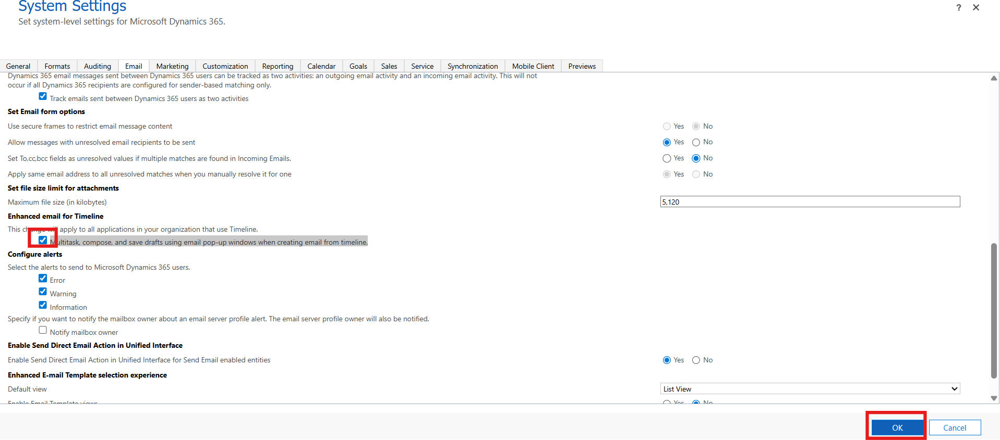

## Task 4 - Configure email attachment size limitations

You can manage file size limits for email file attachments by completing
the following steps:

1.  In Power Apps portal, select **Settings \> Advanced Settings.**

    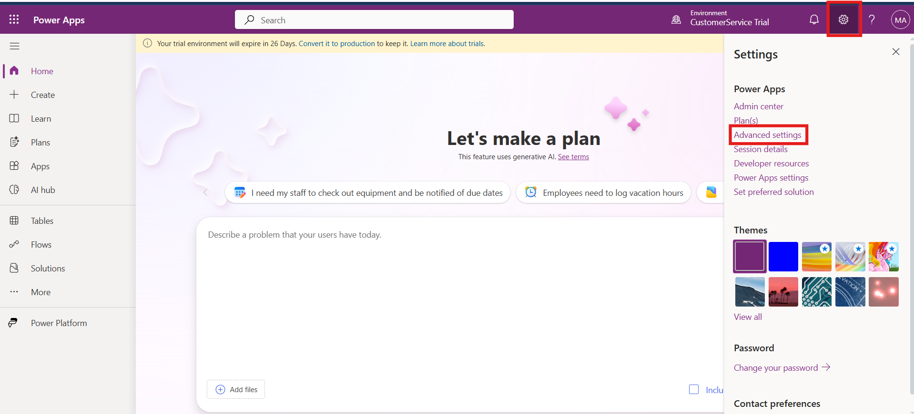 

2.  Click on the down arrow next to **Settings**, select **System \>
    Email Configuration.**
    
    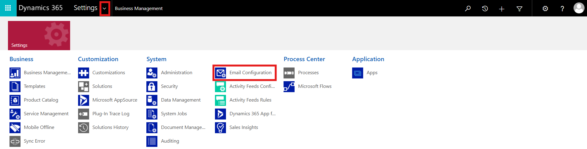

3.  Select **Email Configuration Settings**.

    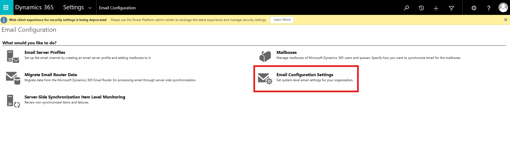

4.  Scroll down to the **Set file size limit for attachments** section,
    the default value is 5,120. Keep the default value and
    select **OK**.

    

## Task 5 - Change the number of attachments to show per page

You can configure the maximum number of attachments to show per page.
Adjust the settings on the **Formatting** tab of the **List or Chart
properties** dialog. For example, if you set the **Number of
Rows** property to 4, and then have more than four attachments per
email, the rest of the attachments paginate and you can then use the
arrow buttons to view them.

## Task 6 - Manage blocked attachment file types

You can configure the attachment file types you want to block to prevent
users from uploading certain files.

1.  In Power Apps, go to **Advanced settings**. Click on the down arrow
    next to setting and then select **Administration.**

    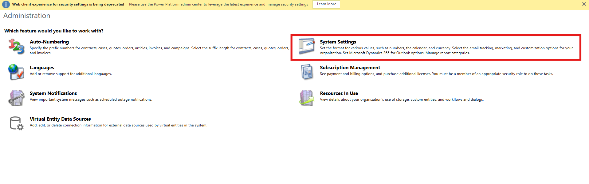

2. On the Administration window click on the **System Settings**.

    

2.  On the **General** tab, scroll down to **Set blocked file extensions
    for attachments**.

3.  You can type one or more file extensions you want to block. Don’t
    make any change for this scenario, Select **OK**

    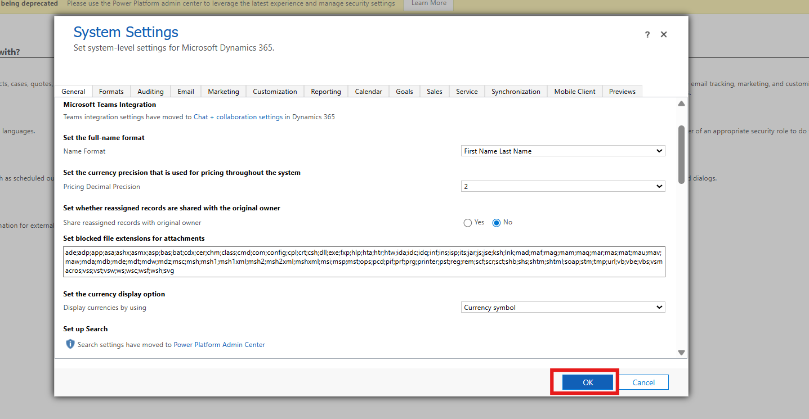

## Task 7 - Enable enhanced experience for email attachments

You can enable the enhanced email attachment control for forms to
provide a consistent email attachment experience to representative. Do
the following steps:

1.  In Power Apps - !!**https://make.powerapps.com/**!!, select the
    **Customer Service Trial** environment that contains your solution.
    Click on the Table from the left hand menu.

    

2.  In the Table windows, scroll down and select **Email** table.

    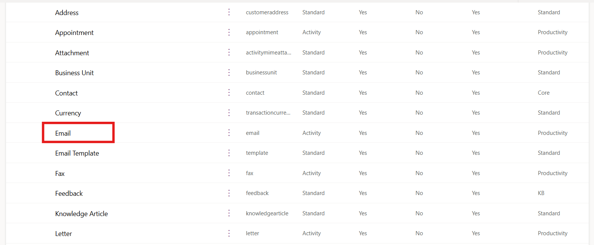

3.  Select **Forms** under **Data experiences**.

    

4.  Click on the **Email** form.

    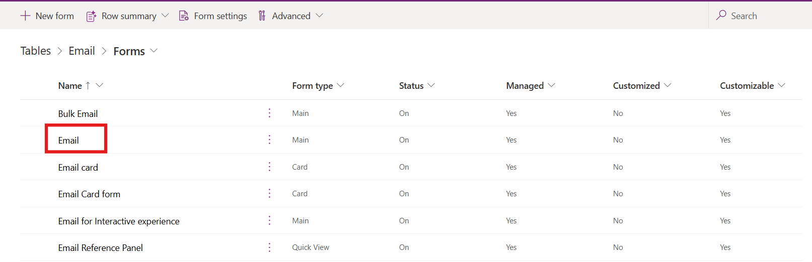

5.  Select **Attachment** and the subgrid displays on the right hand
    side of the page

    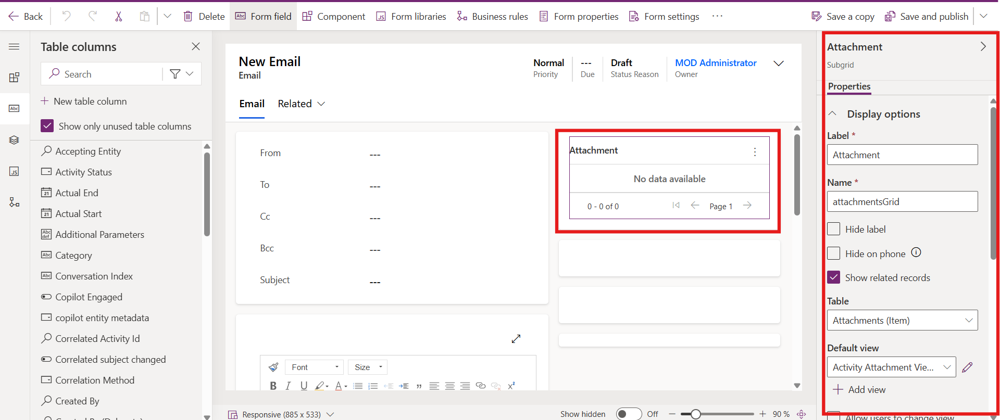

6.  Scroll down and expand **Components** select **+ Component**.

    

7.  Select **Get More Components**.

    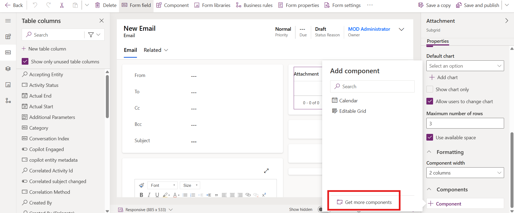

8.  Scroll down and select **Attachment control** then click on the
    **Add** button.

    

9.  From the top right corner click on the **Save and publish**.

    

### Conclusion

This lab provided hands-on experience with configuring email and
enhancing the email attachment experience in Power Apps and Copilot
Service. Participants successfully enabled email functionality,
customized form order, and activated enhanced email features for
improved usability. They also learned how to manage attachment size
limits, configure the number of attachments per page, and set blocked
file types to maintain security and efficiency. By enabling the enhanced
attachment control, participants ensured a streamlined and consistent
attachment experience for representative, contributing to better
productivity and more effective customer service.
