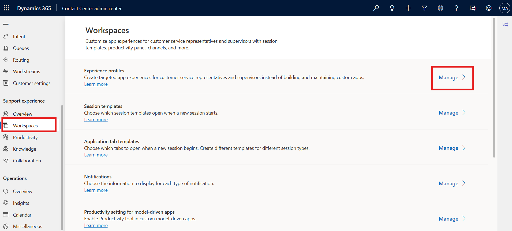
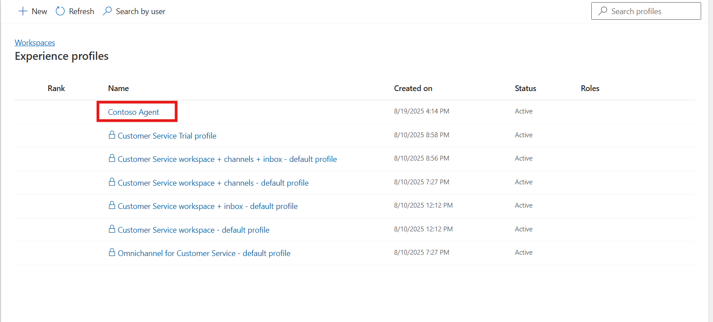

# Lab 14 - Configure the Inbox setting for representatives 

**Introduction:**

In this lab, you will configure the **Inbox settings** and create
**customized views** for agents in the Copilot Service Admin Center. The
Inbox helps agents efficiently manage customer interactions such as
emails, cases, and conversations from a unified workspace. You will
explore existing configurations, enable Inbox functionality (if not
enabled), and create a new multiple-view setup for better email
management.

## Task 1 - Review and Enable Inbox Settings

In this task, you will navigate to the **Contoso Agent Experience
Profile** in the Copilot Service Admin Center and verify if the **Inbox
feature** is enabled. You will also explore available configuration
options for record types and visibility.

1.  On the Copilot Service admin center app, under **Support
    experience**, select **Workspaces**.

2.  In **Experience profiles** section, select **Manage**.

    

3.  Select the **Contoso Agent** profile.

    

4.  Scroll down and select **Edit** in **Inbox** section.

    

5.  On the **Inbox Settings** page, check if the **Enable Inbox** toggle
    is already enabled. If not, enable the toggle.

    

6.  Select a **Closed work items** view and select **Edit** to explore
    the existing view.

    

7.  For this lab guide we are not changing any configuration,
    Participants can explore below given options. Click on the Save and
    Close button.

    - **Name:** Specify a name that shows in the inbox. Alphanumeric
      values are valid names.

    - **Record Type:** Select the record types for which the settings
      need to be applied. You can select more than one record type.

    - **Agent Visibility**: Select one of the following options to show
      or hide the view of agents:

      - **Show**

      - **Hide**

      

## Task 2 - Create a Multiple View in Inbox

In this task, you will create a new **Inbox view** called “Multiple
View” to help agents organize their incoming and assigned emails
efficiently. This setup enhances productivity by segmenting email
records into logical views.

1.  Go to the **Contoso Agent** Agent experience profile.

2.  On the **Inbox** card, select **Edit**. The **Inbox** page is
    displayed.

    

3.  Toggle **Enable Inbox** to **on** if it isn’t already on, and then
    select **+ Add**. Add **a new view** page is displayed.

    

4.  On the **Add a new view** page, enter the following details:

    - **Name**: !!Multiple View!!

    - **Agent visibility**: Select **Show**

    - **Record type**: Select **Email**

    

5.  For each record type, choose one of the following settings. The
    settings are different for each record type. Select **Simple** and
    select.

    - Emails sent to me

    - Emails Assigned to me

    

6.  Select **Save and close**.

    

7.  Select **Save and close** again.

    

### Conclusion:

By completing this lab, you explored and configured **Inbox settings**
and created a **Multiple View** for the Contoso Agent profile in the
Copilot Service Admin Center. These configurations enhance agent
productivity by centralizing communication, enabling quick access to be
assigned or received emails, and improving overall workspace efficiency.
