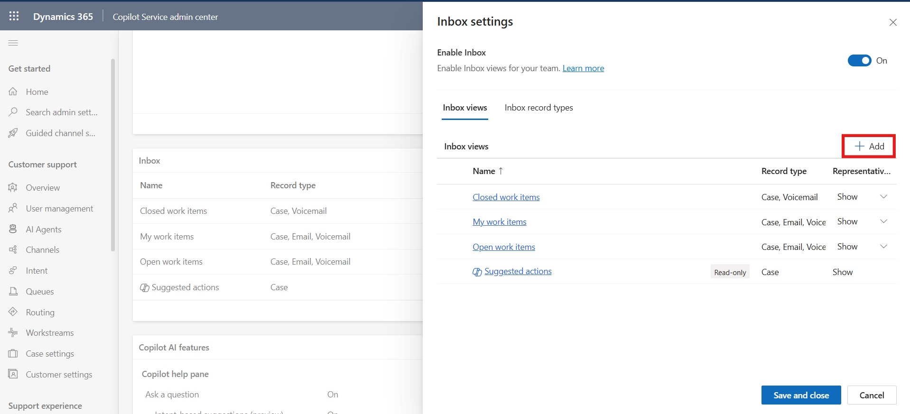
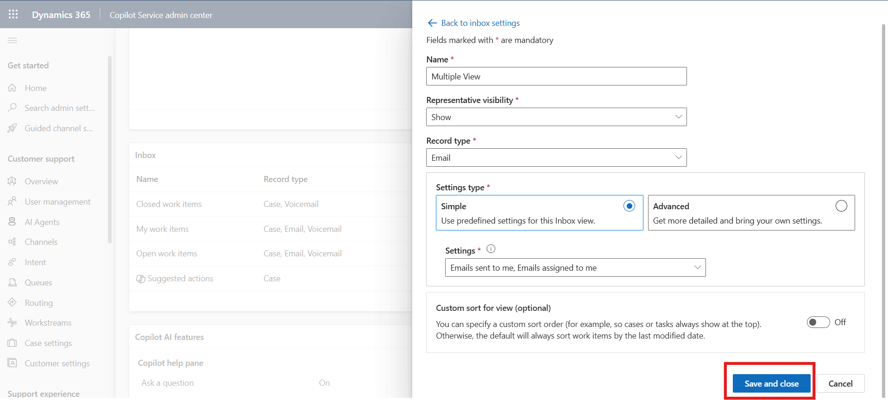

# Lab 14 - Configure the inbox setting for representatives 

### Introduction

In this lab, participants will learn how to configure inbox settings for
representatives in Copilot Service by editing the representatives
experience profile. The inbox provides a centralized workspace where
representatives can manage their cases, conversations, emails, and
voicemails more effectively. The lab begins with exploring the inbox
configuration options, such as enabling the inbox, reviewing closed work
item views, and adjusting record type visibility. Participants will then
configure a custom inbox view that consolidates different record types
into a single interface, enabling representatives to easily track and
manage their assigned work items.

## Task 1 - Exploring the inbox setting for representatives

You can configure the inbox in Contact Center admin center or Copilot
Service admin center by editing the representatives experience profile
to meet your preferred inbox settings.

1.  On the Copilot Service admin center app, under **Support
    experience**, select **Workspaces**.

2.  In **Experience profiles** section, select **Manage**.

    

3.  Select the **Contoso Agent** profile.

    

4.  Scroll down and select **Edit** in **Inbox** section.

    

5.  On the **Inbox Settings** page, check if the **Enable Inbox** toggle
    is already enabled. If not, enable the toggle.

    

6.  Select a **Closed work items** view and select **Edit** to explore
    the existing view.

    

7.  For this lab guide we are not changing any configuration,
    Participants can explore below given options. Click on the Save and
    Close button.

    - **Name:** Specify a name that shows in the inbox. Alphanumeric
      values are valid names.

    - **Record Type:** Select the record types for which the settings
      need to be applied. You can select more than one record type.

    - **Representatives** **Visibility**: Select one of the following
      options to show or hide the view to representatives:

      - **Show**

      - **Hide**

      

## Task 2 - Configure custom views for the inbox

You can configure a customized view for the inbox so that
representatives can see their cases, conversations, emails, and
voicemails all in a single view.

To configure multiple views for the inbox, complete the following steps.

1.  Go to the **Contoso Agent** representatives experience profile.

2.  On the **Inbox** card, select **Edit**. The **Inbox** page is
    displayed.

    

3.  Toggle **Enable Inbox** to **On** if it isn’t already on, and then
    select **+ Add**. The **Add a new view** page is displayed.

    

4.  On the **Add a new view** page, enter the following details:

    - **Name**: !!Multiple View!!

    - **Representatives visibility**: Select **Show**

    - **Record type**: Select **Email**

    

5.  For each record type, choose one of the following settings. The
    settings are different for each record type. Select **Simple** and
    select

    - Emails sent to me

    - Emails Assigned to me

    

6.  Select **Save and close**.

    

7.  Select **Save and close** again.

    

### Conclusion

This lab demonstrated how to configure and customize inbox settings
for representatives in Copilot Service. Participants explored the
available inbox options, enabled the feature if required, and created
a custom inbox view to display relevant records such as emails and
assigned items. By completing these steps, participants gained
practical experience in tailoring the representatives inbox to improve
visibility, enhance productivity, and streamline case and
communication management.
