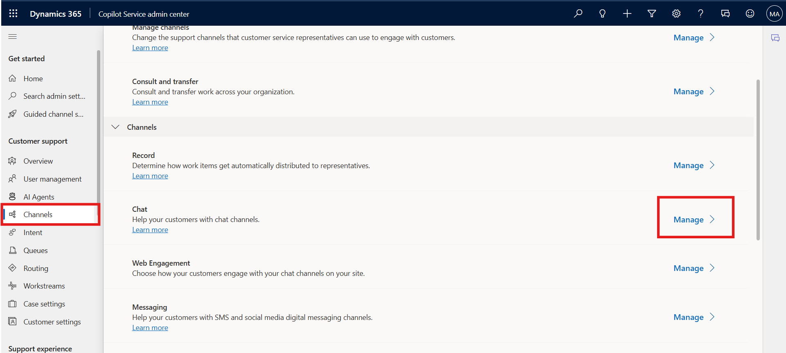
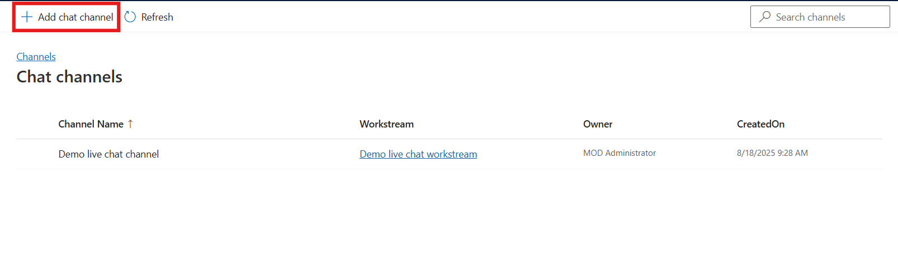
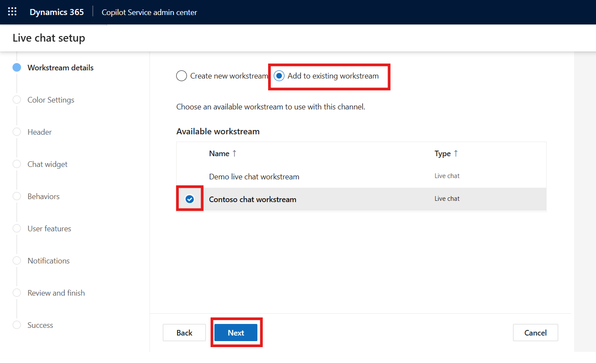
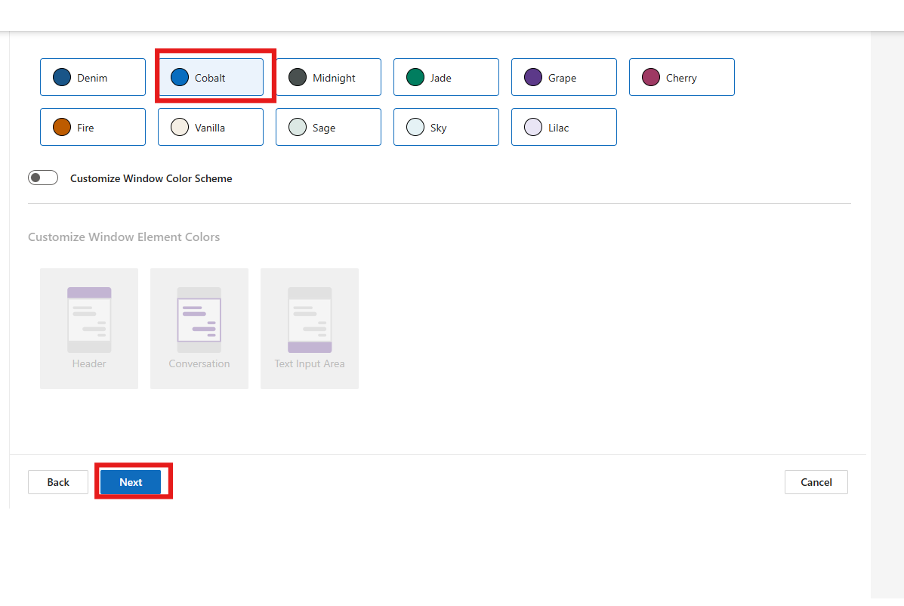
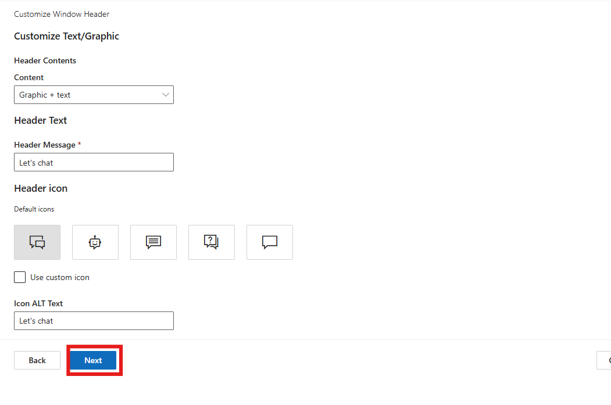
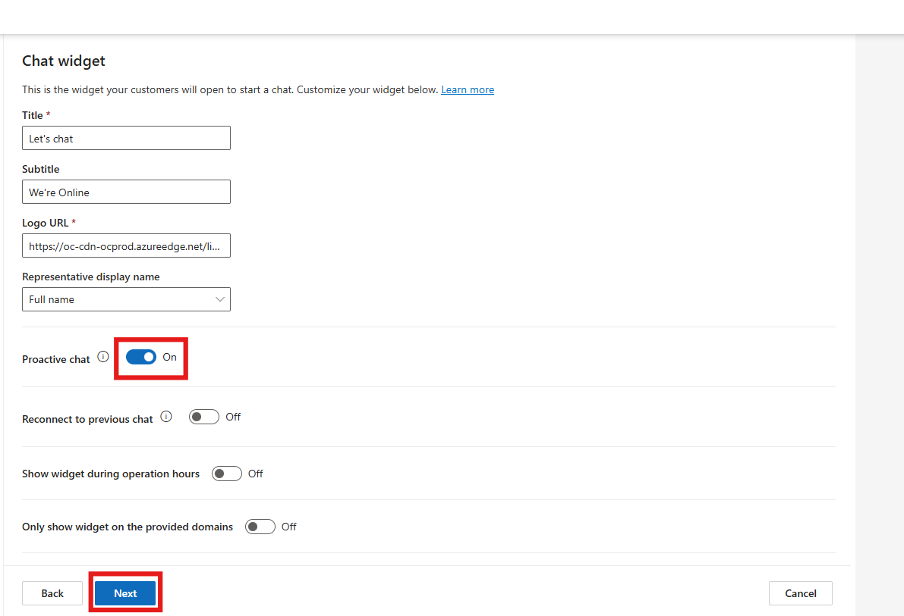
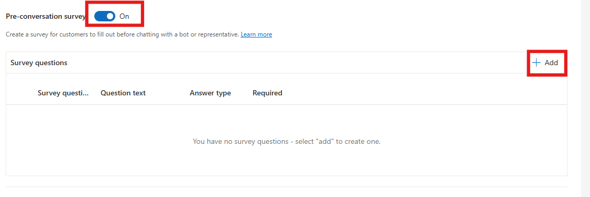
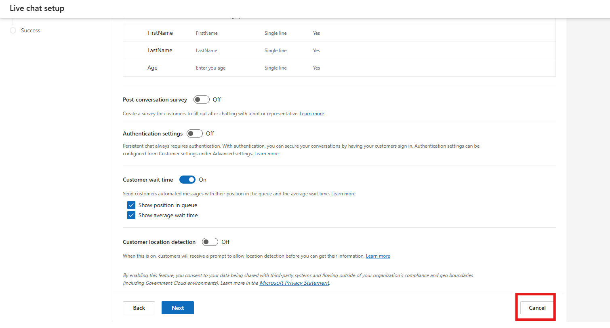

# Lab 15 - Configure a chat widget in Copilot Service admin center 

### Introduction

In this lab, you will learn how to **create and configure a chat
channel** within the **Copilot Service Admin Center**. A chat channel
enables real-time customer engagement through a web-based widget. You
will configure the channel details, associate it with a workstream,
customize the chat widget’s appearance, and define automated and survey
messages.

In this task, you will create a new chat channel named **Contoso Chat
Widget** in the Copilot Service Admin Center. You will specify the
language, associate the chat channel with an existing workstream, and
define visual and behavioral settings.

1.  Navigate to Copilot Service admin center,
    select **Channels** in **Customer support**. The **Channels** page
    appears.

2.  Select **Manage** for **Chat**. The **Chat channels** page appears.

    

3.  Select Add **chat channel**.

    

4.  On the **Channel details** page,

    - Name – !!**Contoso Chat Widget**!!

    - Language – **English – United States**

    - Keep the default values for the rest of the settings.

    - Select **Next.**

    

5.  On the workstream details page.

    - Select **Add to Existing Workstream**

    - Select **Contoso Chat Workstream**

    - Select **Next**

    

6.  On the **Color Settings** page, select the **Cobalt** theme and then
    select **Next**.

    

7.  Select **Next** on the **Header** page.

    

8.  On the **Chat Widget** page, leave the details as it is. Enable the
    **Proactive chat** toggle to **Yes.** Select **Next.**

    

9.  On the **Behaviors** page, under **Custom automated messages** –
    Select **Add a message.**

    

10. On **Add automated message** pane, select a trigger – **Agent
    assigned to conversation** from the **Message trigger** dropdown
    list.

11. In the **Automated message** box, type the message – !!**Hi, how can
    I help you?**!! to be displayed.

12. Select **Confirm**.

    

13. Enable the **Pre-conversation survey.** Select **Add**

    

14. Enter the details.

    - **Survey question name:** !!ContosoConsent!!

    - **Question text**: !!We collect demographic data. Please confirm
      whether you agree to provide the basic information.!!

    - **Answer type –** !!User consent!!

    - **Required -** Yes

    - Select **Confirm**.

    

15. Select **Add** again.

    - **Survey question name:** !!FirstName!!

    - **Question text**: !!FirstName!!

    - **Answer type –** Single line.

    - **Required -** Yes

    - Select **Confirm**.

    

16. Select **Add** again.

    - **Survey question name:** !!LastName!!

    - **Question text**: !!LastName!!

    - **Answer type –** Single line.

    - **Required -** Yes

    - Select **Confirm**.

    

17. Select **Add** again.

    - **Survey question name:** !!Age!!

    - **Question text**: !!Enter your Age!!

    - **Answer type –** Single line.

    - **Required -** Yes

    - Select **Confirm**.

        

18. Set the toggle for **post-conversation survey** to **Off**.

    > **Note - Authentication settings** option is enabled by default.
    
    Select drop-down under **Authentication name** and select **Create authentication setting.** 
    The steps outlined below can be performed only upon acquiring a paid license for Power Pages so that the custom certificates can be uploaded to acquire a public Key URL.
    A Chat widget is then created. You can click on **Cancel** for this lab as we have explored how to create a chat widget in Contact Center Trial.

    

### Conclusion

By completing this lab, you have created a **Contoso Chat Widget** in
the Copilot Service Admin Center, associated it with a **workstream**,
customized the **theme**, configured **automated messages**, and added a
**pre-conversation survey**. These steps simulate how organizations can
set up customer engagement chat experiences for real-time assistance.
