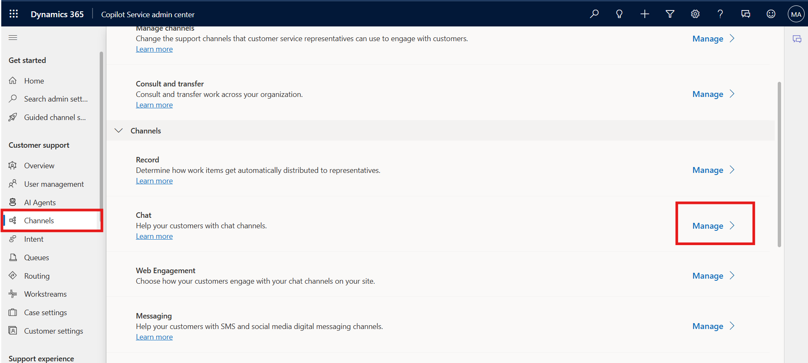
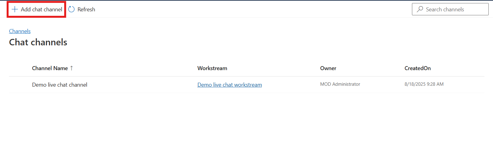
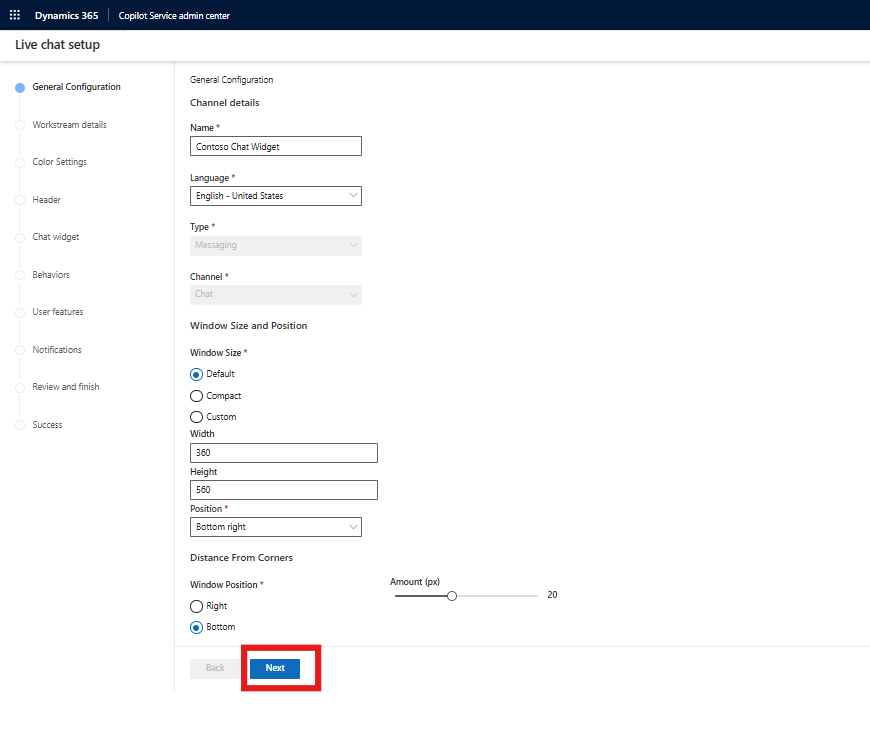
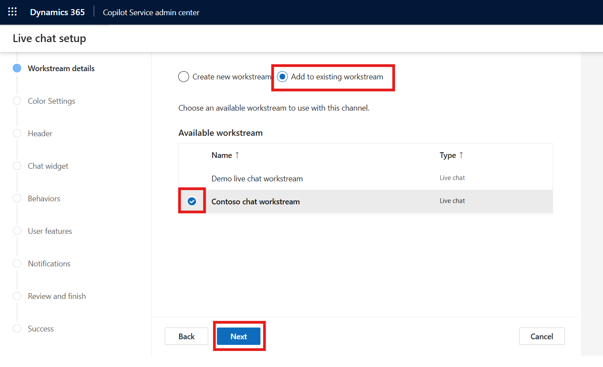
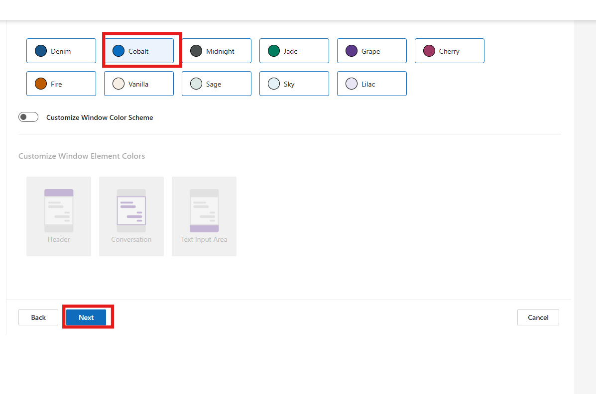
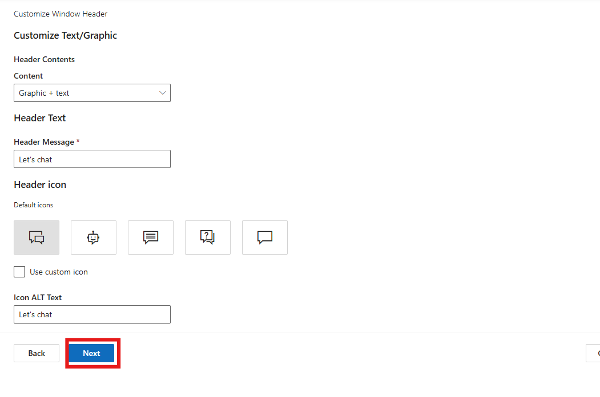
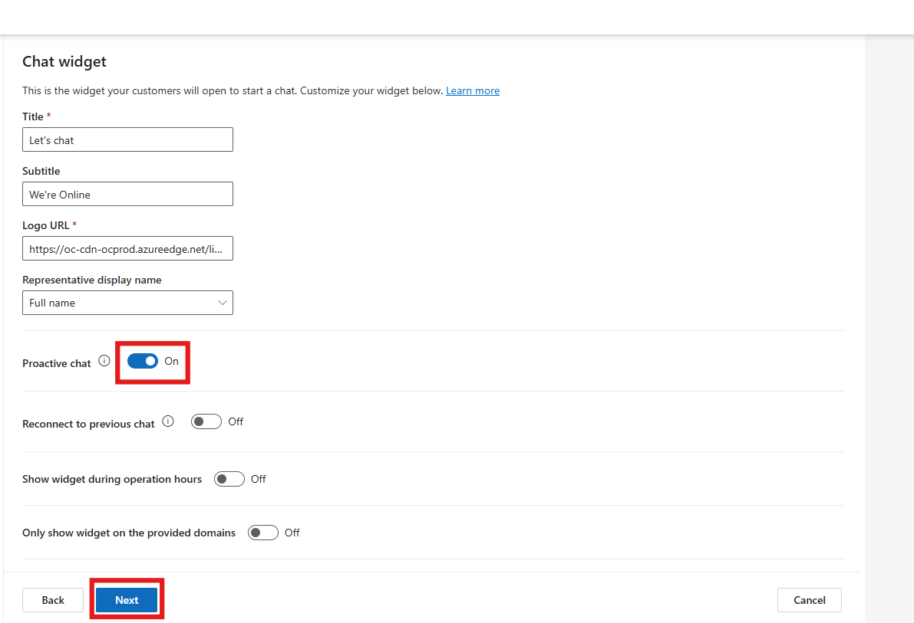
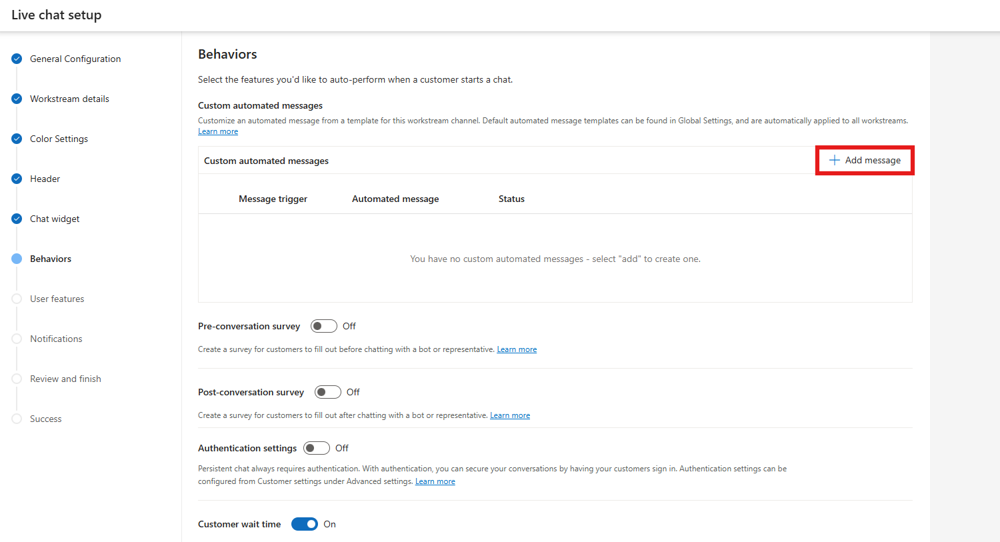
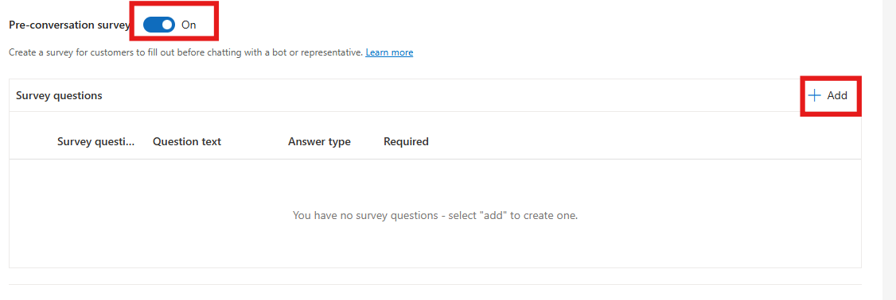
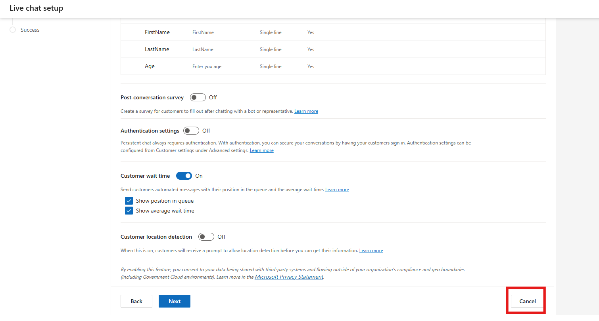

# Lab 15 - Configure a chat widget in Dynamics 365 Customer Service

### Introduction

In this lab, participants will learn how to configure a chat widget in
Dynamics 365 Customer Service using the Copilot Service admin center. A
chat widget allows organizations to provide real-time support to
customers directly on their websites or applications. The lab walks
through the process of creating a chat channel, associating it with an
existing workstream, and customizing its appearance with themes and
proactive chat messages. Participants will also configure
pre-conversation surveys to collect essential information from customers
before a chat begins, ensuring agents have the necessary context to
deliver personalized support.

1.  Navigate to Copilot Service admin center,
    select **Channels** in **Customer support**. The **Channels** page
    appears.

2.  Select **Manage** for **Chat**. The **Chat channels** page appears.

    

3.  Select **Add chat channel**.

    

4.  On the **Channel details** page,

    - Name – !!**Contoso Chat Widget**!!

    - Language – **English – United States**

    - Keep the default values for the rest of the settings.

    - Select **Next.**

        

5.  On the workstream details page.

    - Select **Add to Existing Workstream**

    - Select **Contoso Chat Workstream**

    - Select **Next**

    

6.  On the **Color Settings** page, select the **Cobalt** theme and then
    select **Next**.

    

7.  Select **Next** on the **Header** page.

    

8.  On the **Chat Widget** page, leave the details as it is. Enable the
    **Proactive chat** toggle to **Yes.** Select **Next.**

    

9.  On the **Behaviors** page, under **Custom automated messages** –
    Select **Add a message**

    

10. On **Add automated message** pane, select a trigger – **Agent
    assigned to conversation** from the **Message trigger** dropdown
    list.

11. In the **Automated message** box, type the message – !!**Hi, how can
    I help you?**!! to be displayed.

12. Select **Confirm**.

    

13. Enable the **Pre-conversation survey.** Select **Add**

    

14. Enter the details

    - **Survey question name:** !!ContosoConsent!!

    - **Question text**: !!We collect demographic data. Please confirm
      whether you agree to provide the basic information.!!

    - **Answer type –** !!User consent!!

    - **Required -** Yes

    - Select **Confirm**.

    

15. Select **Add** again

    - **Survey question name:** FirstName

    - **Question text**: FirstName

    - **Answer type –** Single line

    - **Required -** Yes

    - Select **Confirm**.

    

16. Select **Add** again

    - **Survey question name:** LastName

    - **Question text**: LastName

    - **Answer type –** Single line

    - **Required -** Yes

    - Select **Confirm**.

    - 

17. Select **Add** again

    - **Survey question name:** Age

    - **Question text**: Enter your Age

    - **Answer type –** Single line

    - **Required -** Yes

    - Select **Confirm**.

    

18. Set the toggle for **Post-conversation survey** to **Off**.

    > **Note - Authentication settings** option is enabled by default. Select
drop-down under **Authentication name** and select **Create
authentication setting.** The steps outlined below can be performed only
upon acquiring a paid license for Power Pages so that the custom
certificates can be uploaded to acquire a public Key URL.

    A Chat widget is then created. You can click on **Cancel** for this lab
    as we have explored how to create a chat widget in Customer Service
    Trial.

    

### Conclusion

This lab demonstrated how to create and configure a chat widget in
Dynamics 365 Customer Service. Participants successfully set up a chat
channel, linked it to a workstream, and customized it with proactive
chat messages and pre-conversation surveys to gather customer
information. Through these steps, they gained hands-on experience in
enhancing customer engagement by enabling interactive, real-time support
channels that improve both customer satisfaction and agent efficiency.
