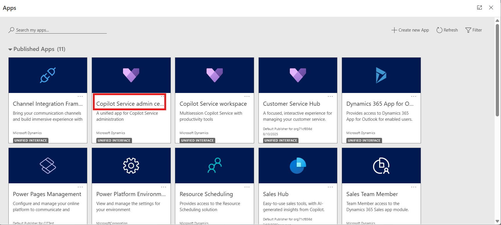
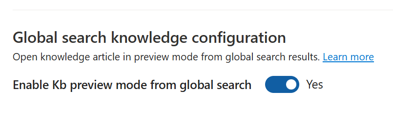

# Lab 16 - Set up Knowledge Management

### Introduction

In this lab, participants will learn how to set up and configure
Knowledge Management in Dynamics 365 Customer Service. Knowledge
Management enables organizations to centralize information, making it
easier for agents to access and share knowledge articles during customer
interactions. The lab covers configuring record types for knowledge
search, adjusting general settings such as feedback and search display
options, and defining authoring languages. Participants will also create
categories to structure knowledge content, configure filters for
personalized search experiences, and review portal settings for
publishing articles externally.

## Task 1 - Record Types section

1.  Open a new tab in the browser. Sign in to the Power Platform admin
    center - !!**https://admin.powerplatform.microsoft.com/**!! with the
    credentials provided to execute the lab in the home tab. Select **\>
    Environments > CustomerService Trial environment > Environment
    URL.**

    

2.  You will be navigated to **Customer Service workspace**. Click on
    **App selector** to display the list of apps.

3.  Select **Copilot Service Admin center** from the list of Apps.

    

4.  Select **Knowledge** in **Support experience**.
    The **Knowledge** page appears.

5.  In the **Record types** section, select **Manage**.

    

6.  On the **Record Types** page, we can add and configure the record
    types for which you want to turn on knowledge management.

    

7.  By default, knowledge management is enabled
    for **Case** and **Conversation** record types.

    

8.  On the **Record Types** page, select **Add**.

    

9.  The **Add record type** dialog appears. On the **Add record
    type** dialog, from the **Select record type** dropdown list, select
    the record type – **Account**.

10. Set the toggle for **Turn on autometic search**.

11. Select **Account Name** for **Provide search results using** field.

12. Select **Save and Close**.

    

## Task 2 - General Settings

1.  Select **Knowledge** again on the left navigation pane.

2.  In the **General Settings** section, select **Manage**.
    The **General Settings** page appears.

    

3.  In the **Search results display count** section,

    - Select the display count from the dropdown. – 10

    - In the **Feedback** section, set the **Enable feedback** toggle
      to **Yes**.

    

4.  In the **Authoring language** section

    - Set the **Enable default authoring language** for your users
      to **Yes**.

    - Select the **Organization’s UI language** option.

    - Set the **Allow users to set default knowledge authoring
      language** toggle to **Yes**.

    

5.  In the **Knowledge search experience** section, enable the following
    as required

    - **Enable suggest as you type - Yes**

    - **Set search mode as all - Yes**

    - **Show recently accessed knowledge articles - Yes**

    

6.  In the **Global search knowledge configuration** section, switch
    the **Enable Kb preview mode from global search option** toggle
    to **Yes**.

    

7.  Scroll up towards the top of the page and select **Save**.

    

## Task 3 - Creating Categories

1.  Go back and select **Knowledge**. In the **Categories** section,
    select **Manage**.

    

2.  The **Categories System Views** page appears. You can create and
    manage a logical structure of categories for your records.

3.  On the command bar, select **New** to create a new category record.

    

4.  Enter the required information in the **General** section:

    - **Title**: !!**Contoso Demo Category**!!

    - **Description**: !!**Contoso Demo Category**!!

    - **Display Order**: !!**1**!!

    - Select **Save & Close**

    

## Task 4 - Filters Section

1.  Go back and select **Knowledge**. In the **Filters** section,
    select **Manage**.

    

2.  Make sure that the **Enable search filters** toggle is set
    to **Yes**.

3.  Set the **Allow agent to personalize** toggle to **Yes**. This
    allows the service representatives to save the search filters
    relevant to their areas.

4.  Select **Save**.

    

## Task 5 - Portal Section

1.  Go back and select **Knowledge**. In the **Portal** section,
    select **Manage**. The **Portals** page appears.

    

2.  In the **Support portal connection** section, Let us understand the
    options available.

    - Set the **Use an external portal** toggle to **Yes** to integrate
      an external portal to publish knowledge articles. For this lab,
      toggle to **No**.

    - **URL Format**: Type the portal URL to use to create external
      (public-facing) portal links for knowledge articles, which the
      service representatives can share with the customers. The external
      URL is created in the following format: https://supportportalURL/kb/{kbnum}. The placeholder, “{kbnum}”, is replaced by an
      actual knowledge article number.

    - In the **Sync knowledge article attachments to portal** section,
      set the **Sync attachments to the portal** toggle to **Yes**.

    - Select **Save**.

    

### Conclusion

This lab demonstrated how to configure and manage Knowledge Management
in Dynamics 365 Customer Service. Participants enabled knowledge for
record types, customized general settings, and defined authoring and
search experiences to improve knowledge accessibility. They also created
categories to logically organize articles, configured filters for agent
personalization, and reviewed portal settings for publishing and sharing
knowledge with customers. By completing these steps, participants gained
practical skills in implementing a structured knowledge base that
enhances agent productivity and improves customer service efficiency.

- 
