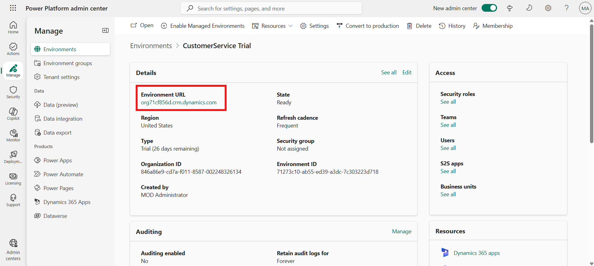
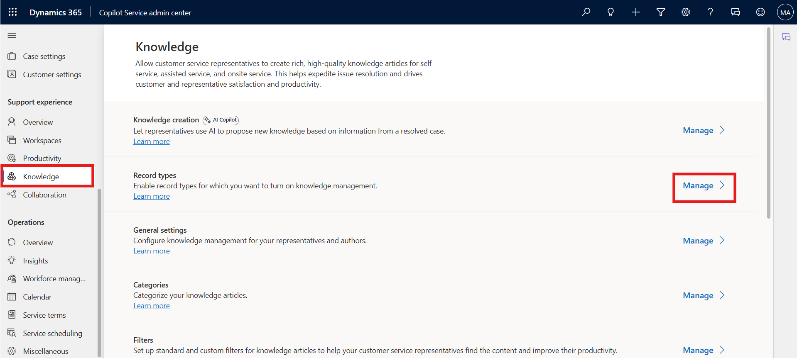
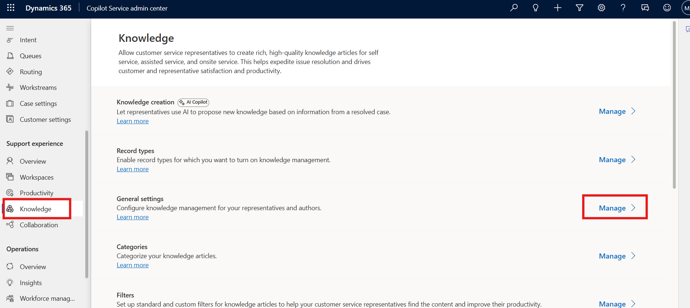
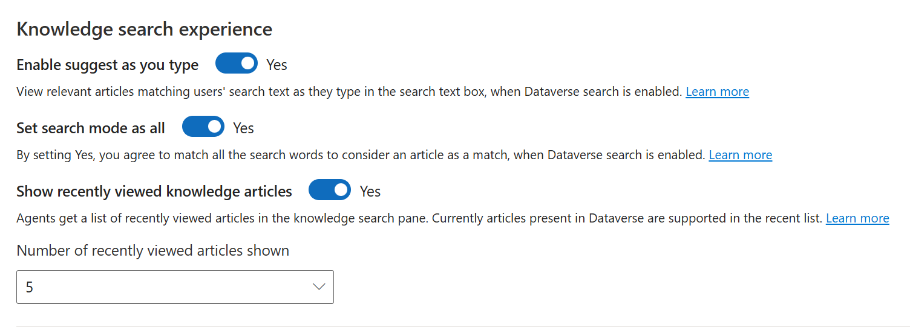
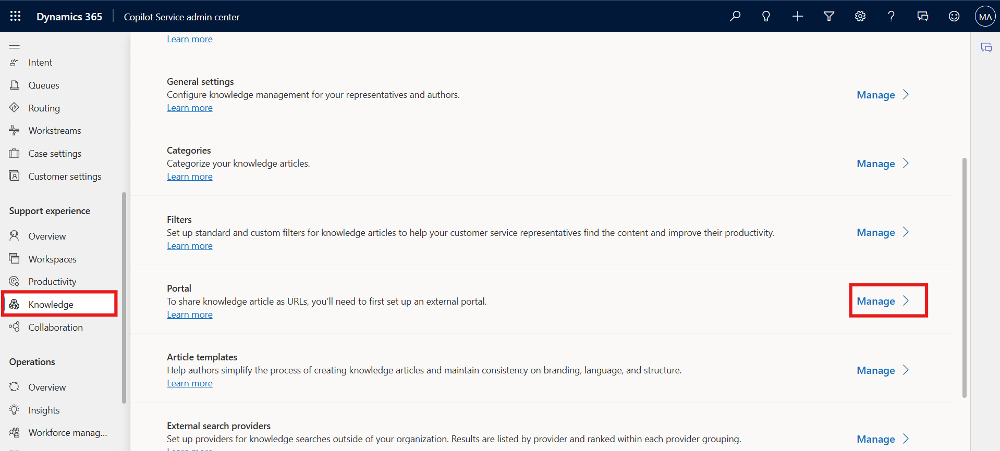
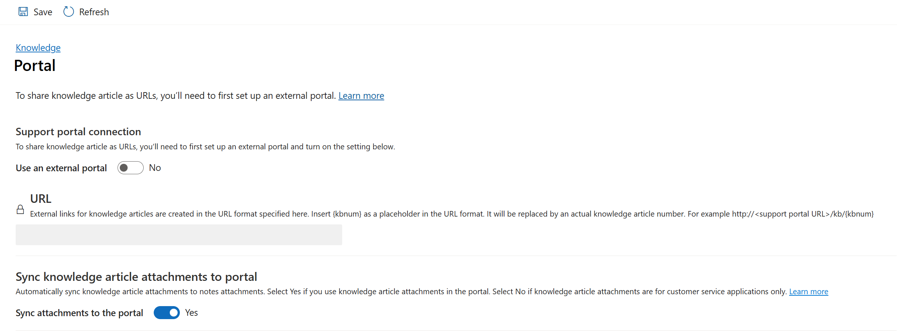

# Lab 16 - Set up Knowledge management

### Introduction

In this lab, you will explore how to configure **Knowledge Management**
in the **Copilot Service Admin Center**. Knowledge management allows
organizations to capture, organize, and share information effectively
with agents and customers. You will enable record types for knowledge,
configure search settings, create categories, manage filters, and define
portal integration options.

## Task 1 - Enable Knowledge Management for Record Types

In this task, you will enable knowledge management for additional record
types, such as **Account**, and configure automatic search behavior.

1.  Open a new tab in the browser. Sign in to the Power Platform admin
    center - !!**https://admin.powerplatform.microsoft.com/**!! with the
    credentials provided to execute the lab in the home tab. Select **\>
    Environments \> ContactCenter Trial environment \> Environment
    URL.**

    

2.  Click on **App selector** to display the list of apps.

3.  Select **Copilot Service Admin center** from the list of Apps.

    

4.  Select **Knowledge** in **Support experience**.
    The **Knowledge** page appears.

5.  In the **Record types** section, select **Manage**.

    

6.  On the **Record Types** page, we can add and configure the record
    types for which you want to turn on knowledge management.

    

7.  By default, knowledge management is enabled
    for **Case** and **Conversation** record types.

    

8.  On the **Record Types** page, select **Add**.

    

9.  The **Add record type** dialog appears. On the **Add record
    type** dialog, from the **Select record type** dropdown list, select
    the record type – **Account**.

10. Set the toggle for **Turn on autometic search**.

11. Select **Account Name** to **Provide search results using** field.

12. Select **Save and Close**.

    

## Task 2 - Configure Knowledge General Settings

In this task, you will configure the general settings for knowledge
search, authoring, and global display options.

1.  Select **Knowledge** again on the left navigation pane.

2.  In the **General Settings** section, select **Manage**.
    The **General Settings** page appears.

    

3.  In the **Search results display count** section,

    - Select the display count from the dropdown. – 10

    - In the **Feedback** section, set the **Enable feedback** toggle
      to **Yes**.

    

4.  In the **Authoring language** section

    - Set the **Enable default authoring language** for your users
      to **Yes**.

    - Select the **Organization’s UI language** option.

    - Set the **Allow users to set default knowledge authoring
      language** toggle to **Yes**.

    

5.  In the **Knowledge search experience** section, enable the following
    as required.

    - **Enable suggest as you type - Yes.**

    - **Set search mode as all - Yes.**

    - **Show recently accessed knowledge articles - Yes.**

    

6.  In the **Global search knowledge configuration** section, switch
    the **Enable Kb preview mode from global search option** toggle
    to **Yes**.

    

7.  Scroll up towards the top of the page and select **Save**.

    

## Task 3 - Create a Knowledge Category

In this task, you will create a **new category** to organize knowledge
articles logically. Categories help structure knowledge for easy access
and retrieval.

1.  Go back and select **Knowledge**. In the **Categories** section,
    select **Manage**.

    

2.  The **Categories System Views** page appears. You can create and
    manage a logical structure of categories for your records.

3.  On the command bar, select **New** to create a new category record.

    

4.  Enter the required information in the **General** section:

    - **Title**: !!**Contoso Demo Category**!!

    - **Description**: !!**Contoso Demo Category**!!

    - **Display Order**: !!**1**!!

    - Select **Save & Close**

    

## Task 4 - Manage Search Filters

In this task, you will enable and configure **search filters** to allow
agents to refine their search experience in the knowledge base.

1.  Go back and select **Knowledge**. In the **Filters** section,
    select **Manage**.

    

2.  Make sure that the **Enable search filters** toggle is set
    to **Yes**.

3.  Set the **Allow agent to personalize** toggle to **Yes**. This
    allows the service representatives to save the search filters
    relevant to their areas.

4.  Select **Save**.

    

## Task 5 - Configure Knowledge Portal Settings

In this task, you will review and configure portal settings for
publishing knowledge articles to an external portal. You will also
define how attachments are synchronized to the portal.

1.  Go back and select **Knowledge**. In the **Portal** section,
    select **Manage**. The **Portals** page appears.

    

2.  In the **Support portal connection** section, let us understand the
    options available.

    - Set the **Use an external portal** toggle to **Yes** to integrate
      an external portal to publish knowledge articles. For this lab,
      toggle to **No**.

    - **URL Format**: Type the portal URL to use to create external
      (public-facing) portal links for knowledge articles, which the
      service representatives can share with the customers. The external
      URL is created in the following format: https://support portal
      URL/kb/{kbnum}. The placeholder, “{kbnum}”, is replaced by an
      actual knowledge article number.

        **Enter Demo URL**: !! http://webserver.contoso.com/kb/{kbnum}!!

        In the **Sync knowledge article attachments to portal** section, set
    the **Sync attachments to the portal** toggle to **Yes**.

        Select **Save**.

        

### Conclusion

In this lab, you configured **Knowledge Management** in the **Copilot
Service Admin Center** by enabling additional record types, setting up
general knowledge options, defining authoring languages, creating
categories, enabling filters, and configuring the portal integration.
These settings improve how knowledge is captured, searched, and shared
within the organization.
