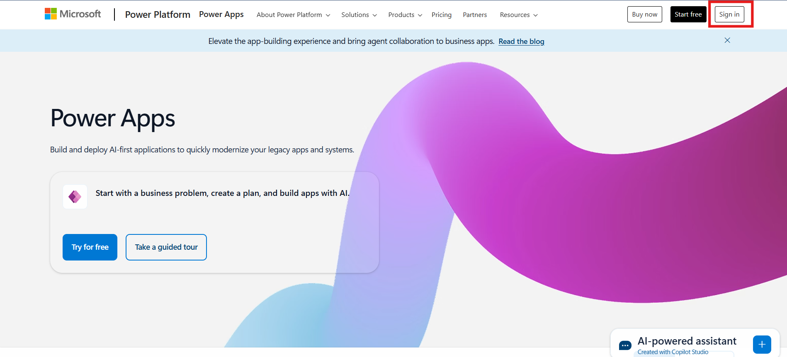
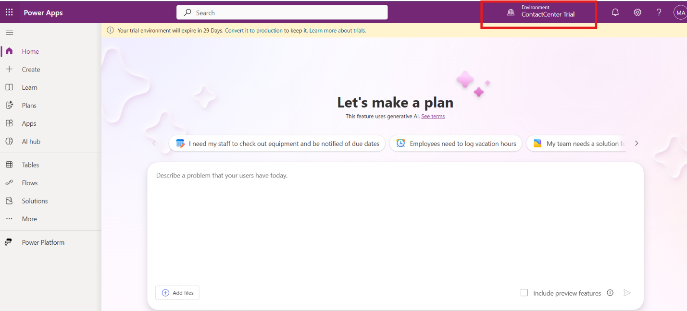
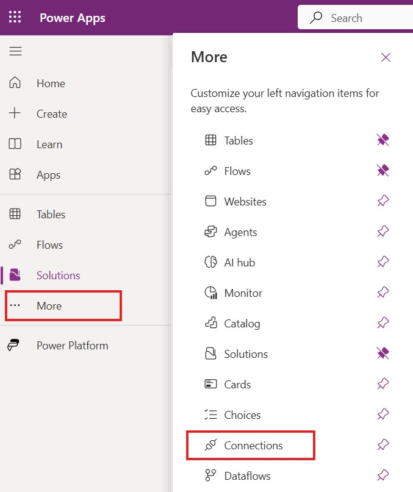
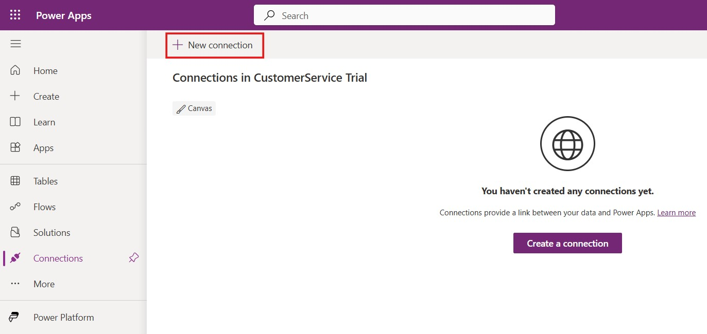
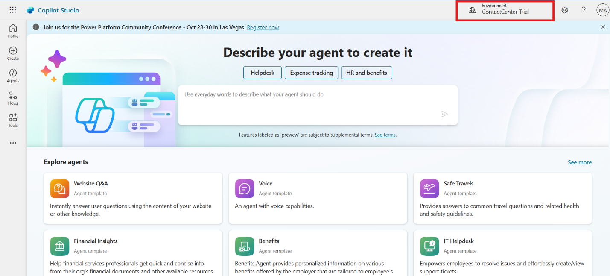
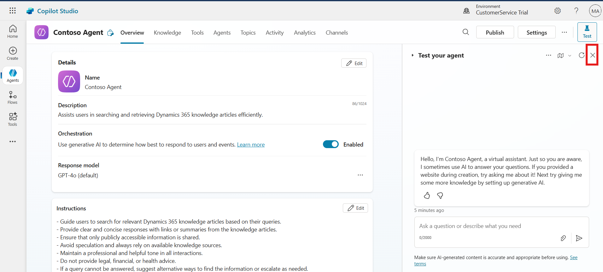
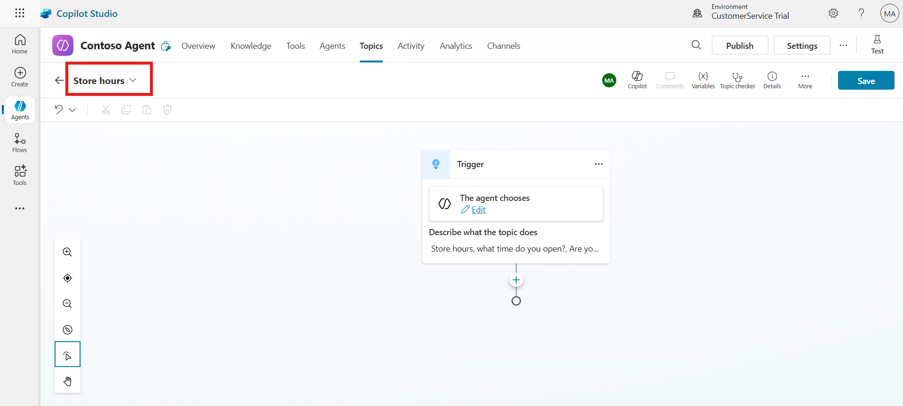
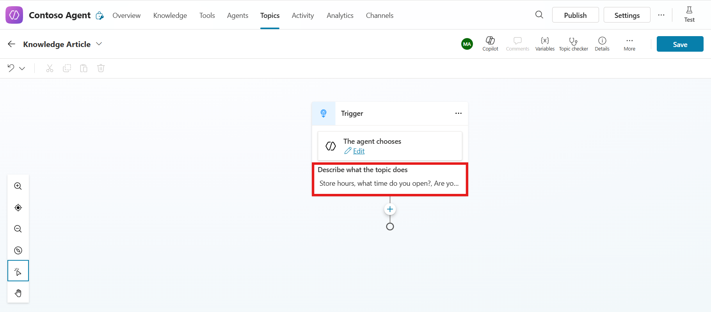
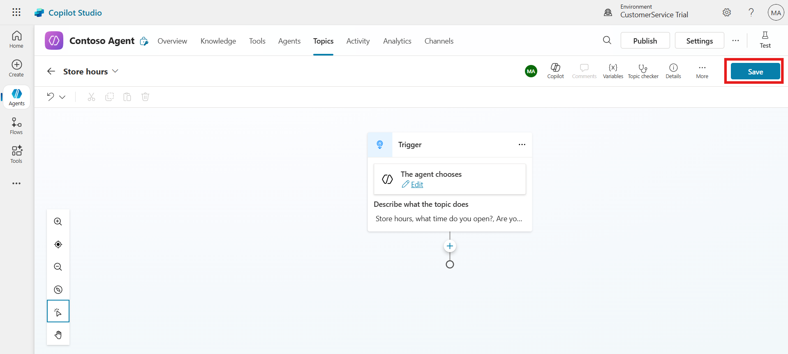
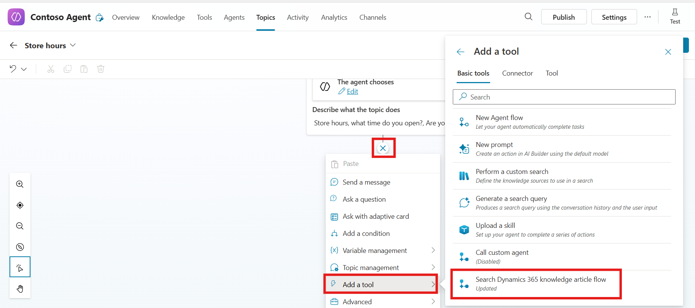

# Lab 17 - Integrate Knowledge management in Dynamics 365 with Copilot Agents 

**Introduction:**

In this lab, you will create a **Copilot Agent** that leverages the
**Search Dynamics 365 Knowledge Article flow**. You will connect
required services in Power Apps, configure the agent in Copilot Studio,
and create a topic to query knowledge articles.

## Task 1 – Configure Connections in Power Apps

In this task, you will create and configure connections in **Power
Apps** for **Microsoft Dataverse** and **Content Conversion**, then link
them to your flows.

1.  Open a new tab and navigate to Power Apps portal
    !!https://make.powerapps.com/!!. Then sign in with the given admin
    tenant and password.

    

2.  Select the **ContactCenter Trial** environment on the top right
    corner of the home page.

    

3.  Select **More** from the left navigation and then select
    **Connections**.

    

4.  From top command bar select **+** **New connection**.

    

5.  Search for **Dataverse** and then select **Microsoft Dataverse**.

    

6.  Select **Create**. Sign in with your credentials if prompted.

    

7.  Again from top command bar select **New connection**.

    

8.  Search and select **Content Conversion**.

    

9.  Select **Create**. Sign in with your credentials if prompted.

    

    

10. From the left navigation of the Power Apps portal, select
    **Solutions** and then select **Default Solution**.

    

11. From the left navigation, select **Connection references** and then
    select **Microsoft Dataverse CDS Connection**.

    

12. In the edit box that opens, select the connection that you created
    from the **Connection** dropdown menu.

    

13. Select **Save changes**.

    

14. Similarly select **Content Conversion**.

    

15. In the edit box that opens, select the connection that you created
    from the **Connection** dropdown menu.

    

16. Select **Save changes**.

    

17. Go back to **Default Solution** \> **Cloud flows** and turn
    on **Search Dynamics 365 knowledge article flow** flow.

    

## Task 2 – Create a Copilot Agent

In this task, you will create a Copilot Agent in **Copilot Studio** and
configure it to use the **Search Dynamics 365 Knowledge Article flow**.

1.  Open a tab in the browser and go to the Copilot Studio home page -
    !!https://copilotstudio.microsoft.com/!! . Login with the
    credentials provided to execute the lab. Accept the free trial,
    select United States for country/region.

2.  Select the Environment as **ContactCenter Trial** on top right
    corner of the homepage

    

3.  Click on the Create from the left menu and then select **+ New
    Agent.**

    

4.  In the descriptive field enter below given prompt and the click on
    the **Execute** button.

    !!Create an agent name as Contoso Agent which use the Search Dynamic 365
    Knowledge article flow.!!

    

5.  Click on the **Create** button from top right corner.

    

6.  Wait for few second, you agent is created successfully.

    

## Task 3 – Create a Topic in the Copilot Agent

In this task, you will create a topic named **Store hours** to handle
user queries about store timings.

1.  For better visibility, close the **Test your agent** panel for now.

    

2.  On the top menu bar, select **Topics**. Select **Add a topic** and
    select **From blank**.

    

3.  In the top left corner, Enter the name of the Topic as !!**Store
    hours**!!

    

4.  In the describe field of trigger node, enter !!Store hours, what
    time do you open?, Are you open on Sunday!! in the field.

    

5.  Select **Save** from top right corner.

    

## Task 4 – Add the Knowledge Article Flow to the Topic

In this task, you will integrate the **Search Dynamics 365 Knowledge
Article flow** to the topic and configure the input/output variables.

1.  Select **Add node** (**+**) and select **Add a tool**.
    Select **Search Dynamics 365 knowledge article flow** action.

    

2.  Provide the input to the flow. An error might appear if the filter
    isn’t provided to the flow. Click on the Search Text Input option on
    the action note, navigate to system and select **Activity.Name**
    Variable.

    

6.  Repeat the same process on Filter Input and select
    **Activity.Recipient.ID** variable.

    

7.  Under Action node click on the **(+)** and then select **Send a
    message** node.

    

8.  On the Message node click on the {X} add variable button and in
    custom variable select **textResult** variable.

      

9.  From top right corner click on the **Save** button to save the
    topic.

    

    **Tip:** If your search doesn’t return any results, modify the search
    terms or filter conditions. You can also add a filter condition if
    required.

### Conclusion

In this lab, you learned how to create a Copilot Agent that integrates
with the Search Dynamics 365 Knowledge Article flow. You began by
configuring the necessary connections in Power Apps for Microsoft
Dataverse and Content Conversion, ensuring that the flows could be
accessed by the agent. Then, you created a new Copilot Agent in Copilot
Studio and set it up to use the knowledge article flow. Following this,
you created a topic named “Store hours” to handle specific user queries
and linked the flow to the topic by configuring the required input and
output variables. By the end of the lab, you successfully enabled the
agent to search and present knowledge articles dynamically,
demonstrating how Copilot Studio can be leveraged to enhance customer
support with automated, intelligent responses.
