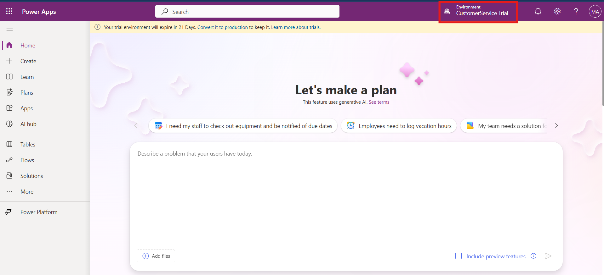
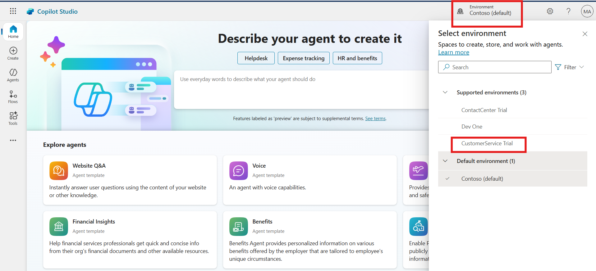
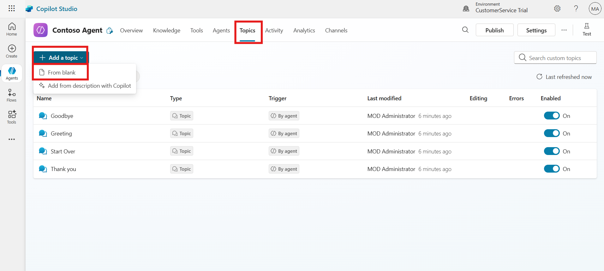
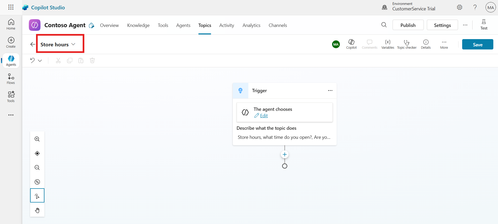
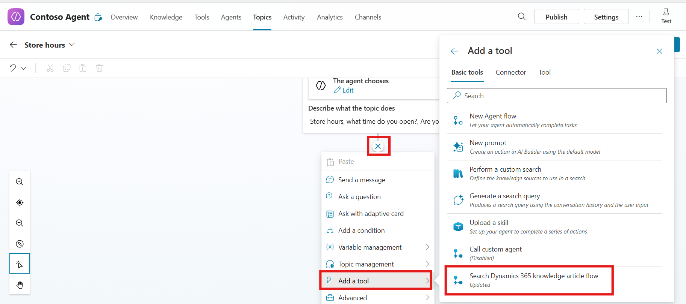

# Lab 17 - Integrate Knowledge management in Dynamics 365 with Copilot Studio Agents

### Introduction

This lab focuses on integrating Knowledge Management in Dynamics 365
with Copilot Studio Agents to enhance customer service interactions. You
begin by setting up connection references in Power Apps, ensuring that
Dataverse and Content Conversion services are properly configured to
support knowledge article searches. Next, you create a Copilot bot that
leverages the Dynamics 365 Knowledge Article flow, enabling it to
provide intelligent and context-driven responses. You also learn how to
build a topic in Copilot Studio, define relevant triggers, and link the
bot with knowledge search actions. These steps help ensure that agents
and customers alike can quickly access accurate information within
conversations.

### Task 1 - Set connection references

1.  Open a new tab and navigate to Power Apps portal
    !!https://make.powerapps.com/!!. Then sign in with given admin
    tenant and password.

    

2.  Select the **Customer Service Trial** environment on the top right
    corner of the home page.

    

3.  Select **More** from the left navigation and then select
    **Connections**.

    

4.  From top command bar select **+** **New connection**.

    

5.  Search for **Dataverse** and then select **Microsoft Dataverse**.

    

6.  Select **Create**. Sign in with your credentials if prompted.

    

7.  Again from top command bar select **New connection**.

    

8.  Search and select **Content Conversion**.

    

9.  Select **Create**. Sign in with your credentials if prompted.

    

    

10. From the left navigation of the Power Apps portal, select
    **Solutions** and then select **Default Solution**.

    

11. From the left navigation, select **Connection references** and then
    select **Microsoft Dataverse CDS Connection**.

    

12. In the edit box that opens, select the connection that you created
    from the **Connection** dropdown menu.

    

13. Select **Save changes**.

- 

14. Similarly select **Content Conversion**.

  

15. In the edit box that opens, select the connection that you created
    from the **Connection** dropdown menu.

  

16. Select **Save changes**.

  

17. Go back to **Default Solution** \> **Cloud flows** and turn
    on **Search Dynamics 365 knowledge article flow** flow.

  

## Task 2 – Create a Copilot Bot

1.  Open a tab in the browser and go to the Copilot Studio home page -
    !!https://copilotstudio.microsoft.com/!! . Login with the
    credentials provided to execute the lab. Accept the free trial,
    select United States for country/region.

2.  Select the Environment as **Customer Service Trial** on top right
    corner of the homepage

  

3.  Click on the Create from the left menu and then select **+ New
    Agent.**

  

4.  In the descriptive field enter below given prompt and the click on
    the **Execute** button.

  !!Create an agent name as Contoso Agent which use the Search Dynamic 365
  Knowledge article flow.!!

  

5.  Click on the **Create** button from top right corner.

  

6.  Wait for few second, you agent is created successfully.

  

## Task 3 - Create a Topic in Copilot Studio Bot

1.  For better visibility, close the **Test your agent** panel for now.

    

2.  On the top menu bar, select **Topics**. Select **Add a topic** and
    select **From blank**.

    

3.  In the top left corner, Enter the name of the Topic as !!**Store
    hours**!!

    

4.  In the describe field of trigger node, enter !!Store hours, what
    time do you open?, Are you open on Sunday!! in the field.

    

5.  Select **Save** from top right corner.

    

### Task 4 - Add the action to the Copilot Studio topic

Perform the following steps to ensure that flow is properly configured
and can now be replaced with **Search Dynamics 365 knowledge
articles** action.

1.  Select **Add node** (**+**) and select **Add a tool**.
    Select **Search Dynamics 365 knowledge article flow** action.

    

2.  Provide the input to the flow. An error might appear if the filter
    isn’t provided to the flow. Click on the Search Text Input option on
    the action note, navigate to system and select **Activity.Name**
    Variable.

    

6.  Repeat the same process on Filter Input and select
    **Activity.Recipient.ID** variable.

    

7.  Under Action node click on the **(+)** and then select **Send a
    message** node.

    

8.  On the Message node click on the {X} add variable button and in
    custom variable select **textResult** variable.

    

9.  From top right corner click on the **Save** button to save the
    topic.

    

    > **Tip:** If your search doesn’t return any results, modify the search
terms or filter conditions. You can also add a filter condition if
required.

### Conclusion  
By completing this lab, you have successfully learned how to integrate
Dynamics 365 Knowledge Management with Copilot Studio Agents. You
configured the necessary connection references, created a custom Copilot
bot, and designed a topic that retrieves knowledge articles dynamically.
Additionally, you added actions and variables to ensure accurate
responses are delivered to user queries. This integration empowers
agents and customers to find relevant information efficiently, improving
resolution times and overall service quality.

- 
