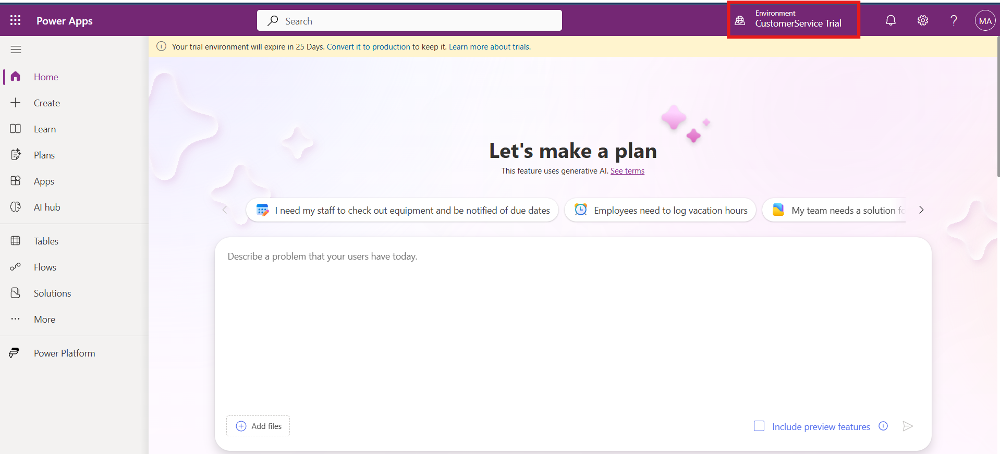
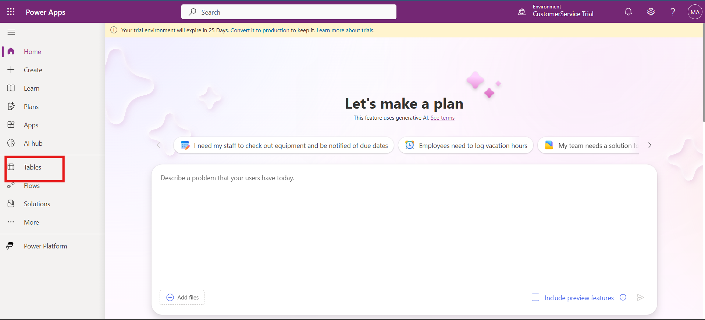
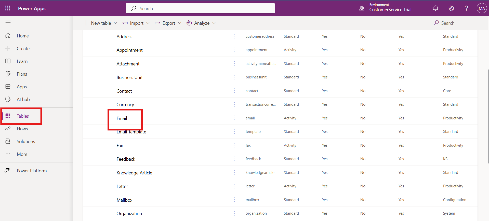
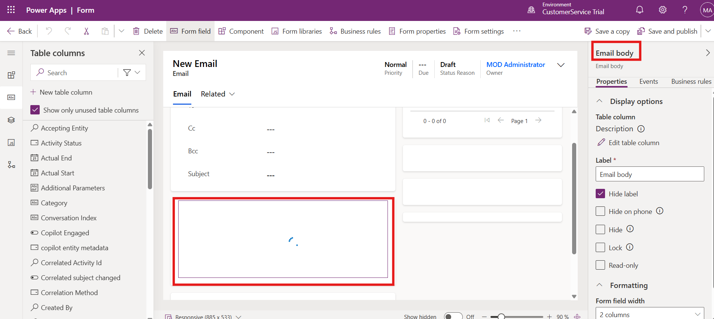
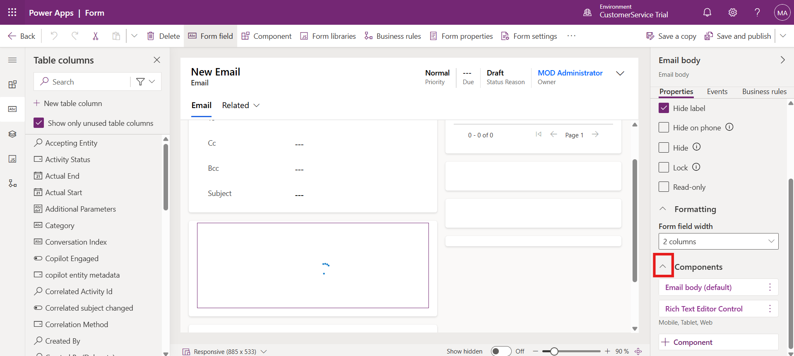
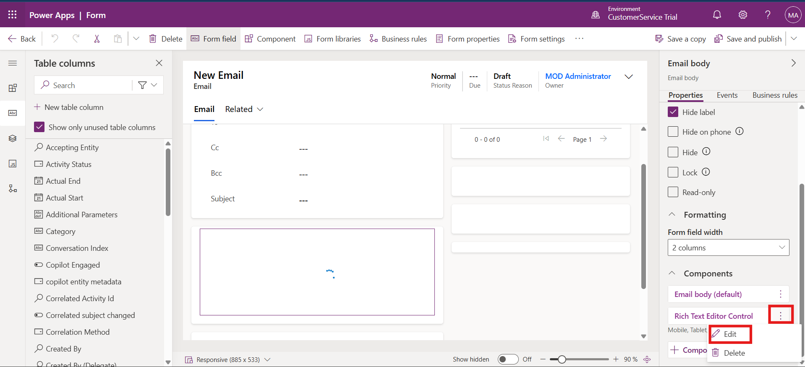

# Lab 18 - Add a Knowledge article rich text editor control to a form 

**Introduction:**

In this lab, you will configure the **Rich Text Editor Control** in the
**Email table** of Power Apps. This setup allows the email body to
leverage a custom configuration that can include knowledge article
integration or specific formatting.

1.  Open a tab in the browser, paste the Power Apps URL –
    !!https://make.powerapps.com!!. Click on the Sign In button.

    

2.  Login with the credentials provided to execute the lab.

3.  Change the environment to **ContactCenter** **Trial** on the top
    right corner of the power platform home page.

    

4.  Select **Tables** on the left navigation pane. Select **Email**
    table.

    

5.  Select Forms under **Data experiences**.

    

6.  Select **Email**.

    

7.  Double click on the Email body to open the properties on the right
    hand side.

    

8.  Expand **components** by scrolling down.

    

9.  For **Rich Text Editor Control** component, select the three
    vertical dots and then select **Edit**.

    

10. Paste the below text under static value -
    !!**webResources/msdyncrm\_/RichTextEditorControl/KnowledgeArticleRTEconfig.js**!!

11. Select **Done**, and then select **Save and Publish**.

    

    

### Conclusion

In this lab, you successfully accessed the **Email table** in Power
Apps, navigated to the Email form, and configured the **Rich Text Editor
Control** component. By linking the control to a custom JavaScript
configuration, you enabled advanced email functionality, including
enhanced formatting options and potential integration with knowledge
articles. This configuration improves the efficiency and effectiveness
of email handling for agents, ensuring a more consistent and enriched
customer interaction experience.
