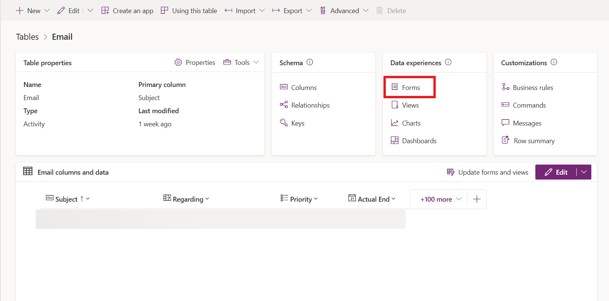
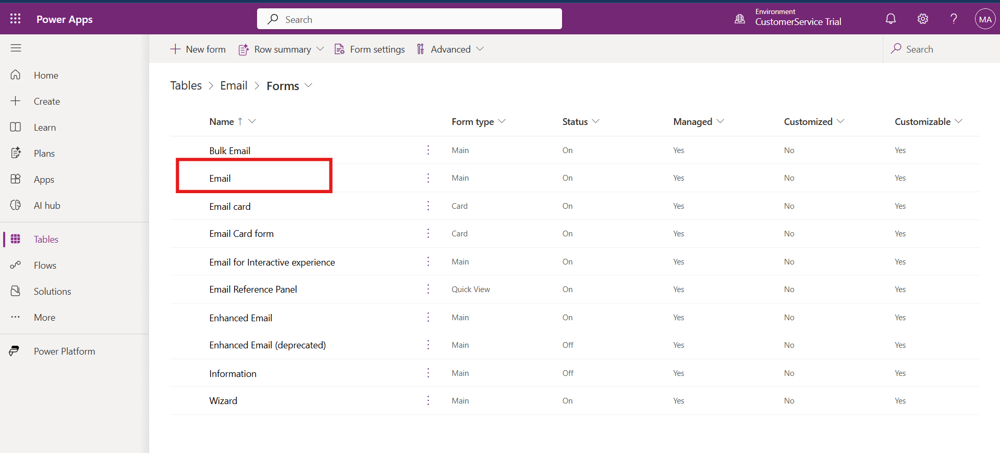
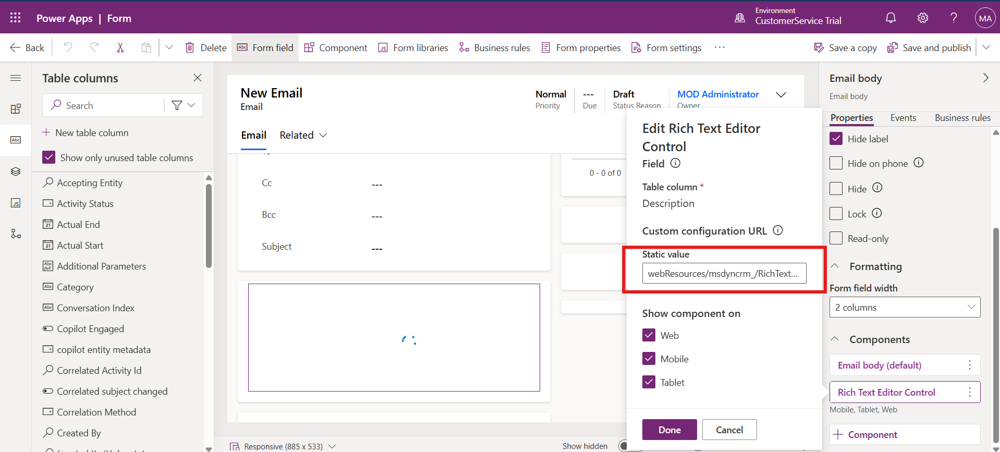

# Lab 18 - Add a knowledge article rich text editor control to a form

### Introduction

In this lab, participants will learn how to enhance the Email form in
Dynamics 365 by adding a Knowledge Article Rich Text Editor control.
This customization allows users to embed a rich text editing experience,
making it easier to format and manage knowledge article content directly
within forms. By configuring the control, participants will provide
agents with advanced text editing capabilities, ensuring consistency and
improved readability when drafting or sharing knowledge content.

1.  Open a tab in the browser, paste the Power Apps URL –
    !!https://make.powerapps.com!!. Click on the Sign In button.

    

2.  Login with the credentials provided to execute the lab.

3.  Change the environment to **Customer Service Trial** on the top
    right corner of the power platform home page.

    

4.  Select **Tables** on the left navigation pane.

    

5.  Select **Email** table.

    

6.  Select Forms under **Data experiences**.

    

7.  Select **Email**.

    

8.  Double click on the Email body to open the properties on the right
    hand side.

    

9.  Expand **components** by scrolling down.

    

10. For **Rich Text Editor Control** component, select the three
    vertical dots and then select **Edit**.

    

11. Paste the below text under static value -
    !!**webResources/msdyncrm\_/RichTextEditorControl/KnowledgeArticleRTEconfig.js**!!

    

12. Select **Done**, and then select **Save and Publish**.

    

    

### Conclusion

This lab guided participants through the process of configuring and
publishing a Rich Text Editor control for the Email form in Dynamics
365. Participants updated the form properties, added the Knowledge
Article Rich Text Editor control, and enabled the configuration script
to enhance the editing experience. With this setup, agents can now work
with well-formatted and user-friendly knowledge content, improving both
knowledge management and customer communication efficiency.
