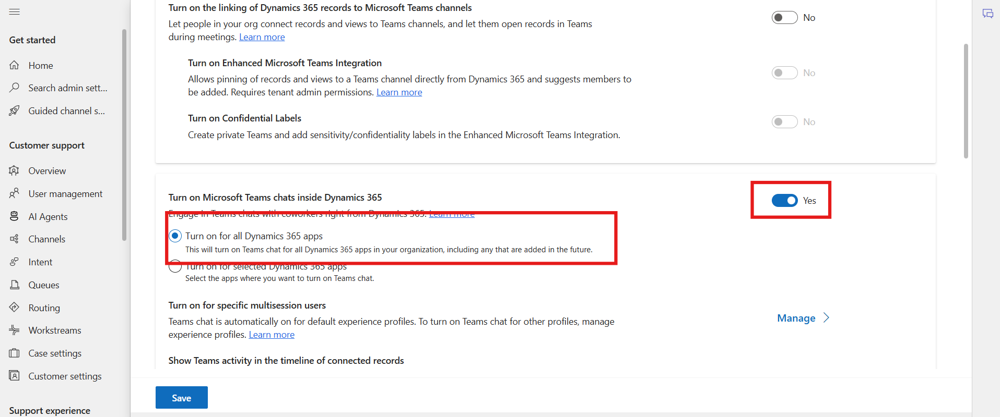
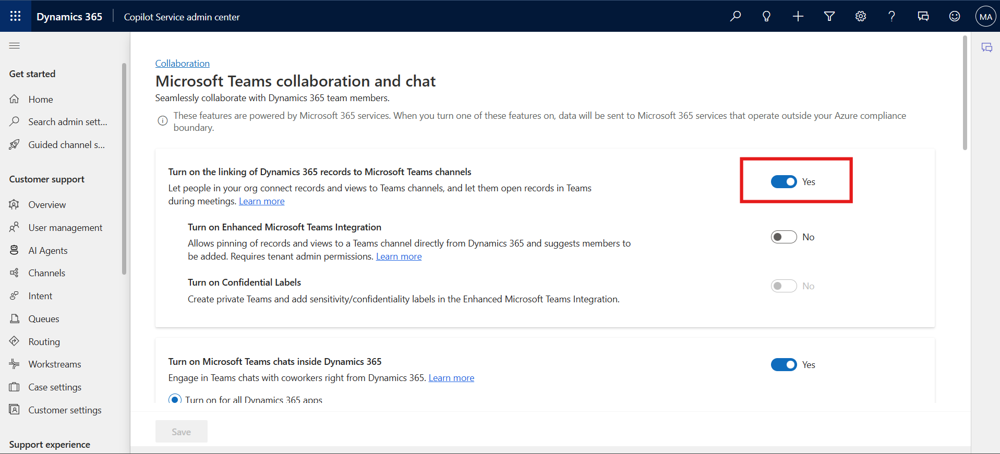
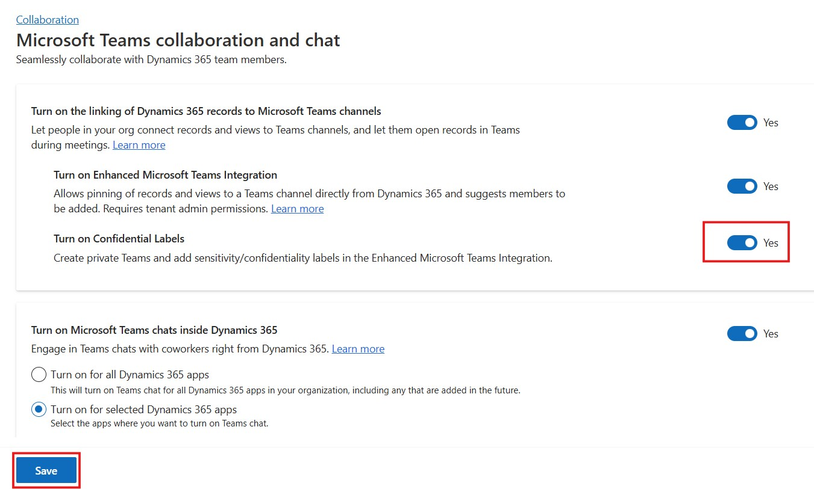
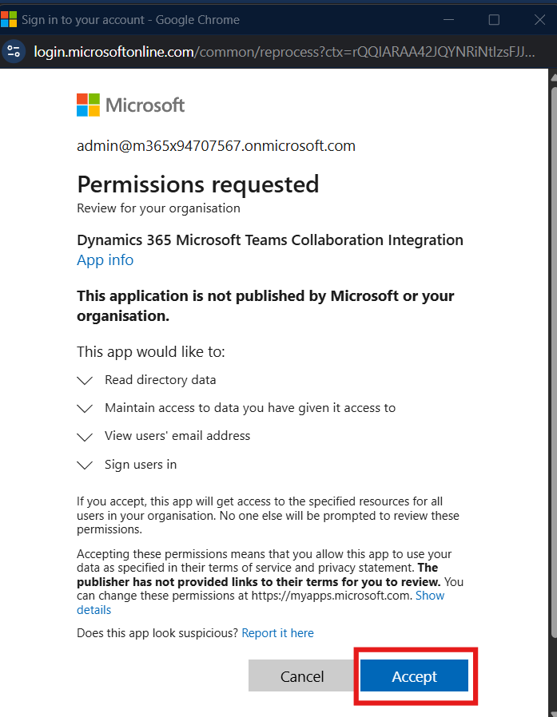
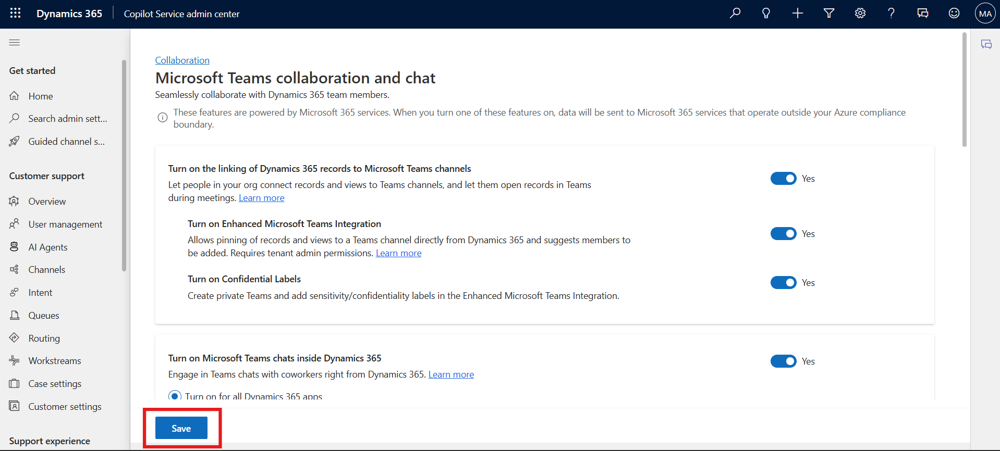
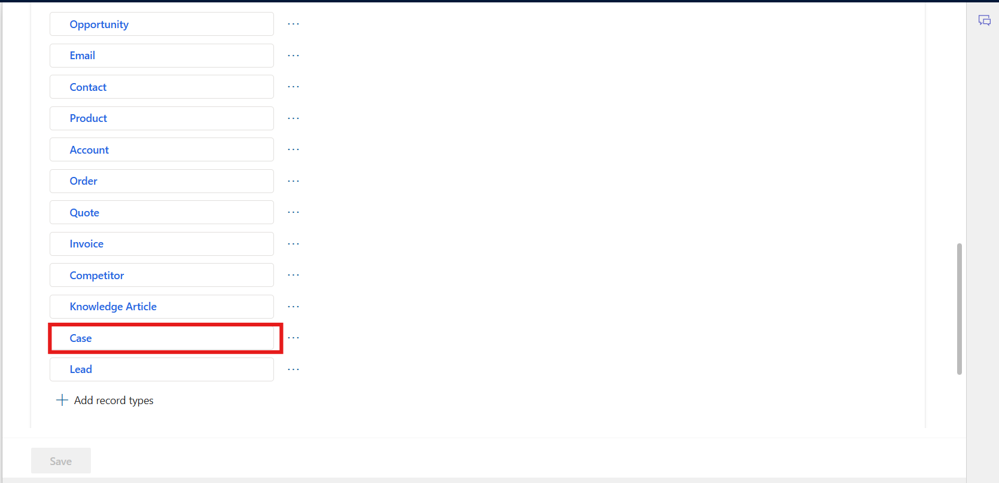
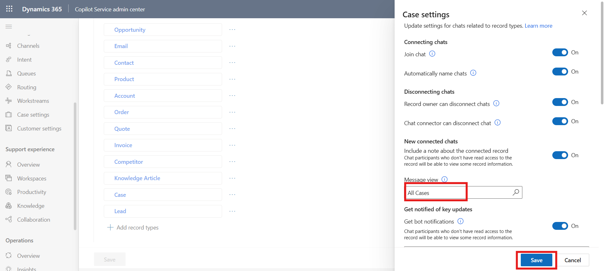

# Lab 19 - Configure Microsoft Teams chat in Customer Service

### Introduction

This lab focuses on enabling and configuring Microsoft Teams chat within
Dynamics 365 Customer Service to enhance collaboration and streamline
customer support operations. By integrating Teams directly into Dynamics
365, service agents can engage in contextual conversations, link chats
to specific records, and manage permissions for chat functionality.
Participants will learn how to access Teams settings in the Copilot
Service admin center, enable enhanced Teams integration, and configure
options such as confidential labels and linking records to Teams
channels. Additionally, the lab demonstrates how to assign permissions
for disconnecting chats, configure record types, and manage user access
to join or disconnect ongoing conversations, ensuring a secure and
collaborative support experience.

## Task 1: Access the Teams settings

1.  In the Copilot Service admin center, go to **Support experience**
    and select **Collaboration**.

2.  In **Embedded chat using Teams**, select **Manage**.

    

3.  On the **Microsoft Teams collaboration and chat** page, turn on the
    toggle for **Turn on Microsoft Teams chats inside Dynamics 365** and
    select **Turn on for all dynamics 365 apps**.

    

4.  Next, set the toggle for **Turn on the linking of Dynamics 365
    records to Microsoft Teams channels** to **Yes**. This setting
    requires tenant admin permission.

    

5.  Next, set the toggle for **Turn on Enhanced Microsoft Teams
    Integration** to **Yes**. This setting requires the tenant admin
    permission.

    

6.  **Sign in (**if prompted) and then **Accept** the Consent.

    

    

7.  Next, set the toggle for **Turn on Confidential Labels** to **Yes**.
    This setting requires the tenant admin permission.

8.  **Sign in** (if prompted) and then **Accept** the Consent.

    

    

9.  From the bottom left corner, click on the **Save** button.

    

## Task 2: Configure the ability to connect chats to Dynamics 365 records

1.  In the Copilot Service admin center or Contact Center admin center,
    go to **Support experience**, select **Collaboration**.

2.  In **Embedded chat using Teams**, select **Manage**.

    

3.  Under **Connect chats to Dynamics 365 records**, select the record
    type you want to configure. For example, select **Case record**.

    

4.  Click on the Message view field and select **All case** then click
    on the **Save** button.

    

## Task 3: To add a record type to link chats to Dynamics 365 records

1.  Under **Connect chats to Dynamics 365 records**, select **Add record
    types**.

    

2.  On the **Allow chats to be connected to this record type** page, in
    **Choose record type**, select the name of the record type you want
    to use. For example, select **Available Times**.

3.  Select **Save**.

    

## Task 4: Assign permissions to disconnect chats for specific user

1.  In the Copilot Service admin center or Contact Center admin center,
    go to **Support experience**, select **Collaboration**.

2.  In **Embedded chat using Teams**, select **Manage**.

3.  Under **Connect chats with Dynamics 365 records**, select the record
    type you want to configure, for example, Case.

    

4.  On the **Case settings** pane, in the **Disconnecting chats**,
    toggle off Chat connector can disconnect chats and the click on the
    **Save** button.

    

## Task 5: Configure the ability for users to join chats

1.  In the Copilot Service admin center or Contact Center admin center,
    go to **Support experience**, select **Collaboration**.

2.  In **Embedded chat using Teams**, select **Manage**.

3.  On the **Microsoft Teams collaboration and chat** page, in **Connect
    chats to Dynamics 365 records**, select the specific record type
    (for example, Case), and then in the settings pane, toggle **Join
    chat** on or off. Then click on the **Save** button.

    

### Conclusion

Upon completing this lab, participants will have successfully configured
Microsoft Teams chat integration with Dynamics 365 Customer Service.
They will understand how to enable embedded chat, link chats to specific
records, assign permissions, and control user participation in chat
sessions. These capabilities not only foster real-time collaboration
among agents but also provide better context for case resolution by
connecting conversations directly to Dynamics 365 data. Ultimately, this
integration strengthens teamwork, improves transparency, and enhances
overall customer service efficiency.
