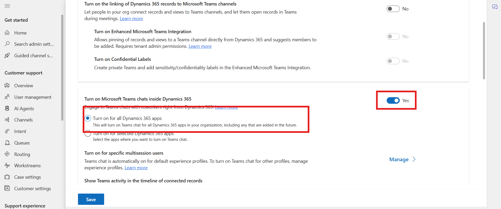
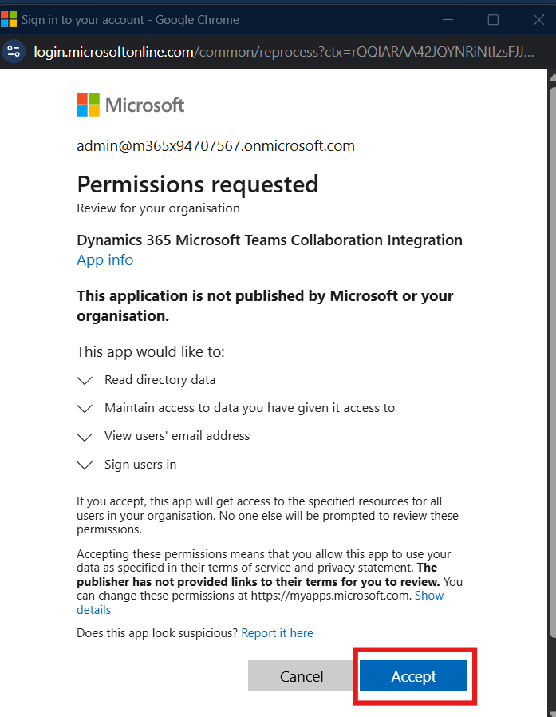
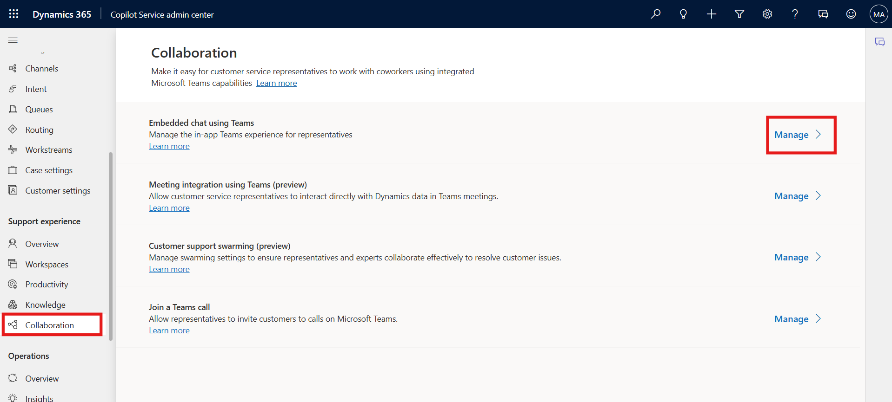
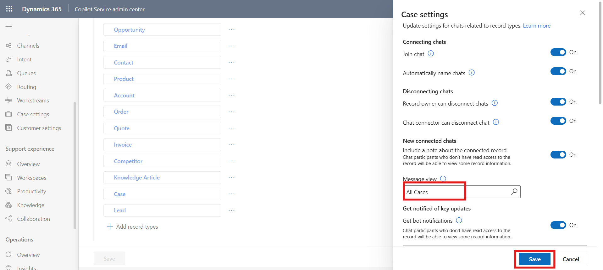

# Lab 19 - Configure Microsoft Teams chat in Dynamics 365 Contact Center

**Introduction:**

In this lab, you will configure **Microsoft Teams chat integration**
within Copilot Service. This setup allows agents to collaborate
seamlessly via Teams while working on Dynamics 365 records, enabling
chat connections, enhanced integration features, and secure handling of
sensitive data through confidential labels.

## Task 1: Enable Microsoft Teams Chat and Integration

In this task, you will enable Teams chat within Dynamics 365 and
configure enhanced integration features, ensuring that Teams
functionality is available across all Dynamics 365 apps and tenant-wide
settings are applied.

1.  In the Copilot Service admin center, go to **Support experience**
    and select **Collaboration**.

2.  In **Embedded chat using Teams**, select **Manage**.

    

3.  On the **Microsoft Teams collaboration and chat** page, turn on the
    toggle for **Turn on Microsoft Teams chats inside Dynamics 365** and
    select **Turn on for all dynamics 365 apps**.

    

4.  Next, set the toggle for **Turn on the linking of Dynamics 365
    records to Microsoft Teams channels** to **Yes**. This setting
    requires tenant admin permission.

    

5.  Next, set the toggle for **Turn on Enhanced Microsoft Teams
    Integration** to **Yes**. This setting requires the tenant admin
    permission.

    

6.  **Sign in (**if prompted) and then **Accept** the Consent.

    

    

7.  Next, set the toggle for **Turn on Confidential Labels** to **Yes**.
    This setting requires the tenant admin permission.

8.  **Sign in** (if prompted) and then **Accept** the Consent.

    

    

9.  From the bottom left corner, click on the **Save** button.

    

## Task 2: Configure Chat Connections for Record Types

This task configures how Teams chats connect to specific Dynamics 365
record types, ensuring that all interactions related to these records
are visible and manageable in Teams.

1.  In the Copilot Service admin center or Contact Center admin center,
    go to **Support experience**, select **Collaboration**.

2.  In **Embedded chat using Teams**, select **Manage**.

    

3.  Under **Connect chats to Dynamics 365 records**, select the record
    type you want to configure. For example, select **Case record**.

    

4.  Click on the Message view field and select **All case** then click
    on the **Save** button.

    

## Task 3: Add Additional Record Types for Chat Connections

Here, you will extend chat connections to additional Dynamics 365 record
types to broaden Teams integration across your environment.

1.  Under **Connect chats to Dynamics 365 records**, select **Add record
    types**.

    

2.  On the **Allow chats to be connected to this record type** page, in
    **Choose record type**, select the name of the record type you want
    to use. For example, select **Available Times**.

3.  Select **Save**.

    

## Task 4: Configure Chat Disconnection Settings

In this task, you will configure chat disconnection settings to control
whether users can disconnect Teams chats from Dynamics 365 records.

1.  In the Copilot Service admin center or Contact Center admin center,
    go to **Support experience**, select **Collaboration**.

2.  In **Embedded chat using Teams**, select **Manage**.

3.  Under **Connect chats with Dynamics 365 records**, select the record
    type you want to configure, for example, Case.

    

4.  On the **Case settings** pane, in the **Disconnecting chats**,
    toggle off Chat connector can disconnect chats and the click on the
    **Save** button.

    

## Task 5: Toggle Join Chat Setting

This task ensures that chat joining functionality is configured for
specific record types to control agent participation in Teams chats.

1.  In the Copilot Service admin center or Contact Center admin center,
    go to **Support experience**, select **Collaboration**.

2.  In **Embedded chat using Teams**, select **Manage**.

3.  On the **Microsoft Teams collaboration and chat** page, in **Connect
    chats to Dynamics 365 records**, select the specific record type
    (for example, Case), and then in the settings pane, toggle **Join
    chat** on or off. Then click on the **Save** button.

    

### Conclusion

In this lab, you successfully enabled **Microsoft Teams chat
integration** within Copilot Service, including enhanced integration
features and confidential label settings. You configured Teams chat
connections for specific Dynamics 365 record types, added additional
record types, and controlled chat disconnection and join settings. This
ensures agents can seamlessly collaborate using Teams while maintaining
proper record linkage, secure communication, and efficient handling of
customer interactions directly from Dynamics 365.
