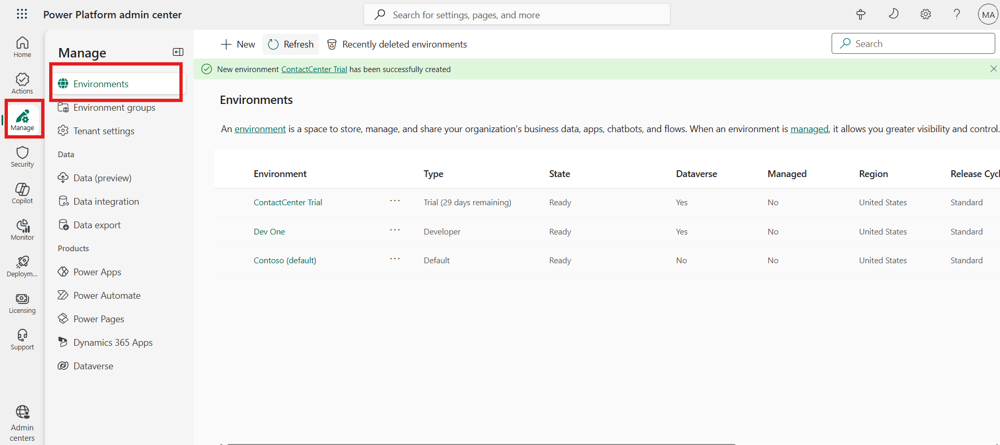
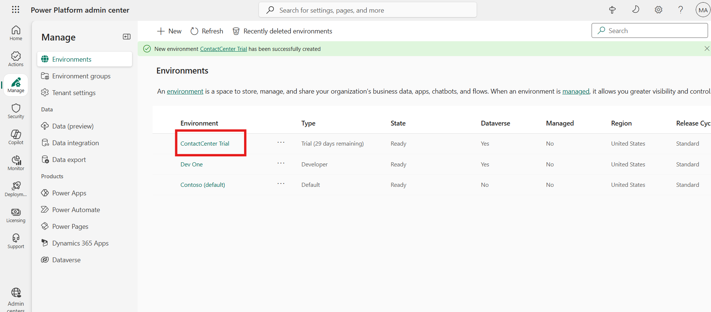
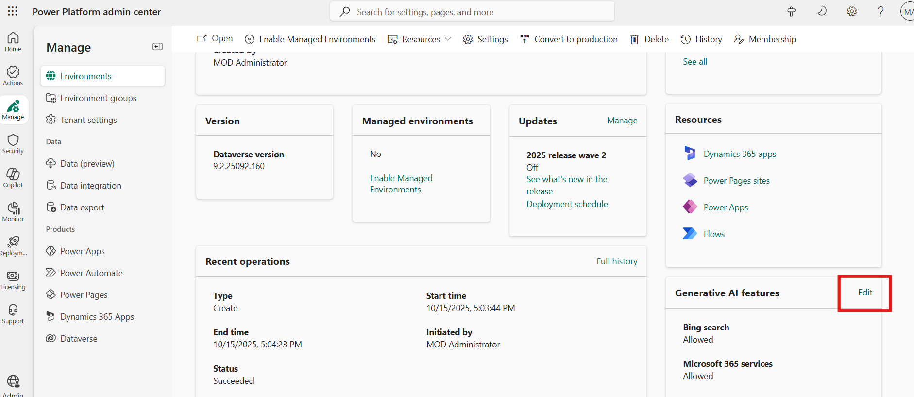
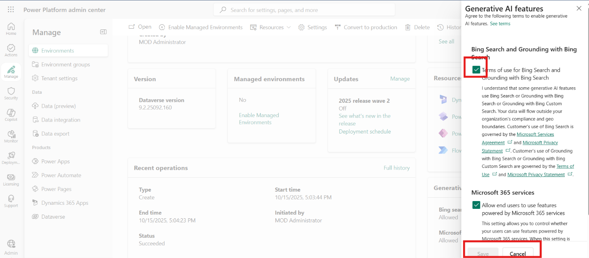
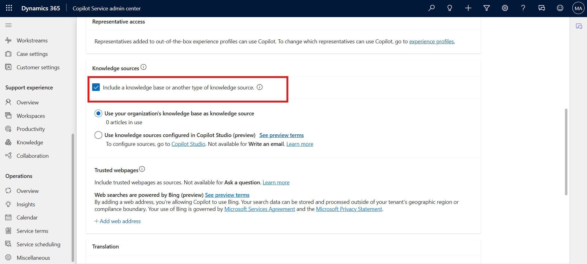

# Lab 2 - Manage Copilot features in Dynamics 365 Contact Center

**Duration:** 15 mins

## Introduction

In this lab, you will learn how to configure and enable Copilot AI
features in the Dynamics 365 Contact Center environment. You will use
the Power Platform admin center to manage environment settings, enable
Bing Search integration, and configure Copilot capabilities such as
knowledge base access and AI-powered productivity tools for agents

## Task 1 - Enable Generative AI Features in the Power Platform Admin Center

In this task, you will access the Power Platform admin center to enable
Generative AI features, review Bing Search options, and ensure the
Copilot service can use the best data sources for intelligent responses.

1.  Open a new tab in the browser. Sign in to the Power Platform admin
    center - !!https://admin.powerplatform.microsoft.com/!! With the
    credentials provided to execute the lab in the home tab.

2.  In the left side panel, select the **Manage** option and then
    navigate to **Environments**.

    

3.  Select your **Contact Center Trial** environment.

    

4.  You will find the **Environment URL** under **Details**. This will
    take you to Customer Service page.

5.  On the Power Platform admin center page, scroll down until you see
    the **Generative AI features** card. Now, select **Edit**.

    

6.  Review the terms of use and select the **Bing Search** checkbox if
    it is not selected. When the **Bing Search** feature is turned on,
    your copilot in Microsoft Copilot Studio can use the data sources
    you provided, but it can use Bing’s APIs to index the results better
    and find the best answer from within your data sources.

7.  If any changes have been made, select **Save** to confirm them;
    otherwise, select **Cancel**.

    

## Task 2 - Configure Copilot for Questions and Emails

In this task, you will enable the Copilot feature for handling customer
questions and emails in the Copilot Service admin center. You will also
include a knowledge source base to improve the quality of
Copilot-generated answers.

1.  Switch back to **Copilot Service admin center** tab.

2.  Select **Productivity** under **Support experience**.

3.  Select **Manage** for **Copilot for questions and emails**.

    

4.  Scroll down and select **Include a knowledge source base** check
    box.

    

5.  Scroll up and then Select the checkbox for **Ask a question**.

6.  Select **Save and close**.

    

## Task 3 - Enable Copilot AI Features in Agent Experience Profile

In this task, you will configure the Customer Service Trial agent
experience profile to ensure that all Copilot AI features—such as
suggesting responses, writing emails, and answering questions—are
enabled within the productivity pane.

1.  On the left navigation pane, Under **Support experience,** select
    **Workspaces.**

2.  Select **Manage** under **Experience profiles.**

    

3.  Select the **Customer Service Trial profile** agent experience
    profile from the list.

    

4.  On the **Productivity Pane**, make sure **Copilot help pane** toggle
    is **ON** so that agents can use the Copilot features such suggest a
    response, ask a question, and write an email on the productivity
    pane.

    

5.  Scroll down to **Copilot AI features** section. Make sure that all
    the Copilot AI features are enabled.

    \\

## Conclusion

By completing this lab, you have successfully configured Copilot AI
capabilities within the Dynamics 365 Contact Center. You enabled
generative AI features, integrated Bing Search, and activated key
productivity enhancements to empower agents with intelligent assistance
during customer interactions.
