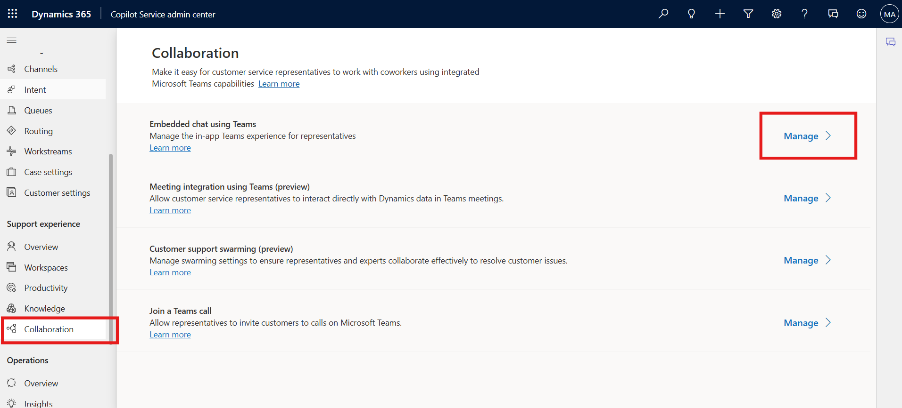

# Lab 20 - Configure AI suggestions for contacts in Microsoft Teams

### Introduction

This lab demonstrates how to configure AI-driven contact suggestions in
Microsoft Teams to enhance collaboration within Dynamics 365 Customer
Service. By enabling this feature, participants will learn how AI
automatically recommends relevant contacts for active cases and
conversations, ensuring that agents can quickly connect with the right
experts or stakeholders. The lab covers configuring the Microsoft Teams
collaboration and chat settings, enabling AI-based contact suggestions,
and linking Dynamics 365 records with Teams channels to improve context
sharing and teamwork.

1.  In the site map of Copilot Service admin center, go to **Support
    experience**  > **Collaboration**.

2.  In **Embedded chat using Teams**, select **Manage**.

    

3.  On the **Microsoft Teams collaboration and chat**, confirm the
    toggle for **Turn on the linking of Dynamics 365 records to
    Microsoft Teams channels** to **Yes**.

    

4.  To get suggested contacts for active cases or supported
    conversations, perform the following steps:

    1.  In **Connect chat to Dynamics 365 records**, select **Case**.
        The **Conversation settings** pane appears on the right.

    2.  In **Suggest contacts**, turn on the toggle for **AI-based
        suggested contacts** and then select **Save.**

    3.  Select Save on the Microsoft Teams collaboration and chat to
        reflect the changes.

        

        > It takes 24 hours for the data to be preprocessed for the first time
  use.

**Conclusion**

By completing this lab, participants will have successfully enabled
AI-based contact suggestions in Microsoft Teams for Dynamics 365
Customer Service. They will understand how to activate and configure the
feature so that agents receive intelligent recommendations of contacts
best suited to assist in resolving cases. This capability not only
accelerates issue resolution but also improves collaboration efficiency
by ensuring the right people are engaged at the right time. Ultimately,
this integration streamlines customer support operations and delivers
faster, more effective service.
