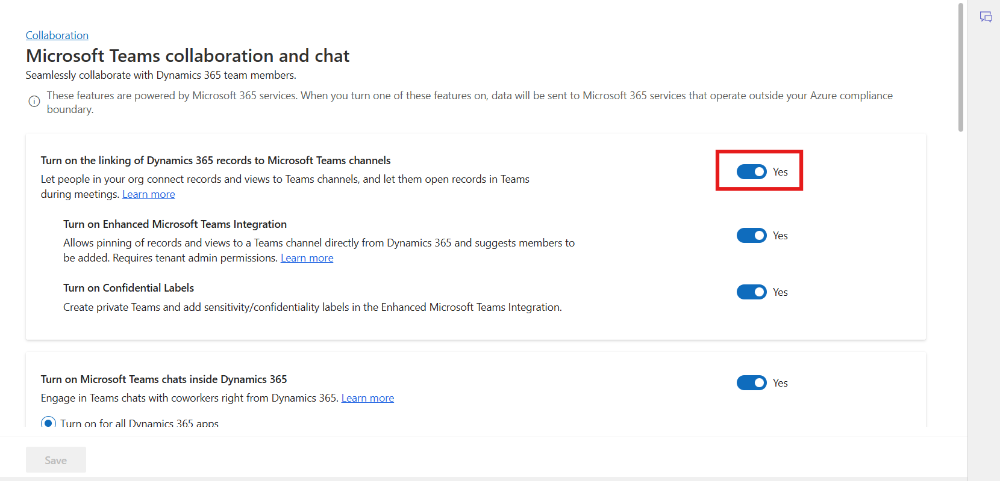

# Lab 20 - Configure AI suggestions for contacts in Microsoft Teams

### Introduction

In this lab, you will configure **AI-based suggested contacts** in
Microsoft Teams chat within Copilot Service. This feature helps agents
by providing intelligent suggestions for relevant contacts when handling
active cases or conversations, improving efficiency and collaboration
across Dynamics 365 and Teams.

**Task 1 – Enable AI-Based Suggested Contacts**

This task enables AI-based suggested contacts for cases or
conversations, allowing agents to quickly identify and engage the most
relevant contacts during customer support interactions.

1.  In the site map of Copilot Service admin center, go to **Support
    experience** > **Collaboration**.

2.  In **Embedded chat using Teams**, select **Manage**.

    

3.  On the **Microsoft Teams collaboration and chat**, confirm the
    toggle for **Turn on the linking of Dynamics 365 records to
    Microsoft Teams channels** to **Yes**.

    

4.  To get suggested contacts for active cases or supported
    conversations, perform the following steps:

    1.  In **Connect chat to Dynamics 365 records**, select **Case**.
        The **Conversation settings** pane appears on the right.

    2.  In **Suggest contacts**, turn on the toggle for **AI-based
        suggested contacts** and then select **Save.**

    3.  Select **Save** on the Microsoft Teams collaboration and chat to
        reflect the changes.

    **Note:** We executed these steps in previous labs.

    

    

    It takes 24 hours for the data to be preprocessed for the first time use.

### Conclusion

In this lab, you successfully enabled **AI-based suggested contacts**
for Microsoft Teams chat in Copilot Service. This feature leverages AI
to provide agents with intelligent recommendations for relevant contacts
during active cases or conversations, enhancing productivity and
collaboration. While the data preprocessing requires up to 24 hours for
initial use, once complete, agents can efficiently identify the right
contacts and streamline customer support operations within Dynamics 365
and Teams.
