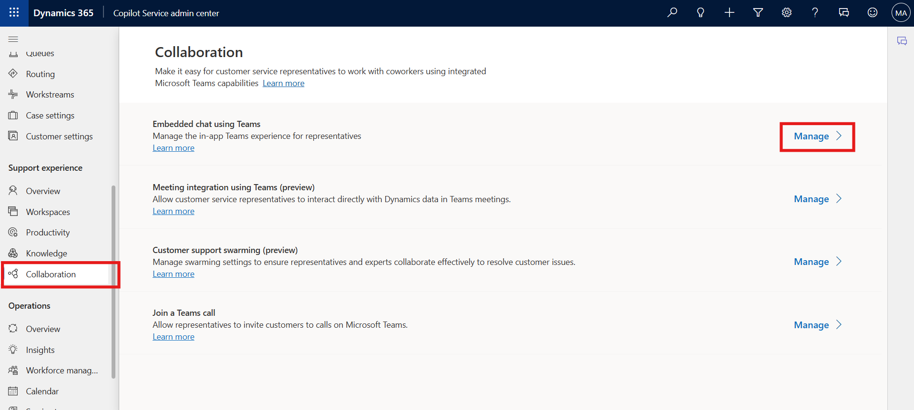
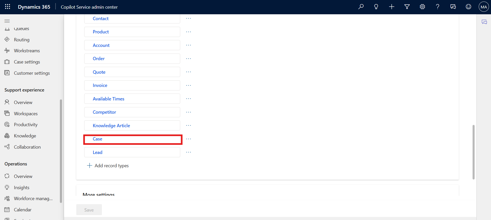
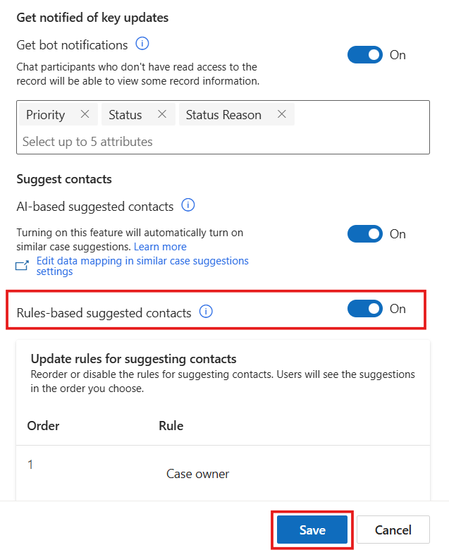
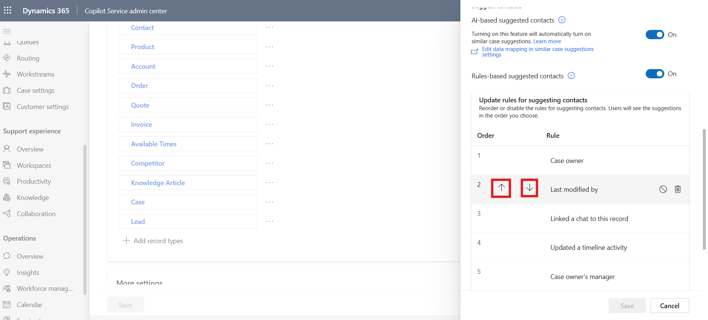
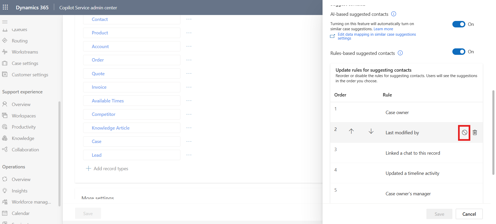
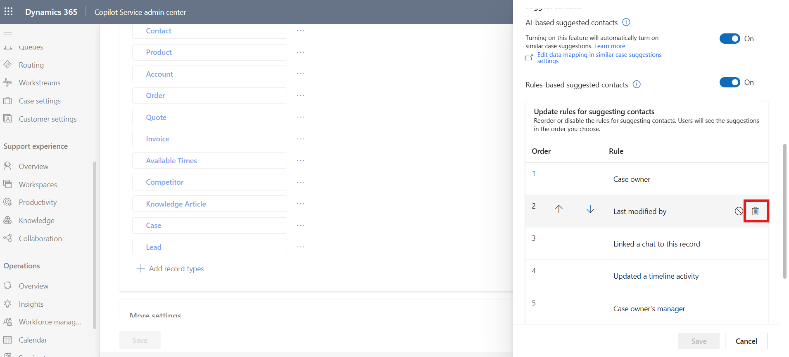
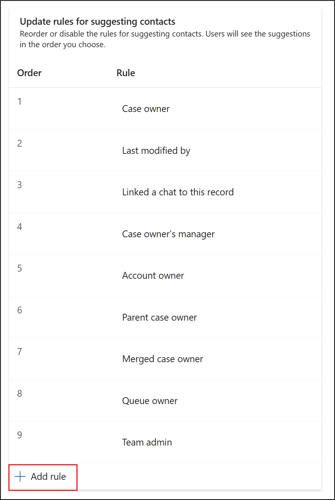
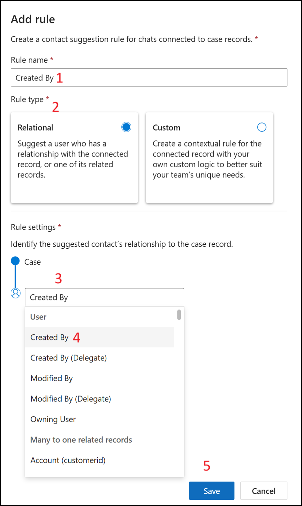
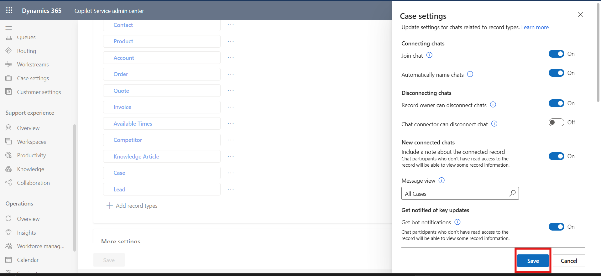

# Lab 21 - Configure rules-based suggestions for contacts in Microsoft Teams​

### Introduction

This lab focuses on configuring **rules-based suggested contacts** for
Microsoft Teams chat in Copilot Service. Unlike AI-based suggestions,
rules-based suggestions allow administrators to define explicit rules
that determine which contacts are recommended for a given record type,
ensuring that agents can quickly access the most relevant contacts based
on business logic and relationships.

## Task 1 - Enable Rules-Based Suggested Contacts

In this task, you will enable rules-based suggested contacts for a
specific record type (e.g., Case) and manage the rules’ order,
enable/disable status, and deletion to control the suggestion flow for
agents.

1.  In the site map of Copilot Service admin center, in **Support
    experience**, select **Collaboration**.

2.  In **Embedded chat using Teams**, select **Manage**.

    

3.  To get suggested contacts for any record type, perform the following
    steps:

    1.  In **Connect chat to Dynamics 365 records**, select record type-
        **Case** which we want to enable rules-based suggested contacts.
        The relative settings pane appears on the right.

        

2.  In **Suggest contacts**, ensure the toggle for **Rules-based
    suggested contacts** is turned on if it is not already enabled.

3.  Select **Save** (If its already turned on it save option is not
    active click on the Cancel button).

    

4.  In the **Update rules for suggesting contacts** section on the
    **Case** record, reorder or disable the rules for suggesting
    contacts. Users see the suggestions in the order we choose.

    - To reorder the rules, hover over a rule, and then select the up or
      down arrow to move the rules up or down, respectively.

      

    - To disable a rule, hover over a rule, and then select the icon to
      disable the rule  . When the rule is disabled,
      a check mark is displayed when you hover over the disabled rule.

      

    - To delete a rule, hover over the rule, and then
      select  . Deleting a rule removes it entirely
      so it won’t influence suggested contacts in the future.

      

5.  Select **Save**.

## Task 2 - Add a New Rule

This task guides you to create a new relational rule for rules-based
suggested contacts, enhancing the contact suggestions based on the
“Created By” relationship.

1.  On the settings pane, in the **Update rules for suggesting
    contacts** section, Select **Updates a timeline activity** rule**.**
    Delete the rule.

    

2.  From the bottom of the section select **+** **Add rule**.

    

3.  The **Add rule** pane is displayed for the record type you selected.

    

4.  Enter the information as mentioned below.

    - **Rule name** - `Created By`

    - **Rule Type** - Relational

    - **Select a user or related record** – Created By

    - Select **Save**

    

5.  A new rule is created. Select **Save** again.

    

6.  Select **Save** on **Microsoft Teams collaboration and chat**

    

### Conclusion

In this lab, you successfully configured **rules-based suggested
contacts** for Microsoft Teams chat in Copilot Service. By enabling,
reordering, disabling, deleting, and creating new rules, you have full
control over which contacts are suggested to agents for a specific
record type, such as Case. This configuration ensures agents have
access to the most relevant contacts based on business relationships
and organizational rules, improving efficiency and accuracy in
customer engagement.
