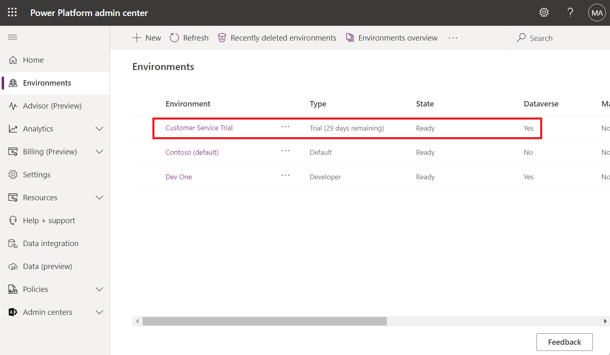
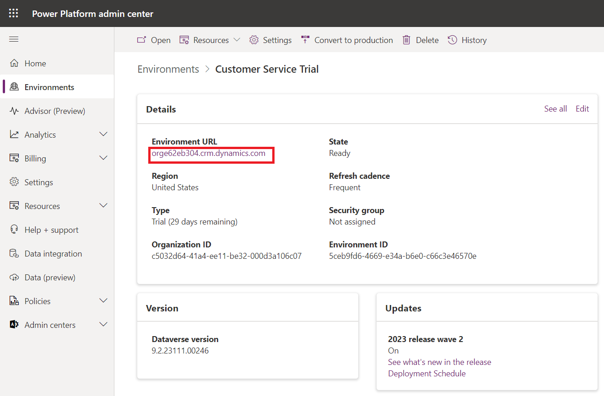
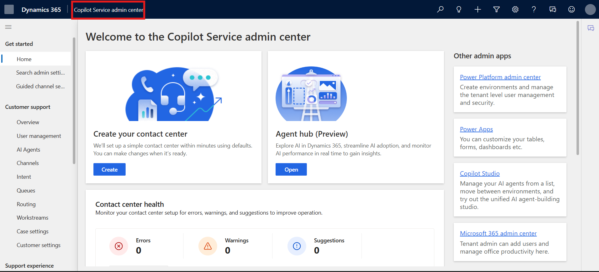
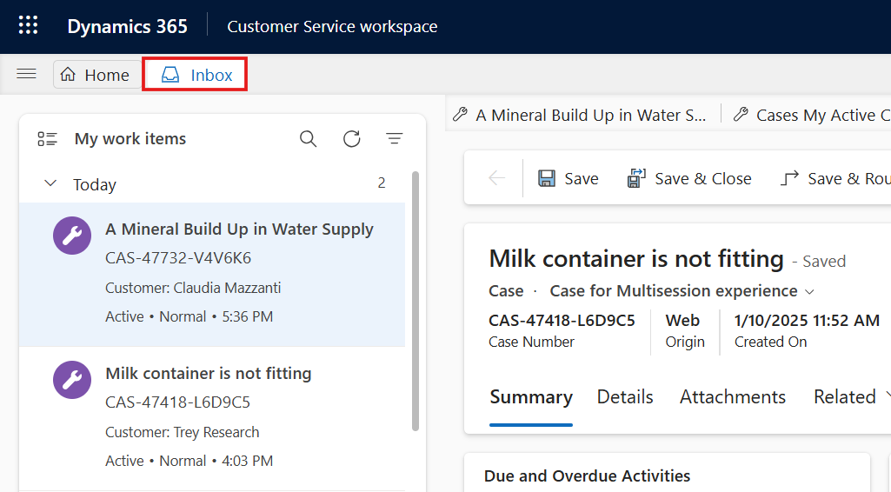
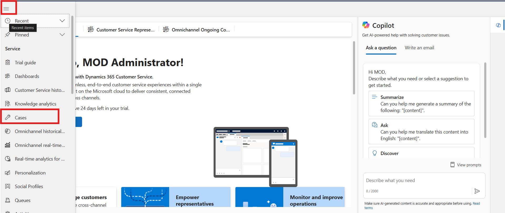

# Lab 22 - Use Dynamics 365 Copilot Service workspace

**Introduction:**

This lab focuses on navigating and using the **Copilot Service
workspace** in Power Platform. Participants learn how to filter and
manage items in the inbox, create and update cases, track activities in
timelines, and manage presence status. These features help service
agents handle customer requests efficiently and maintain clear
visibility of tasks and availability.

### Task 1 – Navigate and Manage Inbox

In this task, you will access the Copilot Service workspace inbox and
use filter and sorting options to organize items efficiently.

1.  To navigate to your **Copilot Service workspace**, go to the **Power
    Platform admin center** using the given
    link !!https://admin.powerplatform.microsoft.com/!!.

2.  Select the **Environments** tab and then select **Contact Center
    Trial** environment.

    

3.  On the ContactCenter **Trial environment** page, click on
    the **Environment URL**.
    
    

4.  From the top app option select **Copilot Service workspace.**

    

    

5.  Select **Inbox** from Left navigation bar.

    

6.  In the inbox, select the **Filter** icon.

7.  Select the required filter views. The following options are
    available:

    - **Filter**

      - **All** - Displays both read and unread items.

      - **Unread** - Displays only unopened items.

      - **Read** - Displays only opened items.

    - **Sort by**

      - **Customer** - Displays items based on the customer record.

      - **Date** - Displays items based on the date they were created.

    - **Sort order**

      - **Oldest on top** - Displays old items first in the inbox.

      - **Latest on top** - Displays most recent items first in the
        inbox.

      

### Task 2 – Create and Edit a Case

1.  On the copilot service workspace navigation page there are two
    options available **account** and **contact**. Participants can
    create cases with both options. For this lab guide we are creating
    cases with contact. In Copilot Service workspace, select
    **Contacts**.

    

2.  Select the contact, Claudia Mazzanti.

    

3.  Click the down arrow next to Related and then select Cases.

    

4.  Click + New Case and fill in the following details:

    1.  Case title: A Mineral Build Up in Water Supply

    2.  Subject: Water Supply

    3.  Priority: Normal

    4.  Case type: Problem

    5.  Case status: In Progress

    6.  Click Save and Close.

    

    

8.  Open the created case → scroll down → select Product field → choose
    Smart Brew 300 → click Save.

    

    

    

### Task 3 - Add Activities to Timeline

This task helps you track and manage activities related to a case.

1.  Scroll down navigate to **Timelines** section of the case.

    

2.  Click on the **+** icon to add activity in the timeline.

    

3.  Filter and view important notes, posts, and activities using
    multiple filter options.

    

### Task 4 - Manage Presence Status

This task shows how to set your availability status in Copilot Service
workspace.

1.  In **Copilot Service workspace** you can view your presence status
    on the navigation bar.

    

2.  Select the status icon. Select the appropriate status from the
    available list.

    - Available

    - Appear away.

    - Busy

    - Don’t disturb.

    - Offline

    

## Conclusion

In this lab, participants successfully navigated the Copilot Service
workspace, managed inbox items using filters, created and updated cases,
tracked activities in timelines, and set their presence status. By
performing these tasks, service agents gain better control over customer
interactions, maintain organized records, and enhance productivity
within the Power Platform environment.
