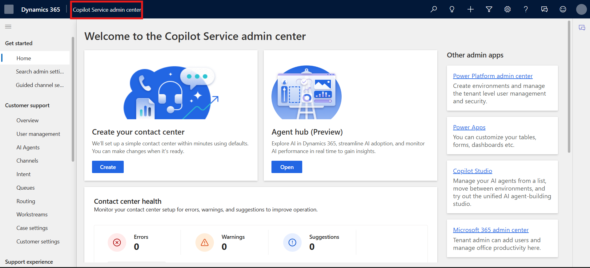
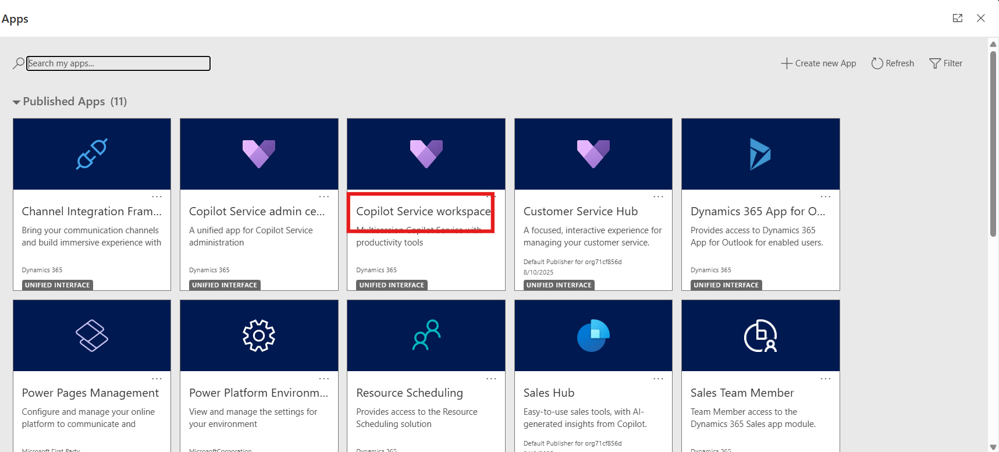
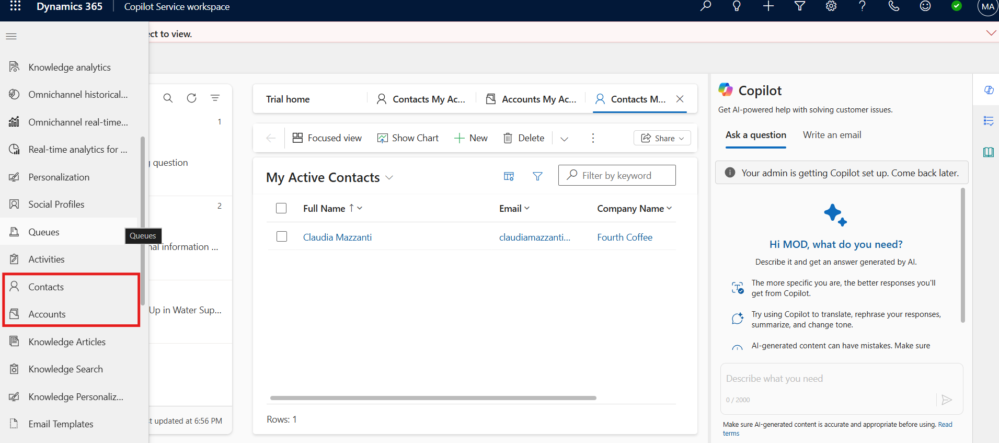

# Lab 22 - Use Dynamics 365 Customer Service workspace

### Introduction

In this lab, you will explore how to effectively use the Dynamics 365
Customer Service workspace to manage cases and collaborate more
efficiently. The lab focuses on key capabilities, including navigating
and filtering the inbox to view important customer interactions,
managing cases through new sessions, and utilizing the timeline feature
to track activities, notes, and posts. Additionally, you will learn how
to manage agent presence within the workspace, which helps indicate
availability and ensures smoother workload distribution across customer
service teams.

## Exercise 1 - Use the inbox

### Task 1 - View and filter your inbox

1.  To navigate to your **Copilot Service workspace**, go to the **Power
    Platform admin center** using the given
    link !!https://admin.powerplatform.microsoft.com/!!.

2.  Select the **Environments** tab and then select **Copilot Service
    Trial** environment.

    

3.  On the **Customer Service Trial environment** page, click on
    the **Environment URL**.

    

4.  From the top app section option select **Copilot Service
    workspace.**

    

    

5.  Select **Inbox** from the upper ribbon.

    

6.  In the inbox, select the **Filter** icon.

7.  Select the required filter views. The following options are
    available:

    - **Filter**

      - **All** - Displays both read and unread items.

      - **Unread** - Displays only unopened items.

      - **Read** - Displays only opened items.

    - **Sort by**

      - **Customer** - Displays items based on the customer record.

      - **Date** - Displays items based on the date they were created.

    - **Sort order**

      - **Oldest on top** - Displays oldest items first in the inbox.

      - **Latest on top** - Displays most recent items first in the
        inbox.

    

### Task 2 – View Cases

1.  In the Copilot Service workspace select the site map and the
    select **Cases**.

    

2.  Select any of the cases to work on. It opens in a new tab.
    Alternatively, you can open an item in a new tab by selecting
    the **new session** icon.

    

## Exercise 2 - Use Timeline

1.  Scroll down navigate to **Timelines** section of the case.

    

2.  Click on the **+** icon to add activity in the timeline.

    

3.  Filter and view important notes, posts, and activities using
    multiple filter options.

    

## Exercise 3 - Manage presence in Customer Service

Presence is an indication of your agent’s availability or status to take
up work in Dynamics 365 Customer Service.

1.  In **Copilot Service workspace** you can view your presence status
    on the navigation bar.

    

2.  Select the status icon. Select the appropriate status from the
    available list.

    - Available

    - Appear away

    - Busy

    - Don’t disturb

    - Offline

    

### Conclusion

By completing this lab, you have gained hands-on experience with the
Dynamics 365 Customer Service workspace. You learned how to filter and
organize the inbox, manage and view cases, track activities using the
timeline, and update agent presence to reflect availability. These
capabilities allow customer service agents to stay organized, improve
case management, and collaborate effectively within the workspace. With
these skills, you are better equipped to deliver efficient, timely, and
consistent customer service experiences.
