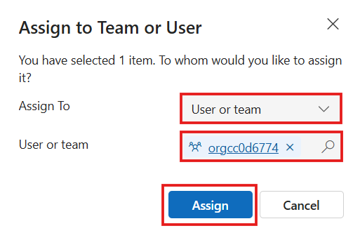
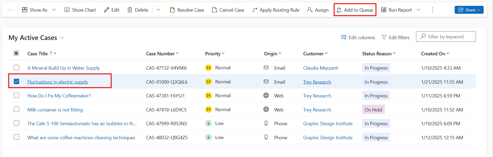
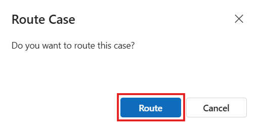

# Lab 23 - Unified Routing and Assignment with Dynamics 365 Contact Center

**Introduction**

This lab focuses on managing queue items and activities within the
Copilot Service workspace in Power Platform. Participants will learn how
to pick, release, and route queue items, create and assign activities,
and add items or cases to queues. These capabilities help service agents
efficiently manage workload distribution, task ownership, and ensure
smooth case handling across teams.

## Task 1 - Pick Items from Queue

In this task, you will learn how to pick items from a queue and assign
them to yourself or another user.

1.  In the Copilot Service workspace, select the **Site Map** and then
    select **Queues**.

    

2.  From the dropdown for **Items, I am working on**, select **All
    items**.

    

3.  Next, from the dropdown for **Queues I’m member of**, select **All
    Queues**.

    

4.  Select the checkbox next to the required item, and then
    select **Pick** from the command menu.

    

5.  The **Pick** dialog appears. For the **Also remove the item(s) from
    the Queue** dropdown, if you select **Yes,** the item is removed
    from the queue. For this scenario, select **No**.

6.  Select **Pick**.

    

7.  If the item is in an advanced queue and is tracked through unified
    routing, the following actions occur:

    - The **Worked By** attribute of the queue item will be updated with
      your user ID. The unified routing system takes this as an
      indicator of work assignment.

      

8.  To manually add another user or team, select the item. Click on the
    Vertical Ellipsis icon and select **Queue Item details** from the
    command menu.

    

    

9.  Select the lookup for the **Worked By** field and then select the
    user. If the queue item is assigned to a private queue, the lookup
    displays only the members of that queue. 

    

  **Note**: Remove the items from the queue can’t be set for work items
  in an advanced queue. Advanced queues are used in unified routing to
  which work items are routed through workstreams.

10. Then click on the Save and Close from the top bar.

    

## Task 2 - Release Items from Queue

This task demonstrates how to release an item so it is no longer
assigned to you.

1.  In the Copilot Service workspace, select the **Site Map** and then
    select **Queues**.

    

2.  From the dropdown for **Items, I am working on**, select **All
    items**.

    

3.  Next, from the dropdown for **Queues I’m member of**, select **All
    Queues**.

    

4.  Select the item that you want to release, and on the command, bar
    select **Release**.

    

5.  On the **Release Queue Item** dialog box, select **Release**.

    

6.  When you release an item, your name is removed from the **Worked
    By** field, and the item is no longer assigned to you; it’s assigned
    to the queue owner.

    

## Task 3 - Route Items to Another Queue

This task teaches you to route cases or items to another queue.

1.  Select the case that you want to move to another queue, and then,
    select **Route**.

    

2.  On the **Route Queued Item** dialog box, select **Queue** for the
    **Route to** field. Select **Contoso queue** **for**
    **supervisors**.

3.  Select **Route**.

    

4.  The queue is routed to **Contoso queue for supervisors**.

    

## Task 4 - Create Task Activity

In this task, you will create a new task activity in Copilot Service
workspace.

1.  In the Copilot Service workspace, select the **Site Map** and then
    select **Activities**.

    

2.  Click on the **Task** to create task activity.

    

3.  Enter the following details in the field and then click on the
    **Save and Close**.

    1.  Subject - !!Setup Warranty Account!!

    2.  Regarding – **A mineral build Up in Water Supply**

    3.  Duration - **30 minutes**

    

## Task 5 - Assign Activity

This task shows how to assign an activity to yourself or another user.

1.  In the Copilot Service workspace, select the **Site Map** and then
    select **Activities**.

    

4.  Select the activity you want, and on the command bar and then Click
    on the ellipsis icon from the top and select **Assign**.

    **Note:** If activity is not visible in my activity, convert my
  activity to All activity.

    

5.  In the **Assign To** field select **User or team / Me**, For this
    scenario, select **Me** as assign to and then click on the
    **Assign** button.

    

## Task 6 - Add Activity to Queue

This task explains how to add an existing activity to a queue.

1.  In the Copilot Service workspace, select the **Site Map** and then
    select **Activities**.

2.  Select the activity you want, from top click on the ellipsis icon
    and then select **Add to Queue**.

    **Note**: If **Add to Queue** button is not seen on the ribbon, select
  the Vertical ellipses and then select **Add to Queue**.

    

3.  The **Queue** field displays the queue the activity belongs to. The
    queue lookup displays only the queues that the activity can be added
    to.

4.  Select the **Default entity queue** and then select **Add**.

    

## Task 7 - Add Case to Queue

This task teaches how to add a case record to a queue.

1.  In the Copilot Service workspace, select the **Site Map** and then
    select **Contact**.

    

2.  Select **Claudia Mazzanti** Contact.

    

3.  In the list of cases, select the case that you want to add to a
    queue.

4.  Click on the Vertical Ellipsis and, select **Add to Queue**.

    

5.  In the **Queue** field, select Default entity queue, and then
    select **Add**.

    

    If a case is already added to a queue, the **Queue** field displays the
    current queue by default.

    The lookup for the **Queue** field displays only the queues that are
    configured for a specific entity. Voice and messaging queues aren’t
    displayed in the lookup results since cases can’t be added to those
    queues.

## Task 8 - Route Case Using Rule Set

This task demonstrates how to route a case based on an active routing
rule set.

1.  From the list of cases, open a case record.

    

2.  Make any changes, and on the command bar, select **Save & Route**.

    

3.  In the **Route Case** dialog, select **Route**.

    

    The case will be routed based on the active routing rule set.

### Conclusion

In this lab, participants successfully managed queues and activities
within the Copilot Service workspace. They learned how to pick, release,
and route queue items; create and assign activities; and add items or
cases to queues. These steps ensure efficient workload management,
improved collaboration among agents, and streamlined case routing within
the Power Platform environment.
