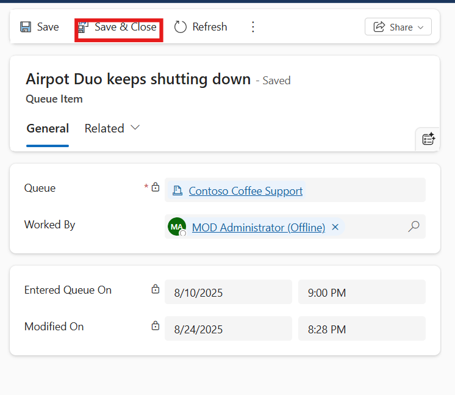
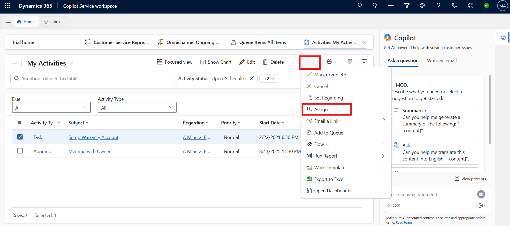
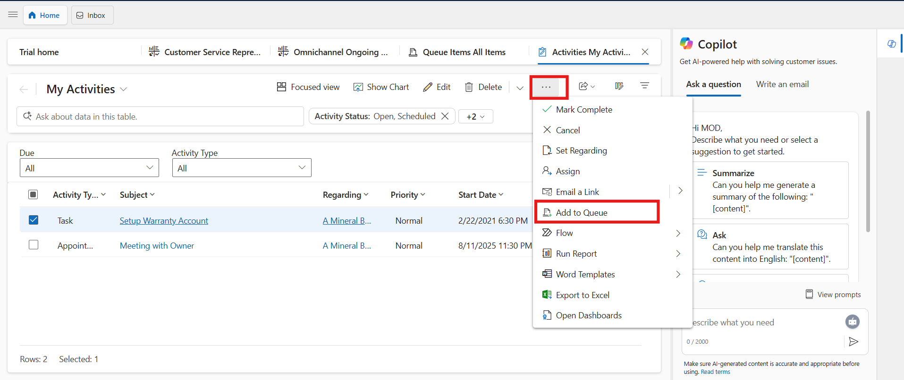

# Lab 23 - Unified routing and assignment with Dynamics 365 Customer Service

### Introduction

In this lab, you will explore how to manage work distribution
effectively using unified routing and assignment in Dynamics 365
Customer Service. You will learn how to pick and release queue items,
route activities or cases to different queues, and assign work to other
users or teams. Additionally, the lab covers adding cases or activities
to queues and using the Save & Route feature to streamline routing based
on active rule sets. These tasks are designed to give you hands-on
experience in optimizing queue management and ensuring that work items
are efficiently assigned to the right agents or teams.

## Task 1 - Pick queue items

1.  In the Copilot Service workspace, select the **Site Map** and then
    select **Queues**.

    

2.  From the dropdown for **Items, I am working on**, select **All
    items**.

    

3.  Next, from the dropdown for **Queues I’m member of**, select **All
    Queues**.

    

4.  Select the checkbox next to the required item, and then
    select **Pick** from the command menu.

    

5.  The **Pick** dialog appears. For the **Also remove the item(s) from
    the Queue** dropdown, if you select **Yes,** the item is removed
    from the queue. For this scenario, select **No**.

6.  Select **Pick**. The item is assigned to you.

    

7.  If the item is in an advanced queue and is tracked through unified
    routing, the following actions occur:

    - The **Worked By** attribute of the queue item will be updated with
      your user ID. The unified routing system takes this as an
      indicator of work assignment.

    

8.  To manually add another user or team, select the item. Click on the
    Vertical Ellipsis icon and select **Queue Item details** from the
    command menu.

    

9.  Select the lookup for the **Worked By** field and then select the
    user. If the queue item is assigned to a private queue, the lookup
    displays only the members of that queue. 

    

    > **Note** : Remove the items from the queue can’t be set for work items
  in an advanced queue. Advanced queues are used in unified routing to
  which work items are routed through workstreams.

10. Then click on the Save and Close from the top bar.

    

## Task 2 - Release an item or case that you’re working on

1.  In the Copilot Service workspace, select the **Site Map** and then
    select **Queues**.

    

2.  From the dropdown for **Items, I am working on**, select **All
    items**.

    

3.  Next, from the dropdown for **Queues I’m member of**, select **All
    Queues**.

    

4.  Select the item that you want to release, and on the command bar
    select **Release**.

    

5.  On the **Release Queue Item** dialog box, select **Release**.

    

6.  When you release an item, your name is removed from the **Worked
    By** field, and the item is no longer assigned to you; it’s assigned
    to the queue owner.

    

## Task 3 - Route an activity or case to another queue or assign to a different user or team

1.  Select the case that you want to move to another queue, and then,
    select **Route**.

    

2.  On the **Route Queued Item** dialog box, select **Queue** for the
    **Route to** field. Select **Contoso queue** for **supervisors**
    **for Add to the following Queue:** field.

3.  Select **Route**.
    
    

4.  The queue is routed to **Contoso queue for supervisors**.

    

## Task 4 - Assign to another user or team

1.  In the Copilot Service workspace, select the **Site Map** and then
    select **Activities**.

    

2.  Select the activity you want, and on the command bar and then Click
    on the ellipsis icon from the top and select **Assign**.

    

3.  In the **Assign To** field select **User or team**, and then select
    the user or team you want to assign the activity to. For this
    scenario, select the organization your Admin tenant belongs to.

4.  Select **Assign**.

    

## Task 5 - Add to queue

1.  In the Copilot Service workspace, select the **Site Map** and then
    select **Activities**.

2.  Select the activity you want, From top click on the ellipsis icon
    and then select **Add to Queue**.

  > **Note**: If **Add to Queue** button is not seen on the ribbon, select
  the ellises (…) and then select **Add to Queue**.

  

3.  The **Queue** field displays the queue the activity belongs to. The
    queue lookup displays only the queues that the activity can be added
    to.

4.  Select the queue you want to route the activity to, and then
    select **Add**.

    

## Task 6 - Add a case to a queue

If you think another group in your team has expertise on the subject,
you can move the case to a queue so that someone else can pick it up.

1.  In the Copilot Service workspace, select the **Site Map** and then
    select **Cases**.

    

2.  In the list of cases, select the case that you want to add to a
    queue.

3.  On the command bar, select **Add to Queue**.

    

4.  In the **Queue** field, select the queue that you want to add the
    case to, and then select **Add**.

    

If a case is already added to a queue, the **Queue** field displays the
current queue by default.

The lookup for the **Queue** field displays only the queues that are
configured for a specific entity. Voice and messaging queues aren’t
displayed in the lookup results since cases can’t be added to those
queues.

## Task 7 - Save and route a case

Save a case record and route it to a queue in a single action.

1.  From the list of cases, open a case record.

2.  Make any changes, and on the command bar, select **Save & Route**.

    

3.  In the **Route Case** dialog, select **Route**.

    

The case will be routed based on the active routing rule set.

### Conclusion

By completing this lab, you have learned how to manage work items
through unified routing and assignment in Dynamics 365 Customer Service.
You practiced picking and releasing items, routing cases and activities
to different queues, assigning work to users or teams, and adding
records to queues for specialized handling. You also explored how to
save and route cases in a single step using active routing rules. These
capabilities ensure that cases and activities are distributed
efficiently, improving collaboration, reducing delays, and enabling
better customer service delivery.
