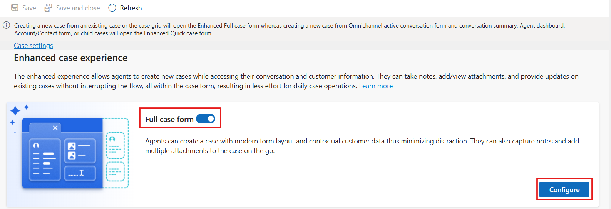
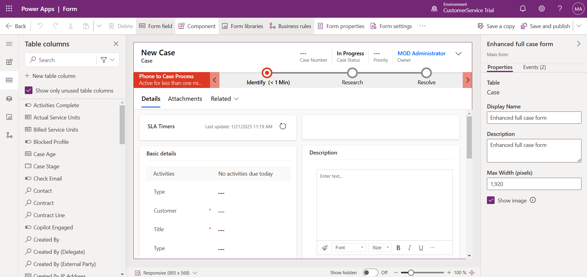
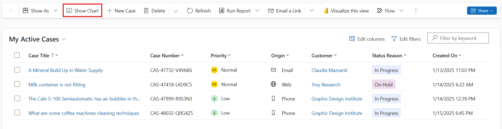
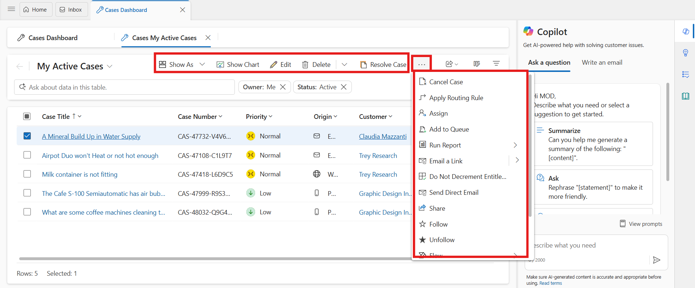
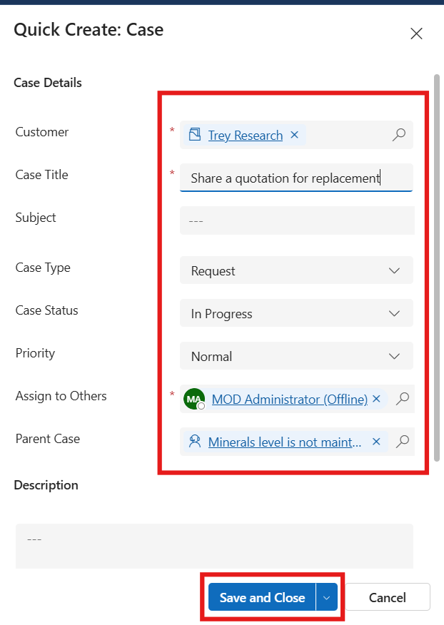
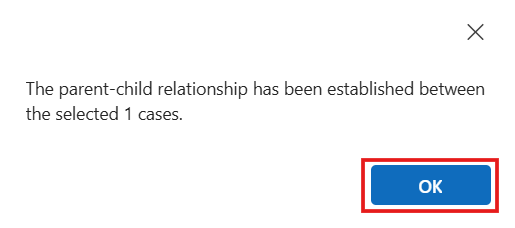

# Lab 24 – Create a Case and view AI-suggested similar Cases and Knowledge articles 

### Introduction

In this lab, you will explore case-management features available in the
**Copilot Service workspace** within Dynamics 365. You will learn how to
create cases, relate them to contacts, build parent–child case
relationships, convert cases into knowledge articles, and use AI-powered
Smart Assist to view suggested knowledge and similar cases. This
hands-on experience will help you understand real-world service
operations in Dynamics 365.

## Task 1 – View and Create Cases for a Customer

In this task, you will navigate to the Copilot Service workspace, locate
a customer record, review existing cases, and create a new case
associated with the customer. This simulates how service agents begin
case work and capture customer problems.

1.  Select the **App selector** from the top ribbon.

2.  Select **Copilot Service workspace** from the **Apps selector**.

    

3.  In the Copilot Service workspace, select the **Site Map** and then
    select **Contacts**.

    

4.  Click on the **Claudia Mazzanti** contact to see the summary.

    

5.  On the Claudia contact page, click on the **Related** option and the
    select **Cases** to see all cases related to contact.

    

6.  If you select a case record from the case view, you see these
    additional options on the command bar:

    - **Save & Route**

    - **Resolve Case**

    - **Cancel Case**

    - **Assign** 

    - **Add to Queue** 

    - **Queue Item Details**

    

7.  Select **New Case** to create.

    

8.  Enter the following information on the **Basic Detail** tab and then
    select **Save and Close**.

    - **Case Title** – !!Minerals level is not maintained!!

    - **Customer** – !!Claudia Mazzanti!!

    - **Subject** – !!Water supply!!

    - **Case Type** - Problem

    - **Priority** – Normal

    - **Case Status** - In Progress

      

9.  Click on the newly created case, Select **Product** field and select
    **Water Filtration System** and then click on the **Save** button
    from top.

    

## Task 2 – Create a Child Case

In this task, you will create a child case from an existing parent case.
This scenario helps track multiple related customer issues under one
main case for better case resolution management.

1.  On the command bar, select the three dots and then select **Create
    Child Case**.

    

2.  On the **Quick Create: Case** pane that appears on the right side,
    enter the following information and then select **Save and Close**.

    - **Case Type** – !!Request!!

    - **Customer** – !!Claudia Mazzanti!!

    - **Case Title** – !!Share a quotation for replacement!!

      

3.  On **Minerals level is not maintained** case and Select **Details**
    tab from the command bar and then scroll down.

4.  You will view the **Child case** on the **Child Cases** tile.

    

5.  Select **Save & Close** from top command bar.

    

## Task 3 – Associate Parent and Child Cases Manually

Sometimes cases are created separately but need to be linked later. In
this task, you will manually associate cases as parent and child to show
how agents organize related case activity.

1.  On **Claudia Mazzanti** contact, select two or more cases that you
    want to associate as parent and child cases.

2.  On the command bar, select **Associate Child Cases**.

    

3.  The **Set Parent Child Relationship** dialog appears.

4.  In the list, select the case that you want to set as parent, and
    then select **Set**.

    

5.  Select **OK**.

    

6.  Select the case that was selected as a Parent case by you.

7.  Select **Details** tab from the command bar and then scroll down.

8.  You will the Child case on the **Child Cases** tile.

    

## Task 4 – Convert Case to Knowledge Article

Knowledge articles help service teams reuse information and resolve
future cases faster. In this task, you will convert an existing case
into a knowledge article.

1.  On the command bar, select the ellipsis icon and go to **Convert
    To** \> **To Knowledge Article**.

    

    

2.  On **Convert to knowledge article** page, keep the default values
    and then select **Convert**.

    

3.  The knowledge article is created.

## Task 5 – Use Smart Assist & AI Suggestions

Smart Assist uses Copilot AI to recommend knowledge articles and similar
resolved cases to help agents solve issues faster. This task shows how
to leverage AI assistance in real-time case handling.

**Note:** If suggestions are not visible, it may be due to limited demo
data. Smart Assist works best with live data and real cases.

1.  From the right-side bar, select **Smart assist** tab from the right
    bar.

    

2.  The **Smart assist** pane lists the knowledge articles and similar
    cases suggested by AI based on the case context.

    

3.  In the **Knowledge article suggestion** area, do any of the
    following:

    - Select an article title to go through and get relevant
      information. The selected knowledge article opens in a new
      application tab.

      

4.  Select more commands to do the following:

    - **Email Content:** Select to open the email compose form with the
      contents of the knowledge article pasted in the mail body.

    

5.  Select the link icon to associate the article with the case as a
    related article.

    

6.  In the **Similar case suggestions** area, do any of the following:

    

    - Select a case title to drill through the details of the resolved
      case.

    - Select more commands to do the following:

    - **Copy resolution:** Select to copy the resolution notes information
      from the resolved case to the clipboard.

    - **Email agent:** Select to open the email compose form to send your
      questions to the agent who handled the similar case. The mail form
      opens on a new tab with the pertinent information and link to the
      resolved case filled in.

7.  Select the link icon to link or clear the link with the similar
    case.

### Conclusion

In this lab, you explored key case-management capabilities within the
Copilot Service workspace in Dynamics 365. You learned how to access
contact-related cases, create and manage new cases, and build
parent-child relationships to organize customer issues effectively. You
also converted a case into a knowledge article to support reusable
service content, and leveraged Smart Assist to view AI-powered knowledge
and similar case recommendations. By completing these tasks, you gained
practical experience in using Dynamics 365 and Copilot intelligence to
streamline service operations, enhance issue resolution, and improve
customer support efficiency.
