# Lab 24 – Create a Case and view AI-suggested similar cases and knowledge articles

### Introduction

In this lab, you will learn how to enhance the case management process
in Dynamics 365 Customer Service by enabling and using the enhanced case
forms. You will practice creating new cases, child cases, and
establishing parent–child relationships to better organize customer
issues. Additionally, the lab covers converting cases into knowledge
articles to build a reusable knowledge base. Finally, you will explore
AI-powered features such as Smart Assist, which provides suggestions for
similar cases and knowledge articles, enabling agents to resolve issues
faster and more accurately.

## Task 1: Enable enhanced case forms for multisession apps

1.  Select the **App selector** from the top ribbon.

    

2.  Select **Copilot Service admin center** from the **Apps** page.

    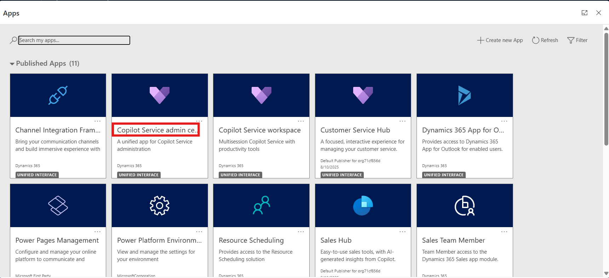

3.  On the left navigation in Copilot Service admin center,
    select **Case Settings**.

4.  Select **Manage** for **Enhanced case experience**.

    

5.  Switch the **Enhanced case experience** toggle to **Yes**.

    - To enable the enhanced full case form:

      1.  Set the **Full case form** toggle to **Yes**, for your agents
          to see the enhanced full case form when they create a new
          case.

      2.  Select **Configure** to customize the form in Power Apps. The
          Power Apps form page opens on a new tab.

    

6.  The Enhanced full case form will be opened in the Power Apps tab.
    You can edit the form as per your requirements.

    

7.  Switch back to the **Copilot Service admin center** tab. To enable
    the enhanced quick case form:

8.  Switch the **Quick case form** toggle to **Yes**.

9.  Select the option in the **Choose Form** dropdown. The selected main
    form appears as the side pane when the agent creates a new case. By
    default, this is set to **Enhanced quick case form**.

    

10. Select **Configure** to customize the form in Power Apps. The Power
    Apps form page opens on a new tab.

  > Note: Do not close the tab.
 

## Task 2: Create a case

1.  Select the **App selector** from the top ribbon.

2.  Select **Copilot Service workspace** from the **Apps** page.

    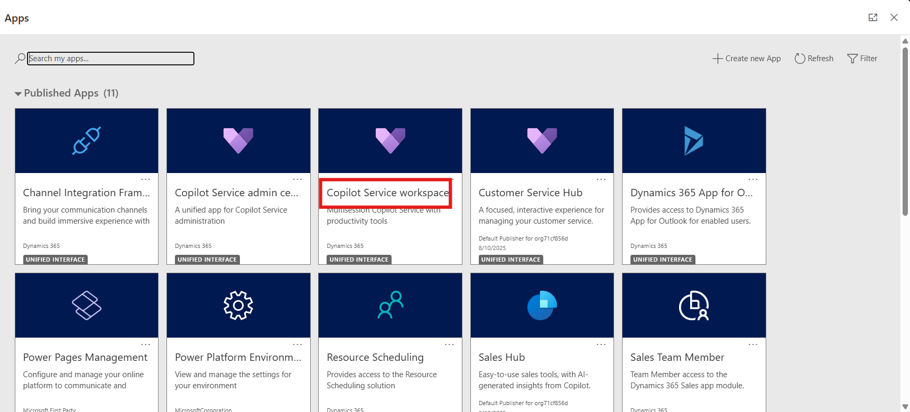

3.  In the Copilot Service workspace, select the **Site Map** and then
    select **Cases**.

    

4.  The **My Active Cases** view is displayed. You can switch between
    the different case views by selecting the current view.

    

5.  Select **Show Chart** on the command bar to see the chart view.

    

6.  Select the three dots on the command bar and then select **Open
    Dashboards**.

    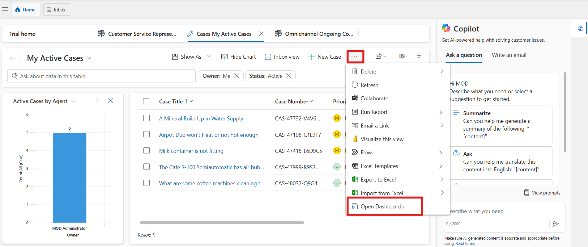

7.  To switch back to views, select **Open Views**.

    

8.  If you select a case record from the case view, you see these
    additional options on the command bar:

    - **Save & Route**

    - **Resolve Case**

    - **Cancel Case**

    - **Assign** 

    - **Add to Queue** 

    - **Queue Item Details**

    

9.  Switch back to the **My Active Cases** tab and select **New Case**.

    

10. Enter the following information on the **Summary** tab and then
    select **Save**.

    - **Case Title** – !!Minerals level is not maintained!!

    - **Customer** – Trey Research

    - **Subject** – !!Water supply!!

    - **Priority** – Normal

    - **Case Status** - In Progress

    - **Product** – !!Water Filtration System!!

      

11. Select the **Details** tab and enter the following information and
    then select **Save**.

    - **Type** – !!Problem!!

    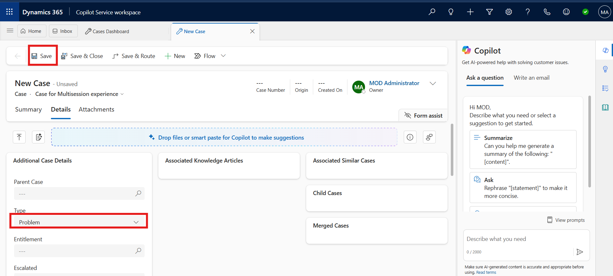

## Task 3: Create a child case

1.  On the command bar, select the three dots and then select **Create
    Child Case**.

    

2.  On the **Quick Create: Case** pane that appears on the right side,
    enter the following information and then select **Save and Close**.

    - **Case Type** – !!Request!!

    - **Customer** – !!Trey Research!!

    - **Case Title** – !!Share a quotation for replacement!!

3.  Select **Save & Close**.

    

4.  Select **Details** tab from the command bar and then scroll down.

5.  You will view the **Child case** on the **Child Cases** tile.

    

6.  Select **Save & Close** from top command bar.

    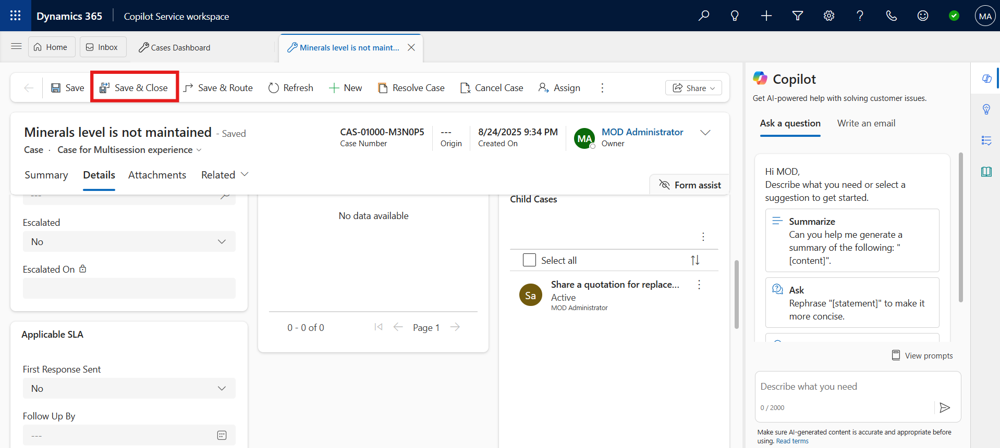

## Task 4: Associate cases as parent and child

You can set a parent-child relationship between cases where you can set
one case as parent and set other cases as its child cases.

1.  Switch back to **My Active Cases** tab, select two or more cases
    that you want to associate as parent and child cases.

2.  On the command bar, select **Associate Child Cases**.

    

3.  The **Set Parent Child Relationship** dialog appears.

4.  In the list, select the case that you want to set as parent, and
    then select **Set**.

    

5.  Select **OK**.

    

6.  Select the case that was selected as a Parent case by you.

7.  Select **Details** tab from the command bar and then scroll down.

8.  You will the Child case on the **Child Cases** tile.

    

## Task 5: Convert a case to a Knowledge article

1.  Switch back to **My Active Cases** tab and open a case that has the
    information that you want to convert to a knowledge article.

2.  On the command bar, select the ellipsis **(…)** and go to **Convert
    To** \> **To Knowledge Article**.

    

    

3.  On **Convert to knowledge article** page, keep the default values
    and then select **Convert**.

    

4.  The knowledge article is created.

## Task 6: View AI-suggested similar cases and knowledge articles

1.  On Copilot Service Workspace, select the **Home** tab and then
    select **Customer** **Service Representative Dashboard**.

    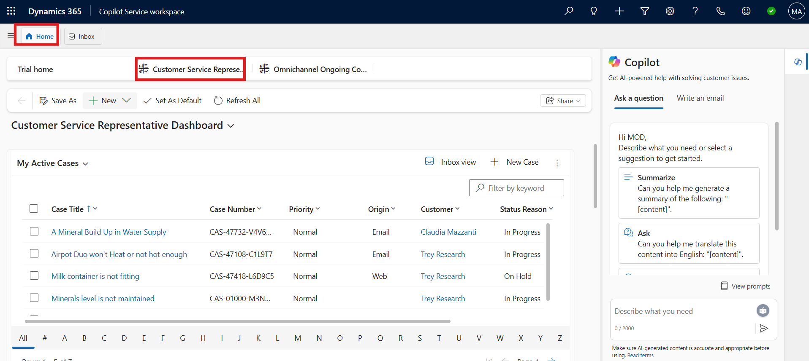

2.  In the **My Active Cases** list, select the **A Mineral Build Up in
    Water Supply** case. The case opens in a session tab. Select **Smart
    assist** tab from the right bar.

    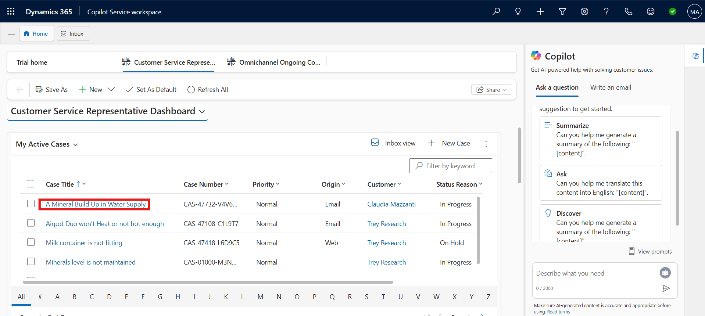

    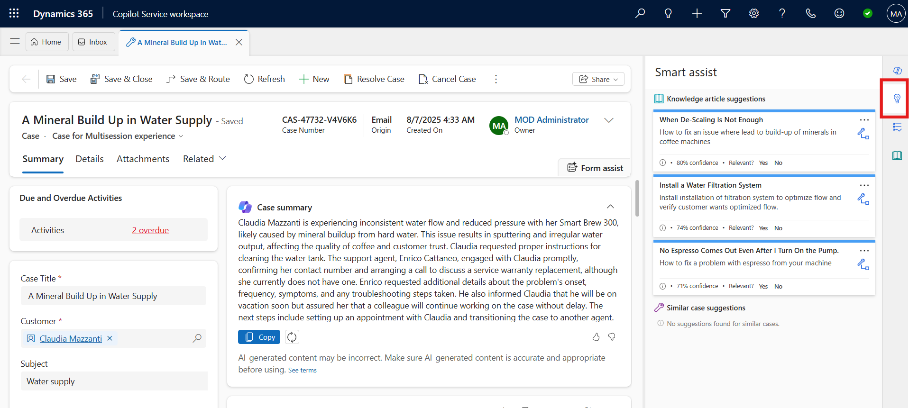

3.  The **Smart assist** pane lists the knowledge articles and similar
    cases suggested by AI based on the case context.

    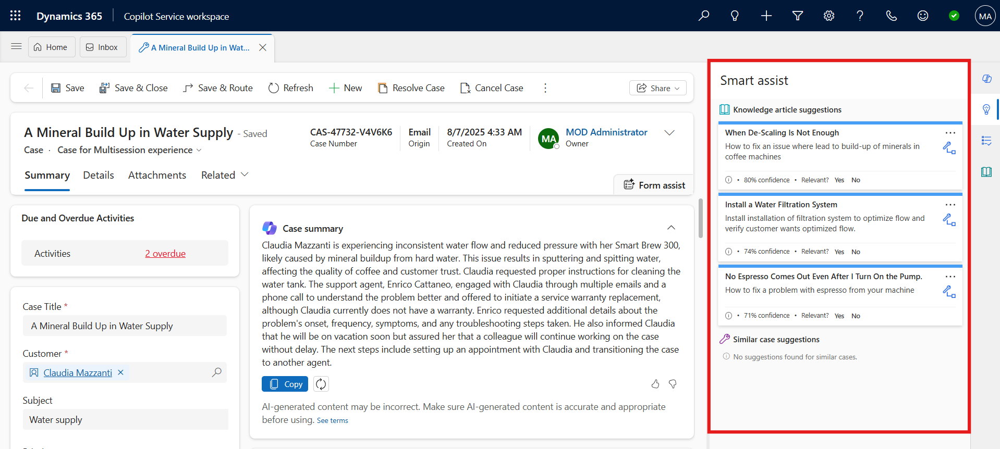

4.  In the **Knowledge article suggestion** area, do any of the
    following:

    - Select an article title to go through and get relevant
      information. The selected knowledge article opens in a new
      application tab.

    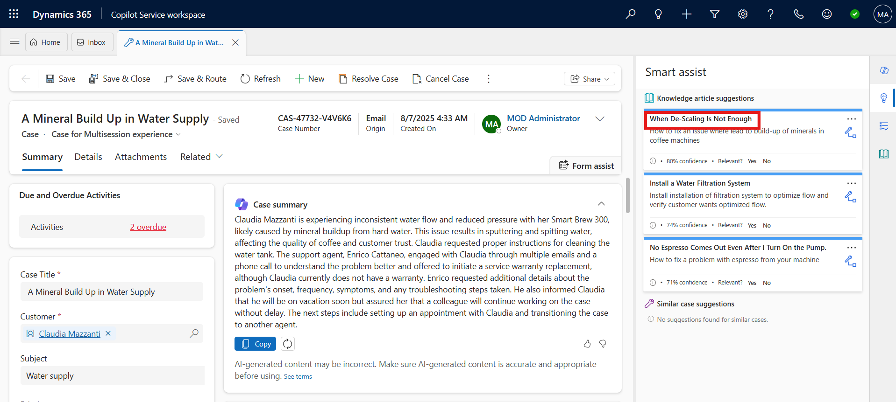

5.  Select more commands to do the following:

    - **Email Content:** Select to open the email compose form with the
      contents of the knowledge article pasted in the mail body.

    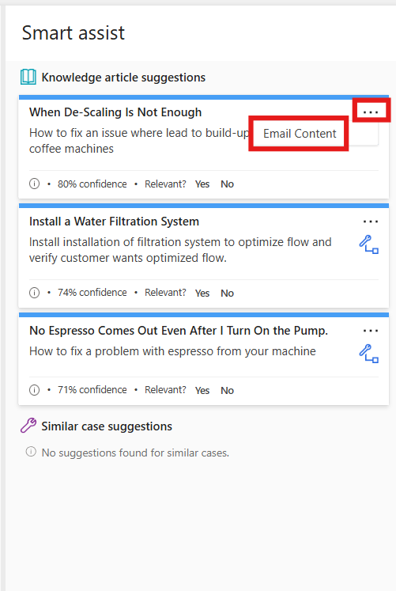

6.  Select the link icon to associate the article with the case as a
    related article.

    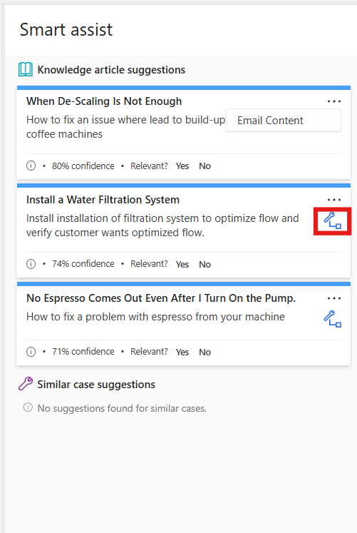

7.  In the **Similar case suggestions** area, do any of the following:

    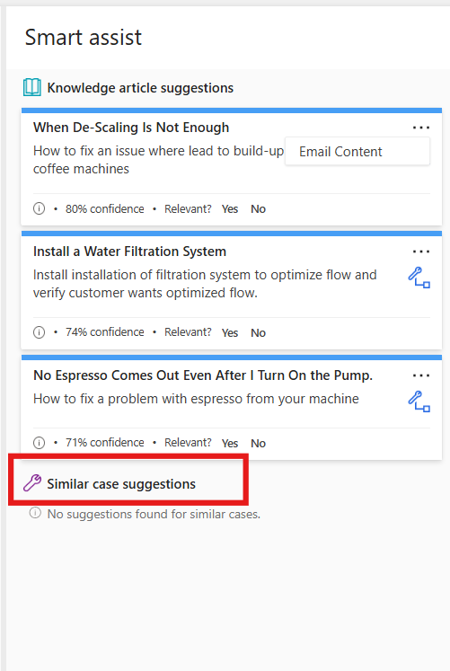

    - Select a case title to drill through the details of the resolved case.

    - Select more commands to do the following:

    - **Copy resolution:** Select to copy the resolution notes information
      from the resolved case to the clipboard.

    - **Email agent:** Select to open the email compose form to send your
  questions to the agent who handled the similar case. The mail form
  opens on a new tab with the pertinent information and link to the
  resolved case filled in.

8.  Select the link icon to link or clear the link with the similar
    case.

### Conclusion

By completing this lab, you have gained practical experience in managing
cases with enhanced case forms in Dynamics 365 Customer Service. You
created and organized cases, associated them as parent and child, and
converted cases into knowledge articles for knowledge reuse. Most
importantly, you explored how AI-driven suggestions for similar cases
and knowledge articles can support agents with relevant insights during
case resolution. These capabilities improve efficiency, enhance
collaboration, and empower agents to deliver a more effective and
informed customer service experience.
