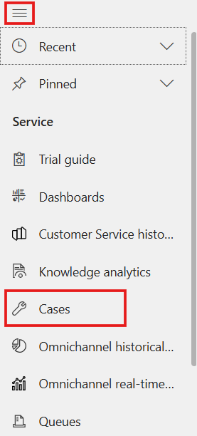

# Lab 25 - Resolve, cancel, reassign and merge Cases

**Introduction**

This lab focuses on managing case lifecycles within the Copilot Service
workspace in Power Platform. Participants will learn how to resolve,
cancel, and reassign cases, as well as create and merge multiple cases
for a single contact. These tasks help service agents efficiently handle
case management, maintain data accuracy, and streamline customer support
processes.

## Task 1 - Resolve a Case

In this task, you will resolve a case linked to a contact and handle
open activities associated with the case.

1.  In the Copilot Service workspace, select the **Site Map** and then
    select **Contact** and then Click on the **Claudia Mazanti.**

    

    

2.  Scroll down and click on the **A Mineral Build Up in Water Supply**
    case.

    

3.  On the command bar, select **Resolve case**.

    

4.  If you have open activities linked to the case, you see a message
    with the following actions.

    - A link with the number of open activities. You can select the link
      to view the open activities associated with the case on a tab your
      administrator has configured.

    

    **Confirm**: If you select **Confirm** on the warning, the system
    automatically cancels the open activities when the case is resolved.

    

5.  Select **Confirm**.

6.  On the **Resolve Case dialog** box, enter the resolution and then
    select **Resolve**.

    

7.  Click on the **Reactivate Case** to execute further steps of lab
    guide.

    

    

## Task 2 - Cancel a Casse

This task demonstrates how to cancel or merge a case using the cancel
option.

1.  On the Case window click on the **Cancel Case** to cancel the case
    If the option not visible click on the ellipsis icon and select
    **Cancel Case**

    

2.  In the **Confirm Cancellation** dialog box, select the case status:

    - **Canceled**: The case is canceled and is no longer assigned to
      you.

    - **Merged**: The case is merged with another case. When the case is
      merged, the case activities are moved to the case it was merged
      with.

    

    

3.  Select **Cancelled**.

4.  Select **Confirm**.

    

## Task 3 - Reassign a Case

This task guides you through assigning a case to yourself or another
user.

1.  Click on the **Vertical Ellipsis** and select Assign to reassign the
    case.

    

2.  In the **Assign to Team or User** dialog box, in the **Assign
    To** field, There are two option are there **Me / User or Team**,
    For this lab guide click on the **Me** and Select **Assign**.

    

## Task 4 - Create and Merge Cases

This task explains how to create a new case for a contact and merge it
with an existing case.

1.  Navigate back to Claudia Mazzanti window, scroll down and select **+
    New Case.**

    

2.  Enter the given details in the field and the click on the **Save and
    Close** to create a new case.

    1.  Case title – Mineral Contain is not Fitting

    2.  Subject – Water Supply

    3.  Case Type – Problem

    4.  Status – In Progress

    

3.  Select at least two active case records that you want to merge.

4.  Select **Merge Cases** from the command menu. If option is not
    visible click on the vertical ellipsis icon and select **Merge
    Case** option.

    

5.  In the **Merge Cases** dialog box, from the list of cases, select
    the case the other cases will be merged into, and then
    select **Merge**.

6.  Select **OK**.

    

7.  To see the merged case, open the case it was merged into.

    

8.  Select the **Details** tab, scroll down and you’ll find the merged
    case listed in the **Merged Cases** section.

    

## Conclusion

In this lab, participants successfully resolved, canceled, reassigned,
and merged cases within the Copilot Service workspace. By performing
these tasks, agents gain a clear understanding of case lifecycle
management, ensuring customer issues are accurately tracked, efficiently
resolved, and properly consolidated. These capabilities help maintain
organized case records and improve overall customer service efficiency
within Power Platform.
