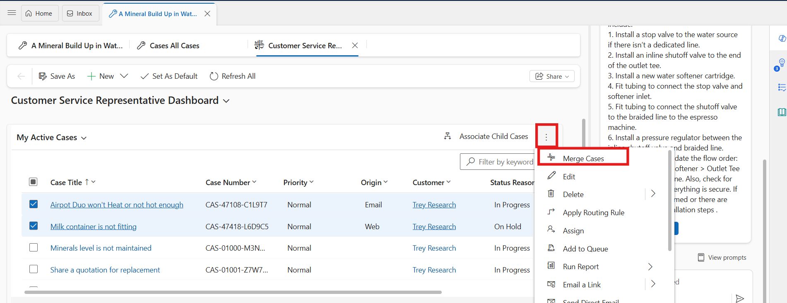

# Lab 25 - Resolve, cancel, reassign and merge cases

### Introduction

In this lab, you will explore the different ways to manage cases in
Dynamics 365 Customer Service through the Copilot Service workspace. You
will learn how to resolve cases by providing closure details, cancel
cases when they are no longer valid, and reassign cases to other users
or teams when collaboration is required. Additionally, the lab covers
merging cases to consolidate duplicate or related issues into a single
record for better case management. These tasks are essential for
ensuring accuracy, reducing duplication, and maintaining efficient
customer service operations.

## Task 1 - Resolve a case

1.  In the Copilot Service workspace, select the **Site Map** and then
    select **Cases**.

    

2.  In the list **My Active Cases**, open the one you want to resolve.

    

3.  On the command bar, select **Resolve case**.

    

4.  If you have open activities linked to the case, you see a message
    with the following actions.

    - A link with the number of open activities. You can select the link
      to view the open activities associated with the case on a tab your
      administrator has configured.

    

  - **Confirm**: If you select **Confirm** on the warning, the system
    automatically cancels the open activities when the case is resolved.

    

5.  Select **Confirm**.

6.  On the **Resolve Case dialog** box, enter the resolution and then
    select **Resolve**.

    

7.  To check if the updated status of the case, select the **My Active
    Cases** dropdown and then select **All Cases**.

    

8.  You can see that the status of the case is **Resolved**.

    

## Task 2 - Cancel a case

All case activities must be closed before you can cancel a case.

1.  In the Copilot Service workspace, select the **Site Map** and then
    select **Cases**.

    

2.  In the list of **My Active Cases**, tick on a case you want to
    cancel, and then on the command bar, select **Cancel Case**. If the
    option not visible click on the ellipsis icon and select **Cancel
    Case**

    

3.  In the **Confirm Cancellation** dialog box, select the case status:

    - **Canceled**: The case is canceled and is no longer assigned to
      you.

    - **Merged**: The case is merged with another case. When the case is
      merged, the case activities are moved to the case it was merged
      with.

      

      A screenshot of a computer Description automatically generated

4.  Select **Cancelled**.

5.  Select **Confirm**.

    

## Task 3 - Reassign a case

1.  In the Copilot Service workspace, select the **Site Map** and then
    select **Cases**.

    

2.  In the list of cases, select the case that you want to reassign, and
    on the command bar, select **Assign**.

    

3.  In the **Assign to Team or User** dialog box, in the **Assign
    To** field, select **User or Team**, and then in the **User or
    team** field, select your organization.

4.  Select **Assign**.

    

## Task 4 - Merge cases from dashboard streams

1.  In the Copilot Service workspace, select the **Site Map** and then
    select **Dashboards**.

    

2.  Select at least two active case records that you want to merge.

3.  Select **Merge Cases** from the command menu. If option is not
    visible click on the vertical ellipsis icon and select **Merge
    Case** option.

    

4.  In the **Merge Cases** dialog box, from the list of cases, select
    the case the other cases will be merged into, and then
    select **Merge**.

    

5.  Select **OK**.

    

6.  To see the merged case, open the case it was merged into.

    

7.  Select the **Details** tab, scroll down and you’ll find the merged
    case listed in the **Merged Cases** section.

    

## Task 5 - Merge cases from a list of case records

1.  In Copilot Service workspace, select **Cases** in the site map.
    Select the **My Active Cases** view on the **Copilot Service Agent
    Dashboard**.

2.  Select at least two active case records that you want to merge, and
    then on the command bar, select **Merge Cases**.

    

3.  In the **Merge Cases** dialog, from the list of cases, select the
    case the other cases will be merged into, and then select **Merge**.

- 

4.  Select **OK**.

- 

5.  To see the merged case, open the case it was merged into.

- 

6.  Select the Details tab, scroll down and you’ll find the merged case
    listed in the **Merged Cases** section.

- 

**Conclusion**

By completing this lab, you gained practical experience in handling
various case lifecycle activities such as resolving, canceling,
reassigning, and merging cases in Dynamics 365 Customer Service. These
actions ensure that cases are properly tracked, efficiently managed, and
accurately assigned to the right resources. The ability to merge related
or duplicate cases also streamlines case management and prevents
redundancy. Overall, this lab highlights how structured case handling
supports better organization, improves agent productivity, and enhances
the quality of customer service delivery.
