# Lab 26 - Configure the enhanced insert email template selection dialog

**Introduction**

In this lab, you will learn how to configure the enhanced email template
selection dialog in Dynamics 365 Customer Service. The enhanced dialog
provides an improved experience for users when inserting templates into
emails, making it easier to locate and apply the right template. You
will first enable the enhanced email selection option within a solution
and then explore how to disable it for specific apps when the default
experience is preferred. This configuration allows organizations to
balance modern functionality with tailored application needs.

## Task 1 - Enable the enhanced email selection dialog

1.  Open a new tab in the browser, navigate to the Power Apps -
    !!https://make.preview.powerapps.com/!!, select the **Customer
    Service Trial** environment.

> 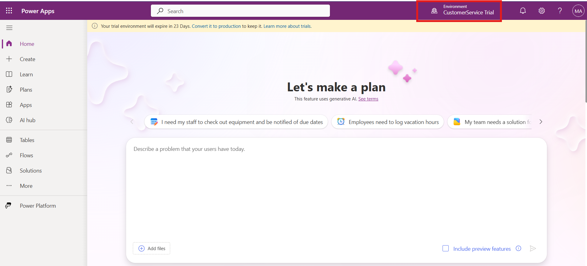

2.  Select **Solutions** on the left navigation pane.

- 

3.  Click on **New Solution** from top command bar.

> 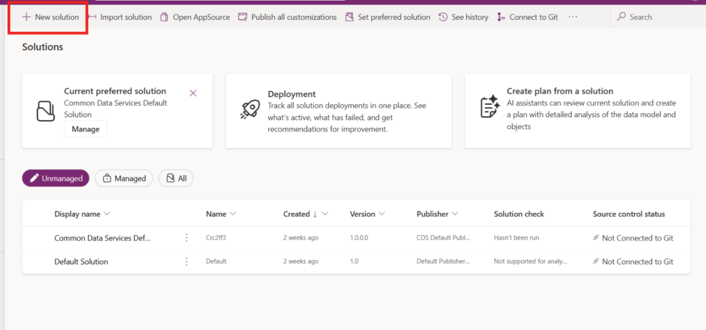

- 

4.  Enter the below details

    1.  **Display Name** of the solution – `Test`

    2.  **Publisher –** Default publisher for your organization

    3.  Select Set as preferred solution check box

    4.  Select **Create**

> 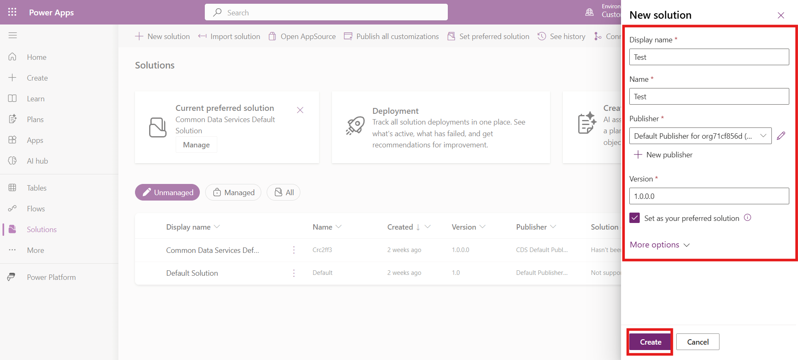

5.  Select **Add Existing** \> **More** \> **Setting**.

- 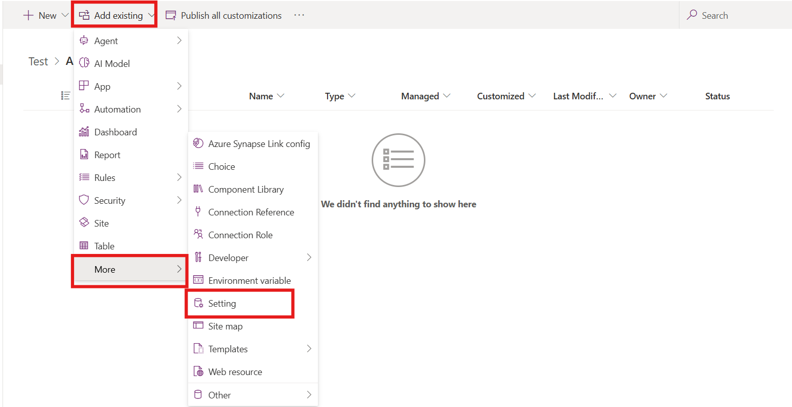

6.  On the **Add existing Setting Definition** pane, search and select
    !!Enable the New Insert Template Dialog!! option and then
    select **Next**.

- 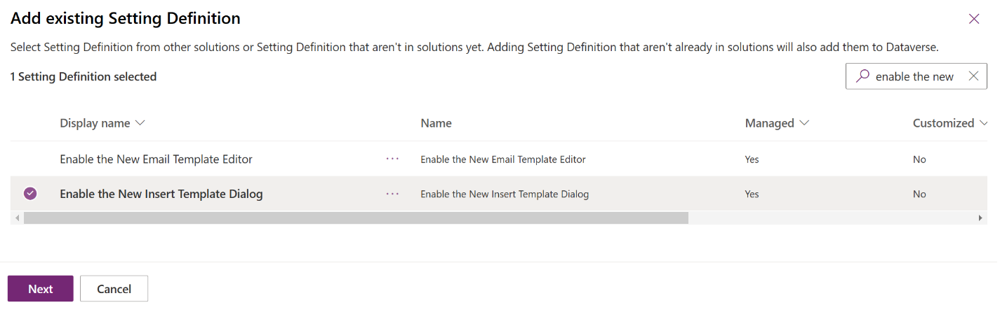

7.  Select **Add** on the **Selected Setting Definition**.

- 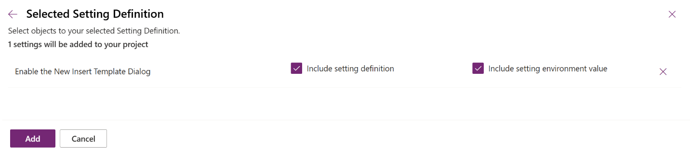

8.  The **Enable the New Insert Template Dialog** option is added to
    your solution. Select **Edit**.

- 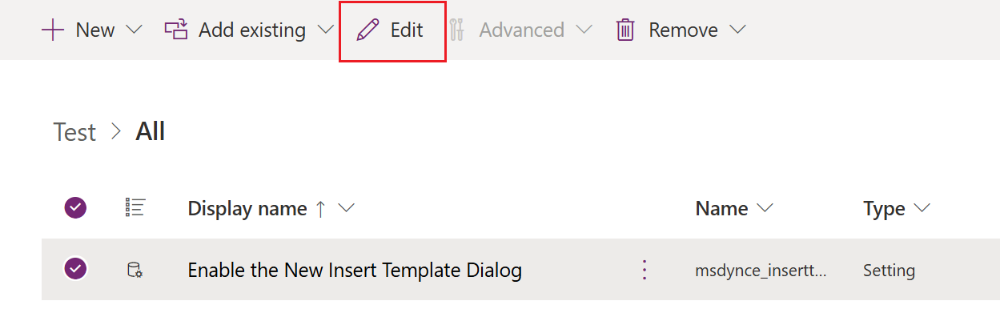

9.  Set the **Setting environment value** option to **Yes** on
    the **Edit Enable the New Insert Template Dialog** pane. Select
    **Save**.

- 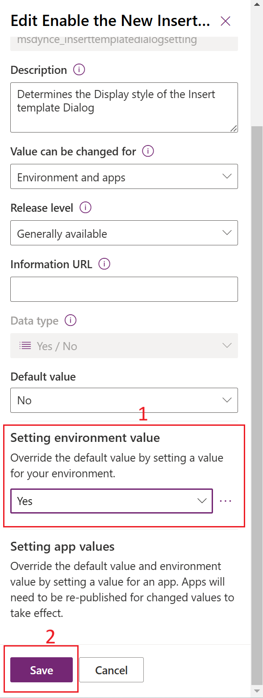

  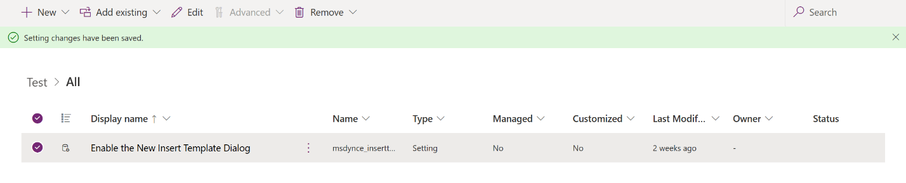

10. Unselect and Select **Publish All Customizations**.

- 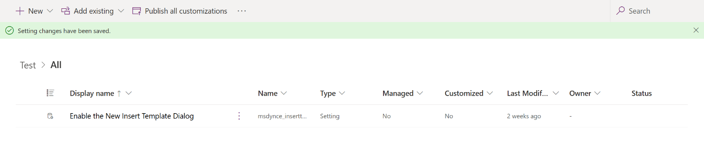

  

## Task 2 - Disable the enhanced email selection dialog for an app

For an app to display the default email template selection dialog, you
must disable the enhanced email template selection option. To disable
the option for a specific app, you must add the app to the Solution in
which you’ve added the email template selection option. Perform the
following steps:

1.  Go to **Add Existing** \> **App** \> **Model-driven app**

- 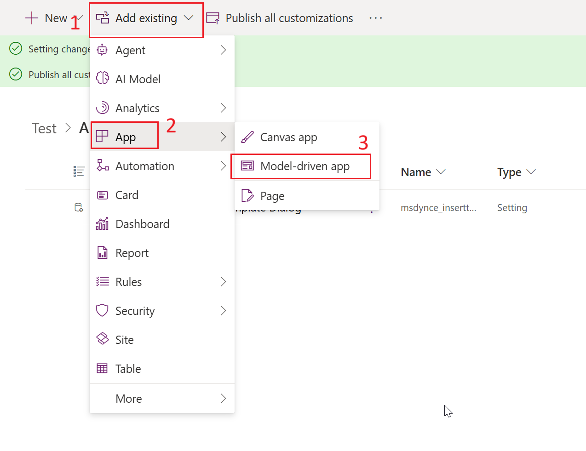

2.   On the **Add existing model-driven apps** pane, select the app for
    which you want to disable the enhanced insert email template
    selection dialog. The app is added to the solution. For this lab, we
    are not selecting any app. Hence select **Cancel**

- 

**Note** -

- Select the **Enable the New Insert Template Dialog** option in the
  solution.

- On the **Edit Enable the New Insert Template Dialog**, in
  the **Setting app value** section, the selected app is displayed.

- Select **New app value** for the app, and select **No** for the
  specified app.

- Select **Save** and **Publish All Customizations**.

**Conclusion**

By completing this lab, you gained hands-on experience in enabling and
managing the enhanced insert email template selection dialog in Dynamics
365 Customer Service. You learned how to activate the enhanced dialog at
the environment level and also how to selectively disable it for
specific apps when required. This flexibility ensures that organizations
can optimize email communications by leveraging the enhanced template
experience while still maintaining control over app-specific
requirements. Ultimately, these capabilities support more efficient
communication and provide a customizable user experience.
