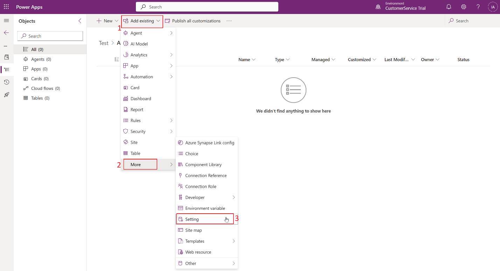

# Lab 26 - Configure the enhanced insert email template selection dialog

**Introduction:**

This lab focuses on configuring the **New Insert Template Dialog** in
Power Apps within a model-driven app environment. The New Insert
Template Dialog improves the user experience when inserting templates,
but administrators have the flexibility to enable or disable this
feature either globally for the environment or for specific apps. This
lab demonstrates how to manage this setting using solutions in Power
Apps.

## Task 1 - Enable the New Insert Template Dialog in a Solution

In this task, you create a solution in the Power Apps portal and add a
**Setting Definition** to enable the New Insert Template Dialog feature.
This allows the setting to be managed centrally and applied across apps.

1.  Open a new tab in the browser, navigate to the Power Apps -
    !!https://make.preview.powerapps.com/!!, select the
    **ContactCenter** **Trial** environment.

    

2.  Select **Solutions** on the left navigation pane.

    

3.  Click on **New Solution** from top command bar.

    

4.  Enter the below details

    1.  **Display Name** of the solution – `Test`

    2.  **Publisher –** Default publisher for your organization

    3.  Select Set as preferred solution check box

    4.  Select **Create**

    

5.  Select **Add Existing** \> **More** \> **Setting**.

    

6.  On the **Add existing Setting Definition** pane, search and select
    **Enable the New Insert Template Dialog** option and then
    select **Next**.

    

7.  Select **Add** on the **Selected Setting Definition**.

    

8.  The **Enable the New Insert Template Dialog** option is added to
    your solution. Select **Edit**.

    

9.  Set the **Setting environment value** option to **Yes** on
    the **Edit Enable the New Insert Template Dialog** pane. Select
    **Save**.

    

    

10. Unselect and Select **Publish All Customizations**.

    

    

## Task 2 - Configure for Specific Model-Driven Apps

This task demonstrates how the feature can be optionally disabled for
specific apps, giving administrators finer control over the New Insert
Template Dialog behavior in different contexts.

1.  Go to **Add Existing** \> **App** \> **Model-driven app**

    

2.   On the **Add existing model-driven apps** pane, select the app for
    which you want to disable the enhanced insert email template
    selection dialog. The app is added to the solution. For this lab, we
    are not selecting any app. Hence select **Cancel**

    

    **Note** -

    - Select the **Enable the New Insert Template Dialog** option in the
      solution.

    - On the **Edit Enable the New Insert Template Dialog**, in
      the **Setting app value** section, the selected app is displayed.

    - Select **New app value** for the app, and select **No** for the
      specified app.

    - Select **Save** and **Publish All Customizations**.

### Conclusion

In this lab, you successfully configured the **New Insert Template
Dialog** in Power Apps using a solution. By enabling the setting at the
environment level, you ensured that the enhanced template insertion
experience is available across all apps in the environment.
Additionally, the lab highlights the flexibility to selectively disable
the dialog for specific model-driven apps, providing administrators with
granular control over user experience and ensuring consistency in
template management across the organization.
