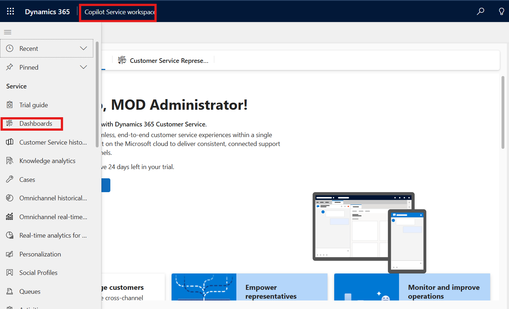
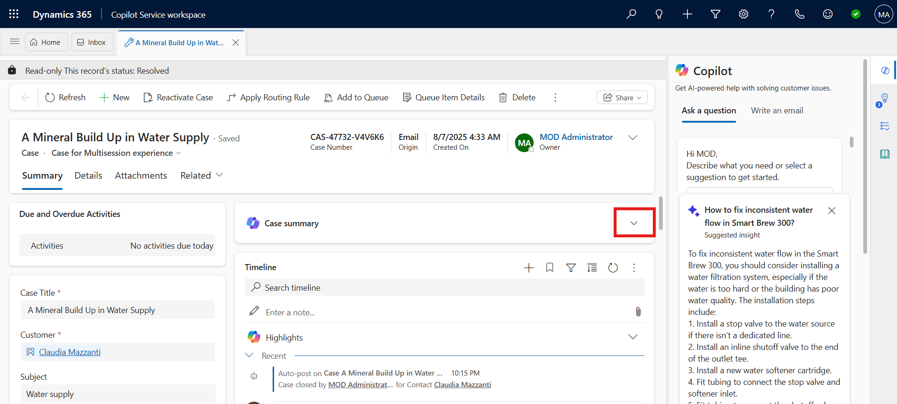
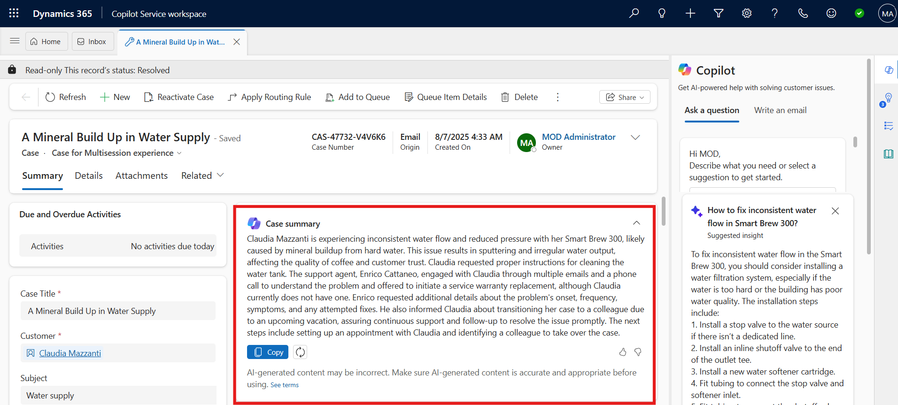
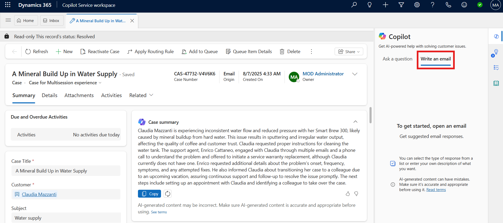
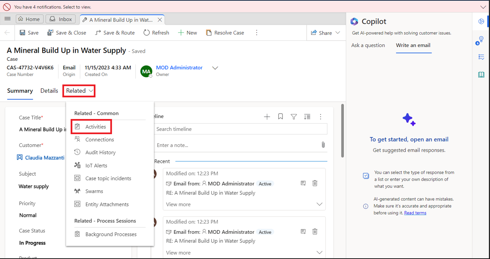
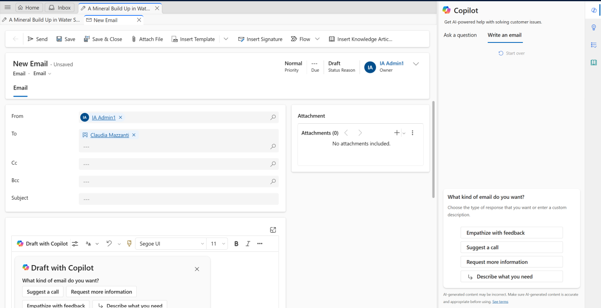

# Lab 27 – Draft email with Copilot in Dynamics 365 Contact Center

### Introduction

In this lab, you will learn how to use **Microsoft Copilot** in the
Copilot Service workspace to assist with drafting customer emails.
Copilot helps service agents communicate effectively by suggesting
responses, offering tone options, and generating empathetic or
informative messages based on case context. This capability supports
faster and more consistent customer engagement.

1.  Open acase from copilot service workspace, Select **Write an email**
    tab on the **Copilot** pane.

    

2.  On the case overview page, select **Related** tab and then select
    **Activities.**

    

3.  Select **+New Activity \> Email**.

    

4.  When you start to draft an email, Copilot opens in the right-side
    panel and presents five predefined prompts and one custom prompt:

    - **Suggest a call**: Drafts a reply that suggests a call with the
      customer today or tomorrow.

    - **Request more information**: Drafts a reply that requests more
      details from the customer to help resolve the problem.

    - **Empathize with feedback**: Drafts a reply that provides an
      empathetic response to a customer who expresses a complaint.

    - **Provide product/service details**: Drafts a reply that offers
      details or answers customer questions about a particular product
      or service.

    - **Resolve the customer’s problem**: Drafts a reply that provides a
      resolution—and resolution steps, if applicable—to the customer’s
      problem.

    - **Custom**: Allows you to provide your own prompt for the reply.

      

      

5.  Select **Empathize with feedback** from the predefined prompts list.

6.  You can see, **Copilot** has generated suggestion.

    

7.  You can now review the response. Make any necessary changes, and
    then select **Copy to email** to copy the entire response to your
    draft. Or select part of the response and use the right-click menu
    to copy and paste the selection.

    

8.  Response is now available in body part on left side.

    

9.  Now you can send the email or save it. For this lab click on the
    **save and close** button from top.

    

### Conclusion

In this lab, you practiced using Copilot to draft customer email
responses in the Copilot Service workspace. You explored predefined
prompts that help agents respond empathetically, request information,
provide service details, or offer resolutions. By leveraging Copilot
suggestions, you can improve response quality, speed, and tone—resulting
in better customer service communication and overall efficiency.
