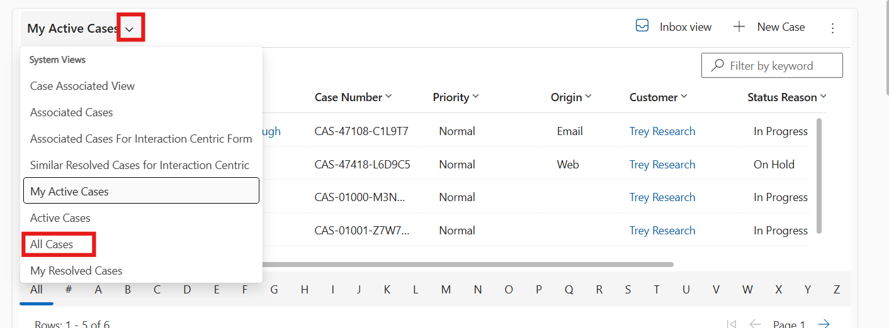
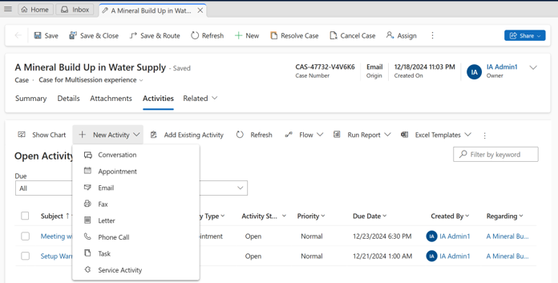

# Lab 27 - Use Copilot to solve customer issues faster with Dynamics 365 Customer Service

**Introduction**  
In this lab, you will explore how Copilot in Dynamics 365 Customer
Service enhances case management and customer communication. By using
Copilot to generate case summaries, you can quickly understand the
essential details of a case, allowing for faster and more informed
decision-making. Additionally, Copilot assists in drafting professional
and empathetic emails, ensuring consistent and effective customer
engagement. Together, these capabilities help service agents resolve
issues more efficiently while maintaining a high level of customer
satisfaction.

## Task 1: Summarize cases

Copilot case summaries help you to quickly understand the context of a
case and resolve customer issues more efficiently. The case summary
includes key information such as the case title, customer, subject,
product, priority, case type, and description.

1.  In the Copilot Service workspace, select the **Dashboard** under services.

- 

2.  On the Dashboard, click on the **My active case** dropdown and
    select **All case** option.

> 

3.  Select one of the cases listed on the **Dashboard**.

- 

4.  The **Case summary** appears as a card on the case form. When you
    open a case, the **Summary** card is collapsed by default. Expand
    the **Summary** tab.

- 

5.  You can see the generated case summary.

- 

## Task 2: Draft emails

1.  Select **Write an email** tab on the **Copilot** pane.

- 

2.  On the case overview page, select **Related** tab and then select
    **Activities.**

- 

3.  Select **+New Activity \> Email**.

- 

4.  When you start to draft an email, Copilot opens in the right-side
    panel and presents five predefined prompts and one custom prompt:

    - **Suggest a call**: Drafts a reply that suggests a call with the
      customer today or tomorrow.

    - **Request more information**: Drafts a reply that requests more
      details from the customer to help resolve the problem.

    - **Empathize with feedback**: Drafts a reply that provides an
      empathetic response to a customer who expresses a complaint.

    - **Provide product/service details**: Drafts a reply that offers
      details or answers customer questions about a particular product
      or service.

    - **Resolve the customer’s problem**: Drafts a reply that provides a
      resolution—and resolution steps, if applicable—to the customer’s
      problem.

    - **Custom**: Allows you to provide your own prompt for the reply.

- 

  

5.  Select **Empathize with feedback** from the predefined prompts list.

6.  You can see, **Copilot** has generated suggestion.

- 

7.  You can now review the response. Make any necessary changes, and
    then select **Copy to email** to copy the entire response to your
    draft. Or select part of the response and use the right-click menu
    to copy and paste the selection.

- 

8.  Response is now available in body part on left side.

- 

9.  Now you can send the email or save it. For this lab click on the
    **save and close** button from top.

> 

**Conclusion**  
By completing this lab, you have learned how to leverage Copilot in
Dynamics 365 Customer Service to improve productivity and streamline
case resolution. You practiced generating AI-powered case summaries to
quickly gain context and reduce manual effort, and you used predefined
prompts to draft accurate and empathetic email responses. These features
not only save time but also help ensure consistent communication with
customers. With Copilot, service agents can focus more on resolving
issues and delivering better customer experiences.
