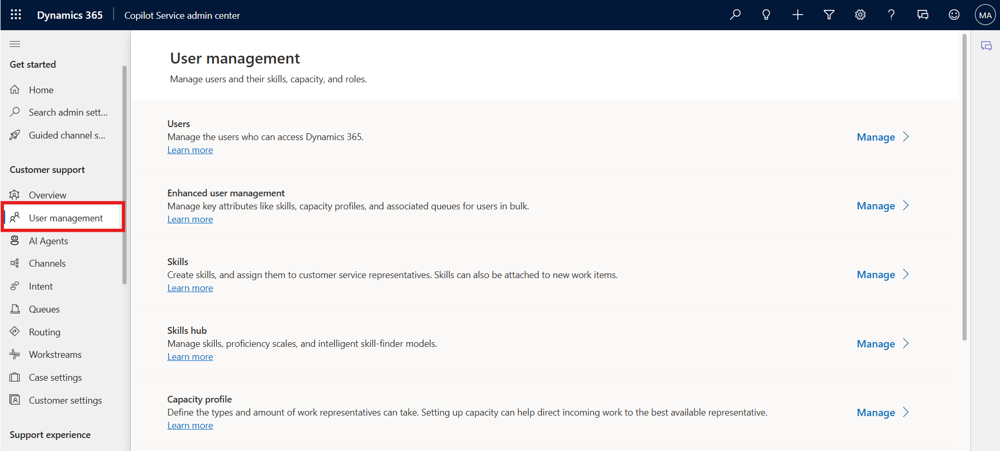
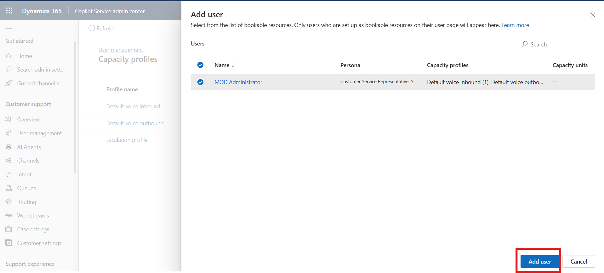

# Lab 3 - Create a capacity profile and assign it to the users

**Duration:** 10 mins

## Introduction

In this lab, you will learn how to create and configure a capacity
profile in the Copilot Service admin center. Capacity profiles define
how many work items an agent can handle and help manage workload
distribution efficiently. You will also assign the created capacity
profile to a user to control work item assignments.

## Task 1: Create and Assign a Capacity Profile

In this task, you will create a new capacity profile, define work
limits and reset frequency, and assign the profile to the admin user to
manage workload capacity effectively.

1. On the Copilot Service admin center,select **User management** under **Customer support**.

    

2.  Select the **Manage** option for **Capacity profile**.

    

3.  On the **Capacity profiles** page, select **Create new**.

   

4.  On the **Details** tab of the **Create capacity profile** dialog
    box, enter the following details:

    - **Profile name**: Name for the capacity profile as !!`Demo``!!`

    - **Work item limit**: Number of units of the work type that you can
      assign to the agent. – Enter - 5

    - **Reset frequency**: Period after which capacity consumption is
      reset for agents. Select **Immediate**

  

    - **Note** - Once configured, you must recreate the capacity profile
      if you want to change the reset frequency.

    - **Assignment blocking**: Set the toggle to **Yes**. When the work
      item limit is met, the agent isn’t assigned a new work item
      automatically.

      

5.  Select the capacity profile created. Select the **Users** Tab and
    Select **Add user**

    

6.  Select the admin user check box and then click on **Add user.**

    

7.  Select **Save and Close.** The capacity profile is assigned to the
    admin user.

    

## Conclusion

By completing this lab, you have successfully created a capacity profile
in the Copilot Service admin center and assigned it to a user. This
setup helps ensure optimal workload management and prevents agents from
being over-assigned tasks beyond their defined capacity.
