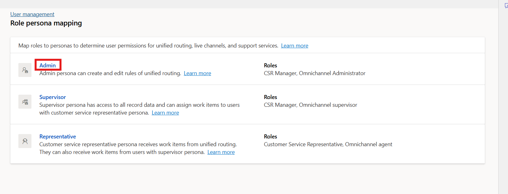

# Lab 4 - Manage personas and custom security roles in Dynamics 365 Contact Center

**Duration:** 10 mins

## Introduction

In this lab, you will learn how to access and manage role persona
mapping in the Copilot Service admin center. Role persona mapping allows
administrators to assign or modify security roles for different
personas, such as agents, supervisors, or admins, to control access
levels and permissions within the system.

## Task 1: View and Edit Role Persona Mapping

In this task, you will navigate to the Role Persona Mapping section,
view available personas, and explore how to add or remove security
roles. Although no changes will be made in this lab, this task
demonstrates the process for managing persona-based security roles.

1.  On the left navigation pane, select **User
    management** in **Customer support** again.

    

2.  Select **Manage** for **Role persona mapping**.

    

3.  Select the persona – **Admin** to add or remove security roles.
    The **Edit roles** pane displays the list of roles.

    

4.  Select or clear the selection from the checkboxes for the required
    security roles.

    

    > **Note** – For this lab, we are not adding or removing any roles for
    the persona.

5.  Select **Save and Close** after you have made any changes.

    

## Conclusion

By completing this lab, you have learned how to access and manage role
persona mappings in the Copilot Service admin center. Understanding this
feature helps administrators ensure that users have the appropriate
permissions and access levels based on their roles.
