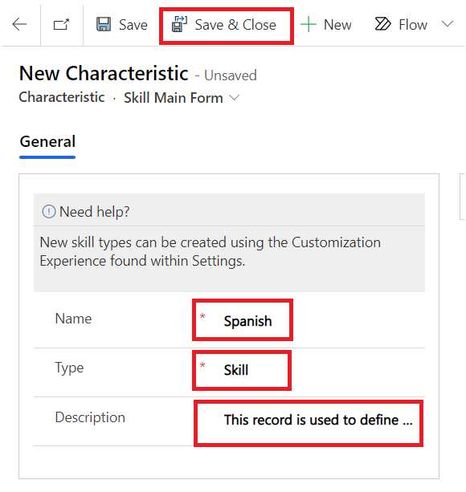
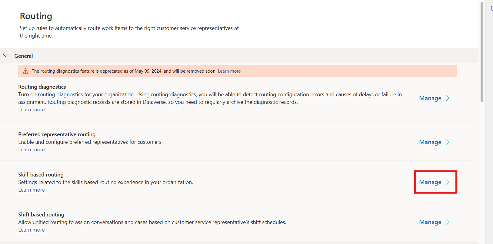
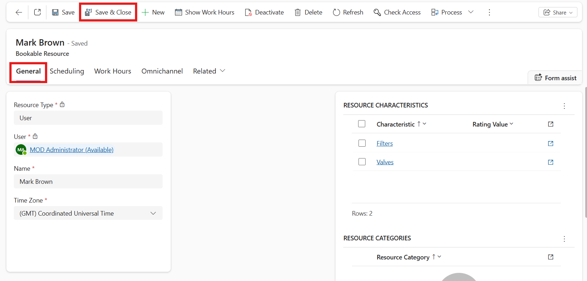

# Lab 8 - Set up skill-based routing in Unified Routing 

**Duration:** 25 mins

## Introduction

In this lab, you will learn how to create and configure skills, rating
models, and skill-based routing in the Copilot Service admin center.
Skill-based routing helps ensure that customer requests are
automatically assigned to the most qualified agents based on their
skills and proficiency levels. You will also learn how to assign newly
created skills and rating values to agents.

## Task 1: Create a New Skill

In this task, you will create a new skill named *Spanish* to define
language proficiency for agents. This skill will later be used in
routing logic to match customers with agents who possess the required
language capability.

1.  In the **Copilot Service admin center** navigate to the site map and
    select **User management** under the **Customer support** group.

2.  On the **User management** page, select **Manage** next to
    **Skills**.

    

3.  Select **+ New** to create new skill.

    

4.  Specify the following in the **New Characteristic** page.

    **Name** - !!Spanish!!

    **Type** - Skill

    **Description** - !!This record is used to define the skill level of
    the Spanish language!!

5.  Select **Save & Close** from top bar.

    

## Task 2: Configure Skill-Based Routing and Rating Model

In this task, you will enable skill-based routing and create a Language
rating model to define the range and levels of skill proficiency. You
will also add a Language rating value to the model to rate agents based
on their capabilities.

1.  In the **Copilot Service admin center** navigate to the site map and
    select **Routing** under the **Customer support** group.

2.  Select **Manage** next to the **Skill-based routing**.

    

3.  On the **Omnichannel Configuration** page, set the toggle for
    **Enable update skill control** to **Yes**. In the **Rating
    Model** section, select **+ New Rating Model**.

    

4.  Specify the following in the **New Rating Model** page.

    **Name** - !!Language rating model!!

    **Min Rating Value** - !!1!!

    **Max Rating Value** - !!10!!

5.  Select **Save**.

    

6.  The **Rating Values** section appears. Click on the vertical
    ellipsis and select **+** **New Rating Value**.

    

7.  The **New Rating Value** page appears.

8.  Specify the following.

    **Name** - !!Language rating value!!

    **Value** - !!10!!

9.  Select **Save & Close** to save and add the rating value to the
    grid.

    

10. Select **Save & Close** on the top of the languagerating model page
    to navigate back to the Omnichannel Configuration page.

    

11. On the **Omnichannel Configuration** page, click **Save & Close**

    

## Task 3: Configure an Omnichannel User Profile

In this task, you will configure an Omnichannel user profile by updating
the agent details for Mark Brown. You will view the agent’s working
hours, save the configuration, and ensure the user is ready to be
assigned skills.

1.  In **Dynamics 365 Copilot Service admin center**, in the site map,
    select **User management** under the **Customer support** group.

2.  On the **User management** page, select **Manage** next
    to **Users**.

    

3.  Click the dropdown next to **Enabled Users** and select
    **Omnichannel Users**.

    

4.  On the **Omnichannel Users** page, select **MOD Administrator** from
    the list.

    

5.  Select the **Omnichannel** tab.

    

6.  Select **Trial User** under the **Skills Configuration** section.

    

7.  On the **New Bookable Resource** page, change the **Name** to !!Mark
    Brown!!. Select **Save**.

    

8.  Click the **Work Hours** tab to see the details of the agent **Mark
    Brown**.

    

9.  Select the **General** tab and then select **Save & Close** to
    navigate back to your admin User page.

    

10. On the **MOD Administrator** page, select **Save & Close**.

    

## Task 4: Assign Skill and Rating Value to an Agent

In this task, you will assign the Spanish skill and the corresponding
Language rating value to the agent Mark Brown. This allows the agent to
handle customer interactions requiring Spanish language proficiency.

1.  In the **Copilot Service admin center** navigate to the site map and
    select **User management** under the **Customer support** group.

2.  On the **User management** page, select **Manage** next
    to **Skills**.

    

3.  Select the skill "**Spanish**" from the list for which you want to
    assign the agents.

    

4.  Select **+ New Bookable Resource Characteristic** in the **Users
    (Agents)** section.

    

5.  On the **New Bookable Resource Characteristic** page, Click on the
    rating value field, press enter button and select **Language rating
    value** for the **Rating Value** field and select **Mark Brown** for
    the **Resource** field.

6.  Select **Save and Close**.

    

7.  On the **Spanish** Characteristic page, select **Save**.

    

## Conclusion

By completing this lab, you have successfully created a skill,
configured a skill-based routing model, and assigned the skill to an
agent with a defined rating value. These configurations enable Dynamics
365 Copilot Service to intelligently route customer requests to the most
suitable agents, improving efficiency and customer satisfaction.
